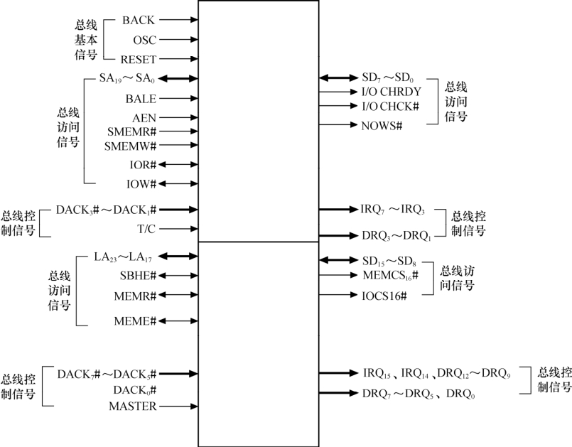

### 2.3.5 ISA

ISA（工业标准结构总线）总线起源于1981年IBM生产的以Intel 8088为CPU的IBM-PC微计算机，开始时总线宽度为8位。1984年推出的IBM-PC/AT系统将ISA总线扩充为16位数据总线宽度，同时地址总线宽度也由20位扩充到了24位。其后推出的EISA（扩展的ISA）采用32位地址线，数据总线也扩展为32位，但仍保持了与ISA的兼容。

图2.15所示为ISA总线的信号，这些信号可分为3组。

● 总线基本信号：ISA总线工作所需要的最基本信号，含复位、时钟、电源、地等。

● 总线访问信号：用于访问ISA总线设备的地址线、数据线以及相应的应答信号。

● 总线控制信号：中断和DMA请求。

图2.15中各信号的详细定义如下。

● RESET、BCLK：复位及总线基本时钟，BLCK为8MHz。

● SA19～SA0：存储器及I/O空间20位地址，带锁存。

● LA23～LA17：存储器及I/O空间20位地址，不带锁存。

● BALE：总线地址锁存，外部锁存器的选通。

● AEN：地址允许，表明CPU让出总线，DMA开始。

● SMEMR#、SMEMW#：8位ISA存储器读写控制。

● MEMR#、MEMW#：16位ISA存储器读写控制。

● SD15～SD0：数据总线，访问8位ISA卡时高8位自动传送到SD7～SD0。

● SBHE#：高字节允许，打开SD15～SD8数据通路。

● MEMCS16#、IOCS16#：ISA卡发出此信号确认可以进行16位传送。

● I/OCHRDY：ISA卡准备信号，可控制插入等待周期。

● NOWS#：有效则暗示不用插入等待周期。

● I/OCHCK#：ISA卡奇偶校验错。

● IRQ15、IRQ14、IRQ12～IRQ9、IRQ7～IRQ3：中断请求。

● DRQ7～DRQ5、DRQ3～DRQ0：ISA卡DMA请求。

● DACK7#～DACK5#、DACK3#～DACK0#：DMA请求响应。

● MASTER#：ISA主模块确立信号，ISA发出此信号，与主机内DMAC（DMA控制器）配合使ISA卡成为主模块。

