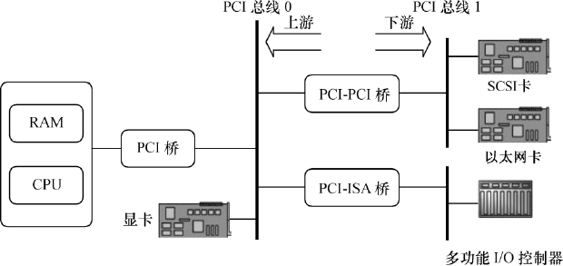
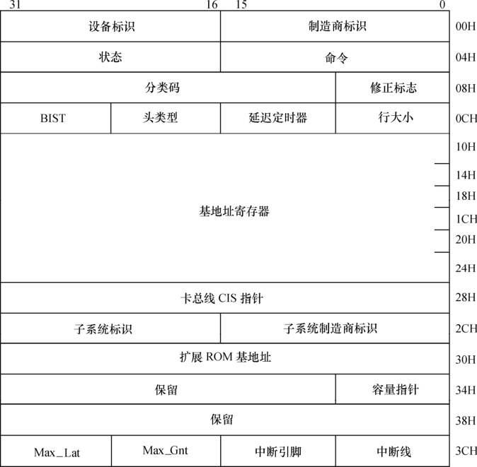
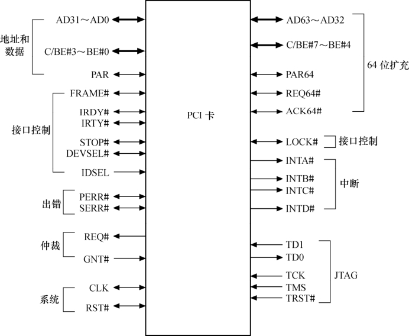
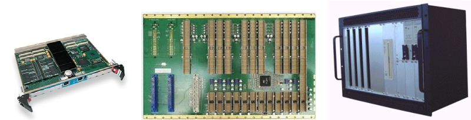

### 2.3.6 PCI和cPCI

PCI（外围部件互连）是由Intel于1991年推出的一种局部总线，作为一种通用的总线接口标准，它在目前的计算机系统中得到了非常广泛的应用。PCI提供了一组完整的总线接口规范，其目的是描述如何将计算机系统中的外围设备以一种结构化和可控化的方式连接在一起，给出了外围设备在连接时的电气特性和行为规约，并且详细定义了计算机系统中的各个不同部件之间应该如何正确地进行交互。PCI总线具有如下特点。

● 数据总线32位，可扩充到64位。

● 可进行突发（burst）模式传输。

● 总线操作与处理器-存储器子系统操作并行。

● 总线时钟频率为33MHz或66MHz，最高传输率可达528MB/s。

● 采用中央集中式总线仲裁。

● 支持全自动配置、资源分配，PCI卡内有设备信息寄存器组为系统提供卡的信息，可实现即插即用。

● PCI总线规范独立于微处理器，通用性好。

● PCI设备可以完全作为主控设备控制总线。

图2.16给出了一个典型的基于PCI总线的计算机系统逻辑示意图，系统的各个部分通过PCI总线和PCI-PCI桥连接在一起。CPU和RAM通过PCI桥连接到PCI总线0（即主PCI总线），而具有PCI接口的显卡则可以直接连接到主PCI总线上。PCI-PCI桥是一个特殊的PCI设备，它负责将PCI总线0和PCI总线1（即从PCI主线）连接在一起，通常PCI总线1称为PCI-PCI桥的下游（downstream），而PCI总线0则称为PCI-PCI桥的上游（upstream）。为了兼容旧的ISA总线标准，PCI总线还可以通过PCI-ISA桥来连接ISA总线，从而支持以前的ISA设备。

当PCI卡刚加电时，卡上只有配置空间是可被访问的，因而PCI卡开始不能由驱动或用户程序访问，这与ISA卡有本质的区别（CPU可直接读取ISA卡在存储空间或I/O空间映射的地址）。PCI配置空间保存着该卡工作所需的所有信息，如厂家、卡功能、资源要求、处理能力、功能模块数量、主控卡能力等。通过对这个空间信息的读取与编程，可完成对PCI卡的配置。如图2.17所示，PCI配置空间共为256字节，主要包括如下信息。

● 制造商标识（Vendor ID）：由PCI组织分配给厂家。

● 设备标识（Device ID）：按产品分类给本卡的编号。

● 分类码（Class Code）：本卡功能的分类码，如图卡、显示卡、解压卡等。

● 申请存储器空间：PCI卡内有存储器或以存储器编址的寄存器和I/O空间，为使驱动程序和应用程序能访问它们，需申请CPU的一段存储区域以进行定位。配置空间的基地址寄存器用于此目的。

● 申请I/O空间：配置空间的基地址寄存器也用来进行系统I/O空间的申请。

● 中断资源申请：配置空间中的中断引脚和中断线用来向系统申请中断资源。中断资源的申请通过中断引脚（interrupt pin）和中断线（interrupt line）来完成的。偏移3Dh处为中断引脚寄存器，其值表明PCI设备使用了哪一个中断引脚，对应关系为：1-INTA#、2-INTB#、3-INTC#、4-INTD#。

PCI总线上的信号大体可分为如下几组。

● 系统接口信号。

● 地址与数据接口信号。

● 接口控制信号。

● 仲裁信号。

● 错误报告信号。

● 中断接口信号。

● 其他接口信号。

如图2.18所示，这些信号的详细定义如下。

● CLK：系统时钟。

● AD31～AD0：地址和数据复用信号线信号。

● C/BE3～C/BE：总线命令和地址使能信号。

● PAR：奇偶校验信号。

● FRAM E#：帧周期信号，指示总线操作起始和终止。

● IRDY#：主设备准备好信号。

● TRDY#：目标设备准备好信号。

● STOP#：目标设备要求终止当前数据传输信号。

● DEVSEL #：目标设备选中信号。

● IDSEL：配置空间读写时的片选信号。

● LOCK#：总线锁定信号。

● RST#：复位信号。

● INTA#、INTB#、INTC#和INTD#：中断请求。

● REQ#、GNT#：PCI总线请求与仲裁后的授权。

● AD63-AD32、C/BE7-4等：作用于64位扩展的PCI总线。

cPCI（Compact PCI，紧凑型PCI）是以PCI电气规范为标准的高性能工业用总线，结合了VME（Visa Module Eurocard，维萨信用卡模块欧洲卡）的高性能、可扩展性和可靠性与PCI标准的经济有效和灵活性。cPCI的CPU及外设与标准PCI是相同的，使用与传统PCI相同的芯片和软件，操作系统、驱动和应用程序都感觉不到两者的区别。图2.19展示了与cPCI总线相关的板卡、背板和机箱，基本上都是“大块头”，应用于工业控制和大型通信设备。

