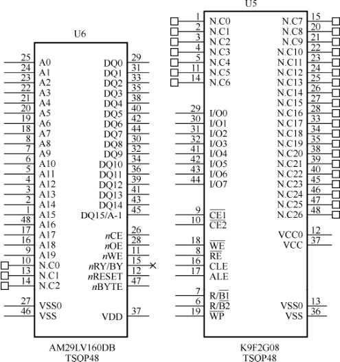
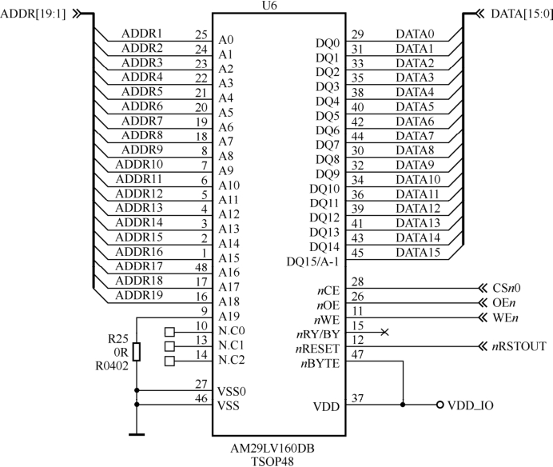
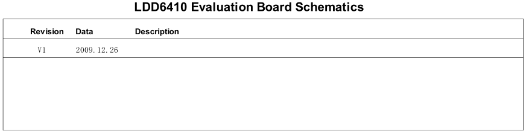

### 2.5.2 原理图的分析方法

原理图的分析方法是以CPU为中心向存储器和外设辐射，步骤如下。

（1）阅读CPU部分，获知CPU的哪些片选、中断和集成的外设控制器被使用，列出这些元素a、b、c…。

CPU引脚比较多的时候，芯片可能会被分成几个模块单独被画在原理图的不同页上，这时候应该把相应的部分都分析到位。

（2）对第一步中列出的元素从原理图中对应的外设和存储器电路中分析出实际的使用情况。

硬件原理图中包含如下元素。

● 符号（symbol）。

symbol描述芯片的外围引脚以及引脚的信号，对于复杂的芯片，可能被分割为几个symbol。在symbol中，一般把属于同一个信号群的引脚排列在一起。图2.23所示为NOR Flash AM29LV160DB 和NAND Flash K9F2G08的symbol。

● 网络（net）。

描述芯片、接插件和分离元器件引脚之间的互连关系，每个网络需要根据信号的定义赋予一个合适的名字，如果没有给网络取名字，EDA软件会自动添加一个默认的网络名。添加网络后的AM29LV160DB如图2.24所示。

● 描述

原理图中会添加一些文字来辅助描述原理图（类似源代码中的注释），如每页页脚会有该页的功能描述，对重要的信号，在原理图的相应symbol和net也会附带文字说明。图2.25中给出了原理图中描述的例子。

