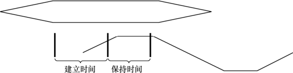

### 2.6.1 时序分析的概念

驱动工程师一般不需要分析硬件的时序，但是鉴于许多企业内驱动工程师还需要承担电路板调试的任务，因此，掌握时序分析的方法也就比较必要了。

对驱动工程师或硬件工程师而言，时序分析的意思是让芯片之间的访问满足芯片手册中时序图信号有效的先后顺序、采样建立时间（setup time）和保持时间（hold time）的要求，在电路板工作不正常的时候，准确地定位时序方面的问题。

建立时间是指在触发器的时钟信号边沿到来以前，数据已经保持稳定不变的时间，如果建立时间不够，数据将不能在这个时钟边沿被打入触发器；保持时间是指在触发器的时钟信号边沿到来以后，数据还需稳定不变的时间，如果保持时间不够，数据同样不能被打入触发器。如图2.26所示，数据稳定传输必须满足建立和保持时间的要求，当然在一些情况下，建立时间和保持时间的值可以为零。

在工具方面，SynaptiCAD公司的Timing Diagrammer Pro是一种非常好的数字/模拟时序图编辑器及分析引擎。

