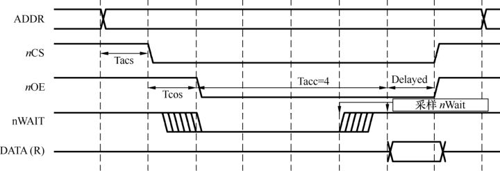

### 2.6.2 典型硬件时序

最典型的硬件时序是SRAM的读写时序，在读/写过程中涉及的信号包括地址、数据、片选、读/写、字节使能和就绪/忙。对于一个16位、32位（甚至64位）的SRAM，字节使能表明哪些字节被读写。

图2.27给出了SRAM的一个读时序，写时序与此相似。首先是地址总线上输出要读写的地址，然后SRAM片选被发出，接着读/写信号被输出，之后读写信号要经历数个等待周期。当SRAM读写速度比较慢时，等待周期可以由MCU的相应寄存器设置，也可以通过设备就绪/忙（如图2.27中的nWait）向CPU报告，这样，读写过程中会自动添加等待周期。

NOR Flash和许多外设控制芯片都使用了类似SRAM的访问时序，因此，牢固掌握这个时序意义重大。一般，在芯片数据手册给出的时序图中，会给出图中各段时间的含义和要求，真实的电路板必须满足芯片手册上描述的建立时间和保持时间的最小要求。

