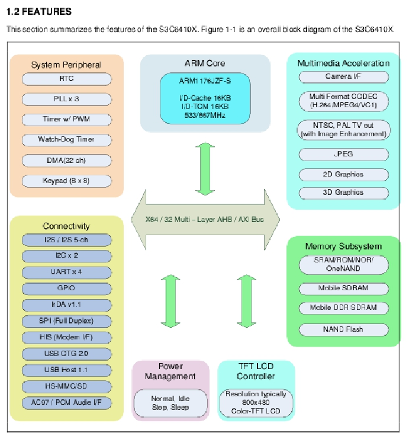
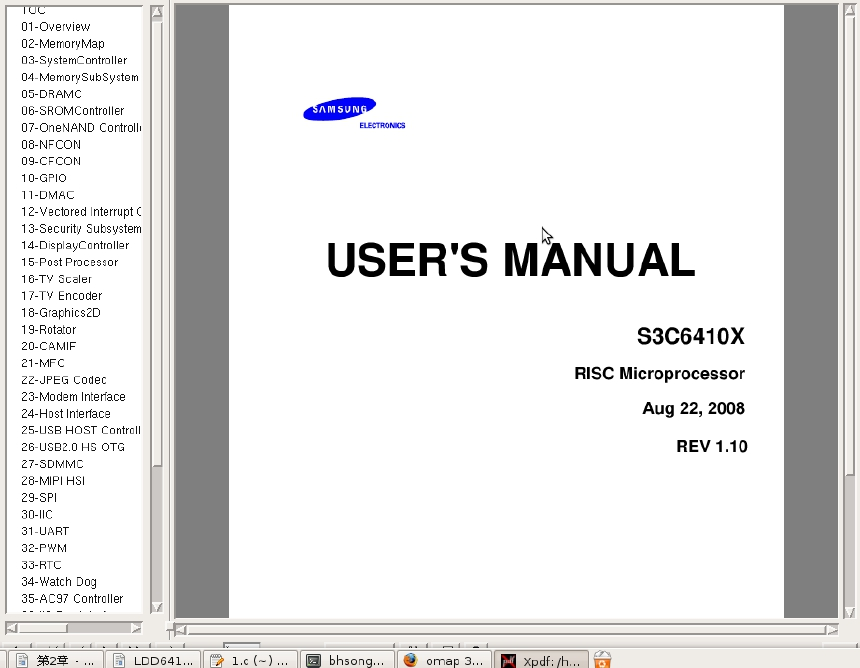
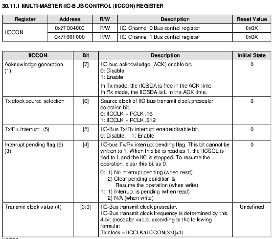
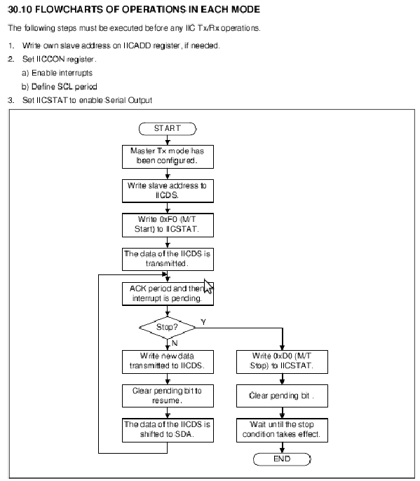

### 2.7 芯片手册阅读方法

芯片手册往往长达数百页甚至上千页，而且全部是英文，从头到尾不加区分地阅读需要花费非常长的时间，而且不一定能获取对设计设备驱动有帮助的信息。芯片手册的正确阅读方法是快速而准确地定位有用信息，重点阅读这些信息，忽略无关内容。下面以S3C6410A 的datasheet为例来分析阅读方法，为了直观地反映阅读过程，本节的图都直接从手册中抓屏而得。

打开S3C6410 A的datasheet，发现页数为1378页，阅读这样的数据手册所花费的时间足够完成整个驱动的设计工作了。

S3C6410A datasheet的第1章“PRODUCT OVERVIEW”即“产品综述”是必读的，通过阅读这一部分可以获知整个芯片的组成。这一章往往会给出一个芯片的整体结构图，并对芯片内的主要模块进行一个简洁的描述。如图2.28所示，S3C6410A的整体结构图在第61页出现。

第2～43章每一章都对应S3C6410A整体结构图中的一个模块，图2.29为从Adobe Acrobat中直接抓出的S3C6410A datasheet目录结构图。

第2章“MemoryMap”即“内存映射”比较关键，对于定位存储器和外设所对应的基地址有直接指导意义，这一部分应该细看。

第3～34章对应于CPU内部集成的外设或总线控制器，当具体编写某一接口的驱动时，应该详细阅读，主要是要分析数据、控制、地址寄存器（datasheet中一般会以表格列出）的访问控制和具体设备的操作流程（datasheet中会给出步骤，有的还会给出流程图）。譬如为了编写S3C6410A的I2C控制器驱动，我们需要详细阅读类似图2.30的寄存器定义表格和图2.31的操作流程图。

第44章“ELECTRICAL DATA”即“电气数据”，描述芯片的电气特性，如电压、电流和各种工作模式下的时序及建立时间和保持时间的要求。所有的datasheet都会包含类似章节，这一章对于硬件工程师比较关键，但是，一般来说，驱动工程师并不需阅读。

第45章“MECHANICAL DATA”即“机械数据”，描述芯片的物理特性、尺寸和封装，硬件工程师会依据这一章绘制芯片的封装（footprint），但是，驱动工程师无需阅读。

