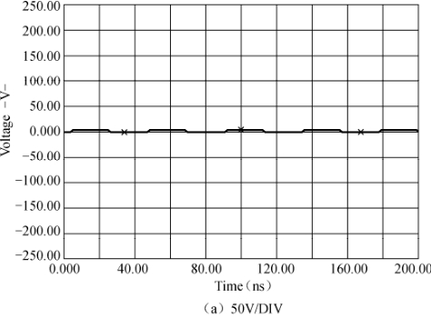
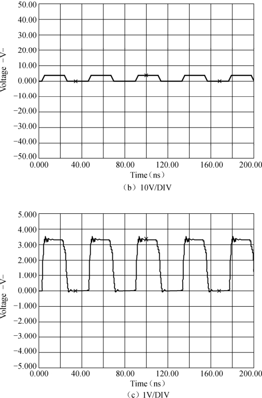
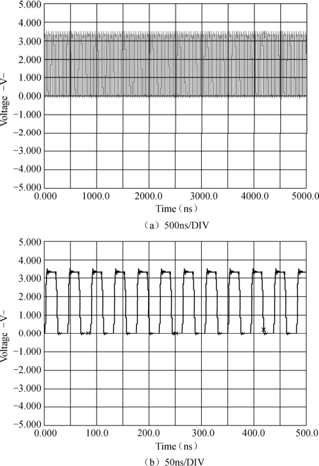

### 2.8.2 示波器

示波器是利用电子示波管的特性，将人眼无法直接观测的交变电信号转换成图像，显示在荧光屏上以便测量的电子仪器。它是观察数字电路实验现象、分析实验中的问题、测量实验结果必不可少的重要仪器。

使用示波器主要应注意调节垂直偏转因数选择（VOLTS/DIV）和微调、时基选择（TIME/DIV）和微调以及触发方式。

如果VOLTS/DIV设置不合理，则可能造成电压幅度超出整个屏幕或在屏幕上变动太过微小无法观测的现象。图2.32所示为同一个波形在VOLTS/DIV设置由大到小变化过程中的示意图。

如果TIME/DIV设置不合适，则可能造成波形混迭。混迭意味着屏幕上显示的波形频率低于信号的实际频率。这时候，可以通过慢慢改变扫速TIME/DIV到较快的时基挡，如果波形的频率参数急剧改变或者晃动的波形在某个较快的时基挡稳定下来，说明之前发生了波形混迭。根据奈奎斯特定理，采样速率至少高于信号高频成分的2倍才不会发生混迭，如一个500MHz的信号，

至少需要1GS/s的采样速率。图2.33所示为同一个波形在TIME/DIV设置由小到大变化过程中的示意图。

示波器的触发能使信号在正确的位置点同步水平扫描，使信号特性清晰。触发控制按钮可以稳定重复的波形并捕获单次波形。大多数用示波器的用户只采用边沿触发方式，如果拥有其他触发能力在某些应用上是非常有用的，特别是对新设计产品的故障查询，先进的触发方式可将所关心的事件分离出来，找出用户关心的非正常问题，从而最有效地利用采样速率和存储深度。触发能力的提高可以较大提高测试过程的灵活性。

