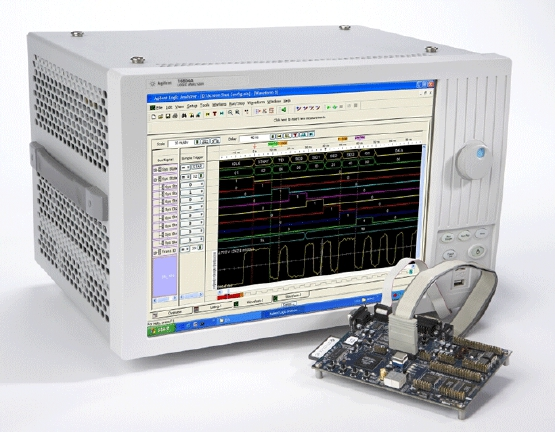
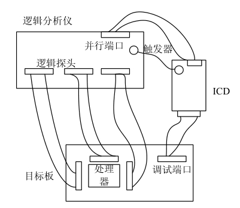

### 2.8.3 逻辑分析仪

逻辑分析仪是利用时钟从测试设备上采集数字信号并进行显示的仪器，其最主要的作用是用于时序的判定。与示波器不同，逻辑分析仪并不具备许多电压等级，通常只显示两个电压（逻辑1和0）。在设定了参考电压之后，逻辑分析仪对待测试信号通过比较器来进行判定，高于参考电压者为High，低于参考电压者为Low。

例如，如果以n MHz采样率测量一个信号，逻辑分析仪会以1 000/n ns为周期采样信号，当参考电压设定为1.5V时，超过1.5V则判定为1，低于1.5V则为0，将逻辑1和0连接成连续的波形，工程师依据此连续波形可寻找时序问题。

高端的逻辑分析仪会安装有Windows XP操作系统并提供非常友善的逻辑分析应用软件，在其中可方便地编辑探针、信号并察看波形，如图2.34所示。

逻辑分析仪的波形可以显示地址、数据、控制信号及任意外部探勾信号的变化轨迹，在使用之前应先编辑每个探钩的信号名。

逻辑分析仪具有超强的逻辑跟踪分析功能，它可以捕获并记录嵌入式处理器的总线周期，也可以捕获如实时跟踪用的ETM接口的程序执行信息，并对这些记录进行分析、译码并还原出应用程序的执行过程。因此，可使用逻辑分析仪通过触发接口与ICD（在线调试器）协调工作以补充ICD在跟踪功能方面的不足。逻辑分析仪与ICD协作可为工程师提供断点、触发和跟踪调试手段，如图2.35所示。

ICD是一个容易与ICE（在线仿真器）混淆的概念，ICE本身需要完全仿真CPU的行为，可以从物理上完全替代CPU，而ICD则只是与芯片内部提供的嵌入式ICE单元通过JTAG等接口互通。因此，对ICD的硬件性能要求远低于ICE。目前市面上出现的很多号称为ICE的产品实际上是ICD，如ARM公司的Multi-ICE、WindRiver公司的visionICE和visionProbe等。

