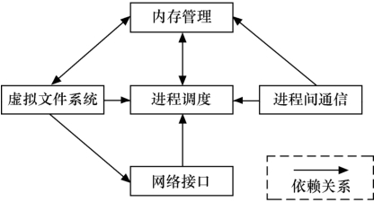
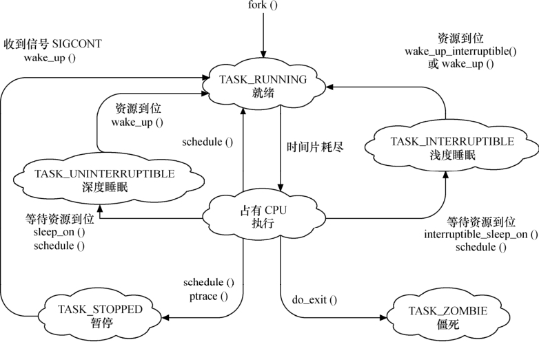
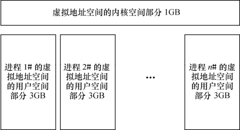
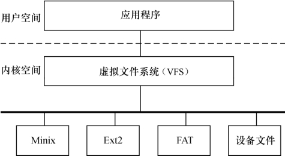
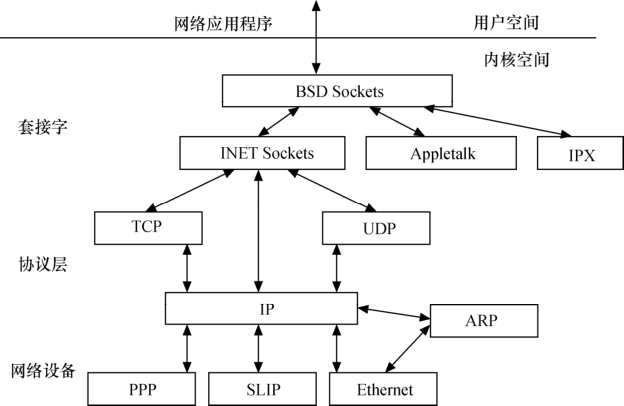

### 3.3.2 Linux内核的组成部分

如图3.1所示，Linux内核主要由进程调度（SCHED）、内存管理（MM）、虚拟文件系统（VFS）、网络接口（NET）和进程间通信（IPC）5个子系统组成。

#### 1．进程调度

进程调度控制系统中的多个进程对CPU的访问，使得多个进程能在CPU中“微观串行，宏观并行”地执行。进程调度处于系统的中心位置，内核中其他的子系统都依赖它，因为每个子系统都需要挂起或恢复进程。

如图3.2所示，Linux的进程在几个状态间进行切换。在设备驱动编程中，当请求的资源不能得到满足时，驱动一般会调度其他进程执行，并使本进程进入睡眠状态，直到它请求的资源被释放，才会被唤醒而进入就绪态。睡眠分成可被打断的睡眠和不可被打断的睡眠，两者的区别在于可被打断的睡眠在收到信号的时候会醒。

在设备驱动编程中，当请求的资源不能得到满足时，驱动一般会调度其他进程执行，其对应进程进入睡眠状态，直到它请求的资源被释放，才会被唤醒而进入就绪态。

设备驱动中，如果需要几个并发执行的任务，可以启动内核线程，启动内核线程的函数为：

pid_t kernel_thread(int (*fn)(void *), void *arg, unsigned long flags);

#### 2．内存管理

内存管理的主要作用是控制多个进程安全地共享主内存区域。当CPU提供内存管理单元（MMU）时，Linux内存管理完成为每个进程进行虚拟内存到物理内存的转换。Linux 2.6引入了对无MMU CPU的支持。

如图3.3所示，一般而言，Linux的每个进程享有4GB的内存空间，0～3GB属于用户空间，3～4GB属于内核空间，内核空间对常规内存、I/O设备内存以及高端内存存在不同的处理方式。

#### 3．虚拟文件系统

如图3.4所示，Linux虚拟文件系统（VFS）隐藏各种了硬件的具体细节，为所有的设备提供了统一的接口。而且，它独立于各个具体的文件系统，是对各种文件系统的一个抽象，它使用超级块super block存放文件系统相关信息，使用索引节点inode存放文件的物理信息，使用目录项dentry存放文件的逻辑信息。

#### 4．网络接口

网络接口提供了对各种网络标准的存取和各种网络硬件的支持。如图3.5所示，在Linux中网络接口可分为网络协议和网络驱动程序，网络协议部分负责实现每一种可能的网络传输协议，网络设备驱动程序负责与硬件设备通信，每一种可能的硬件设备都有相应的设备驱动程序。

#### 5．进程通信

进程通信支持提供进程之间的通信，Linux支持进程间的多种通信机制，包含信号量、共享内存、管道等，这些机制可协助多个进程、多资源的互斥访问、进程间的同步和消息传递。

Linux内核的5个组成部分之间的依赖关系如下。

● 进程调度与内存管理之间的关系：这两个子系统互相依赖。在多道程序环境下，程序要运行必须为之创建进程，而创建进程的第一件事情，就是将程序和数据装入内存。

● 进程间通信与内存管理的关系：进程间通信子系统要依赖内存管理支持共享内存通信机制，这种机制允许两个进程除了拥有自己的私有空间，还可以存取共同的内存区域。

● 虚拟文件系统与网络接口之间的关系：虚拟文件系统利用网络接口支持网络文件系统(NFS)，也利用内存管理支持RAMDISK设备。

● 内存管理与虚拟文件系统之间的关系：内存管理利用虚拟文件系统支持交换，交换进程（swapd）定期由调度程序调度，这也是内存管理依赖于进程调度的惟一原因。当一个进程存取的内存映射被换出时，内存管理向文件系统发出请求，同时，挂起当前正在运行的进程。

除了这些依赖关系外，内核中的所有子系统还要依赖于一些共同的资源。这些资源包括所有子系统都用到的例程，如分配和释放内存空间的函数、打印警告或错误信息的函数及系统提供的调试例程等。

