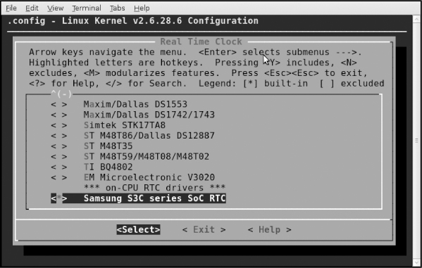
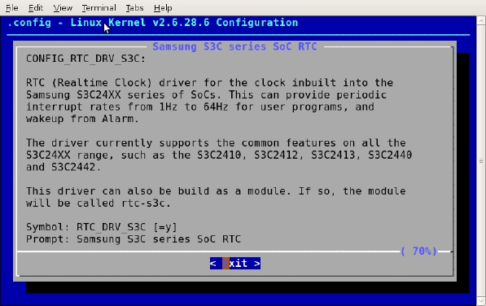

### 3.4.2 Kconfig和Makefile

在Linux内核中增加程序需要完成以下3项工作。

● 将编写的源代码拷入Linux内核源代码的相应目录。

● 在目录的Kconfig文件中增加关于新源代码对应项目的编译配置选项。

● 在目录的Makefile文件中增加对新源代码的编译条目。

#### 1．实例引导：S3C6410处理器的RTC驱动配置

在讲解Kconfig和Makefile的语法之前，我们先利用两个简单的实例引导读者建立初步的认识。

首先，在linux-2.6.28-samsung/drivers/rtc目录中包含了S3C6410处理器的RTC设备驱动源代码rtc-s3c.c。

而在该目录的Kconfig文件中包含关于RTC_DRV_S3C的配置项目：

config RTC_DRV_S3C 
 
 tristate "Samsung S3C series SoC RTC" 
 
 depends on ARCH_S3C2410 || ARCH_S3C64XX || ARCH_S5PC1XX || ARCH_S5P64XX

help 
 
 RTC (Realtime Clock) driver for the clock inbuilt into the 
 
 Samsung S3C24XX series of SoCs. This can provide periodic 
 
 interrupt rates from 1Hz to 64Hz for user programs, and 
 
 wakeup from Alarm.

The driver currently supports the common features on all the 
 
 S3C24XX range, such as the S3C2410, S3C2412, S3C2413, S3C2440 
 
 and S3C2442.

This driver can also be build as a module. If so, the module 
 
 will be called rtc-s3c.

上述Kconfig文件的这段脚本意味着只有在ARCH_S3C2410、ARCH_S3C64XX、ARCH_ S5PC1XX或ARCH_S5P64XX项目之一被配置的情况下，才会出现RTC_DRV_S3C配置项目，这个配置项目为三态（可编译入内核，可不编译，也可编译为内核模块，选项分别为“Y”、“N”和“M”），菜单上显示的字符串为“Samsung S3C series SoC RTC”，“help”后面的内容为帮助信息。图3.7显示了RTC_DRV_S3C菜单以及其help在运行make menuconfig时的情况。

除了布尔型的配置项目外，还存在一种布尔型（bool）配置选项，它意味着要么编译入内核，要么不编译，选项为“Y”或“N”。

在目录的Makefile中关于RTC_DRV_S3C的编译脚本为：

obj-$(CONFIG_RTC_DRV_S3C) += rtc-s3c.o

上述脚本意味着如果RTC_DRV_S3C配置选项被选择为“Y”或“M”，即obj-$(CONFIG_RTC_ DRV_S3C)等同于obj-y或obj-m时，则编译rtc-s3c.c，选“Y”的情况直接会将生成的目标代码直接连接到内核，为“M”的情况则会生成模块rtc-s3c.ko；如果RTC_DRV_S3C配置选项被选择为“N”，即obj-$(CONFIG_RTC_DRV_S3C)等同于obj-n时，则不编译rtc-s3c.c。

一般而言，驱动工程师只会在内核源代码的drivers目录的相应子目录中增加新设备驱动的源代码，并增加或修改Kconfig配置脚本和Makefile脚本，完全仿照上述过程执行即可。

#### 2．Makefile

这里主要对内核源代码各级子目录中的kbuild（内核的编译系统）Makefile进行简单介绍，这部分是内核模块或设备驱动的开发者最常接触到的。

Makefile的语法包括如下几个方面。

（1）目标定义。

目标定义就是用来定义哪些内容要作为模块编译，哪些要编译并连接进内核。

例如：

obj-y += foo.o

表示要由foo.c或者foo.s文件编译得到foo.o并连接进内核，而obj-m则表示该文件要作为模块编译。除了y、m以外的obj-x形式的目标都不会被编译。

而更常见的做法是根据.config文件的CONFIG_变量来决定文件的编译方式，如：

obj-$(CONFIG_ISDN) += isdn.o 
 
 obj-$(CONFIG_ISDN_PPP_BSDCOMP) += isdn_bsdcomp.o

除了obj-形式的目标以外，还有lib-y library库，hostprogs-y主机程序等目标，但是基本都应用在特定的目录和场合下。

（2）多文件模块的定义。

最简单的Makefile如上一节一句话的形式就够了，如果一个模块由多个文件组成，会稍微复杂一些，这时候应采用模块名加-y或-objs后缀的形式来定义模块的组成文件。如以下例子：

# 
 
 # Makefile for the linux ext2-filesystem routines. 
 
 #

obj-$(CONFIG_EXT2_FS) += ext2.o 
 
 ext2-y := balloc.o dir.o file.o fsync.o ialloc.o inode.o \ 
 
 ioctl.o namei.o super.o symlink.o 
 
 ext2-$(CONFIG_EXT2_FS_XATTR) += xattr.o xattr_user.o xattr_trusted.o 
 
 ext2-$(CONFIG_EXT2_FS_POSIX_ACL) += acl.o 
 
 ext2-$(CONFIG_EXT2_FS_SECURITY) += xattr_security.o 
 
 ext2-$(CONFIG_EXT2_FS_XIP) += xip.o

模块的名字为ext2，由balloc.o、dir.o、file.o等多个目标文件最终链接生成ext2.o直至ext2.ko文件，并且是否包括xattr.o、acl.o等则取决于内核配置文件的配置情况，例如，如果CONFIG_ EXT2_FS_POSIX_ACL被选择，则编译acl.c得到acl.o并最终链接进ext2。

（3）目录层次的迭代。

如下例：

obj-$(CONFIG_EXT2_FS) += ext2/

当CONFIG_EXT2_FS 的值为y或m时，kbuild将会把ext2目录列入向下迭代的目标中。

#### 3．Kconfig

内核配置脚本文件的语法也比较简单，主要包括如下几个方面。

（1）菜单入口。

大多数的内核配置选项都对应Kconfig中的一个菜单入口：

config MODVERSIONS 
 
 bool "Module versioning support" 
 
 help 
 
 Usually, you have to use modules compiled with your kernel. 
 
 Saying Y here makes it ...

“config”关键字定义新的配置选项，之后的几行定义了该配置选项的属性。配置选项的属性包括类型、数据范围、输入提示、依赖关系、选择关系及帮助信息和默认值等。

每个配置选项都必须指定类型，类型包括bool、tristate、string、hex和int，其中tristate 和string是两种基本的类型，其他类型都基于这两种基本类型。类型定义后可以紧跟输入提示，下面的两段脚本是等价的：

bool "Networking support"

和

bool 
 
 prompt "Networking support"

输入提示的一般格式为：

prompt <prompt> [if <expr>]

其中可选的if用来表示该提示的依赖关系。

默认值的格式为：

default <expr> [if <expr>]

一个配置选项可以存在任意多个默认值，这种情况下，只有第一个被定义的值是可用的。如果用户不设置对应的选项，配置选项的值就是默认值。

依赖关系的格式为：

depends on（或者requires） <expr>

如果定义了多重依赖关系，它们之间用“&&”间隔。依赖关系也可以应用到该菜单中所有的其他选项(同样接受if表达式)，下面的两段脚本是等价的：

bool "foo" if BAR 
 
 default y if BAR

和

depends on BAR 
 
 bool "foo" 
 
 default y

选择关系（也称为反向依赖关系）的格式为：

select <symbol> [if <expr>]

A如果选择了B，则在A被选中的情况下，B自动被选中。

kbuild Makefile中的expr（表达式）定义为：

<expr> ::= <symbol> 
 
 <symbol> '=' <symbol> 
 
 <symbol> '!=' <symbol> 
 
 '(' <expr> ')' 
 
 '!' <expr> 
 
 <expr> '&&' <expr> 
 
 <expr> '||' <expr>

也就是说expr是由symbol、两个symbol相等、两个symbol不等以及expr的赋值、非、与或运算构成。而symbol分为两类，一类是由菜单入口定义配置选项定义的非常数symbol，另一类是作为expr组成部分的常数symbol。

数据范围的格式为：

range <symbol> <symbol> [if <expr>]

为int和hex类型的选项设置可以接受输入值范围，用户只能输入大于等于第一个symbol，小于等于第二个symbol的值。

帮助信息的格式为：

help（或---help---） 
 
 开始 
 
 … 
 
 结束

帮助信息完全靠文本缩进识别结束。“---help---”和“help”在作用上没有区别，设计“---help---”的初衷在于将文件中的配置逻辑与给开发人员的提示分开。

menuconfig关键字的作用与config类似，但它在config的基础上要求所有的子选项作为独立的行显示。

（2）菜单结构。

菜单入口在菜单树结构中的位置可由两种方法决定。第一种方式为：

menu "Network device support" 
 
 depends on NET 
 
 config NETDEVICES 
 
 … 
 
 endmenu

所有处于“menu”和“endmenu”之间的菜单入口都会成为“Network device support”的子菜单。而且，所有子菜单选项都会继承父菜单的依赖关系，比如，“Network device support”对“NET”的依赖会被加到了配置选项NETDEVICES的依赖列表中。

注意menu后面跟的“Network device support”项目仅仅是1个菜单，没有对应真实的配置选项，也不具备3种不同的状态。这是它和config的区别。

另一种方式是通过分析依赖关系生成菜单结构。如果菜单选项在一定程度上依赖于前面的选项，它就能成为该选项的子菜单。如果父选项为“N”，子选项不可见；如果父选项可见，子选项才能可见。例如：

config MODULES 
 
 bool "Enable loadable module support"

config MODVERSIONS 
 
 bool "Set version information on all module symbols" 
 
 depends on MODULES

comment "module support disabled" 
 
 depends on !MODULES

MODVERSIONS直接依赖 MODULES，只有MODULES不为“n”时，该选项才可见。

除此之外，Kconfig中还可能使用“choices … endchoice”、“comment”、“if…endif”这样的语法结构。其中“choices … endchoice”的结构为：

choice 
 
 <choice options> 
 
 <choice block> 
 
 endchoice"

它定义一个选择群，其接受的选项（choice options）可以是前面描述的任何属性，例如LDD6410 的VGA输出分辨率可以是1 024×768或者800×600，在drivers/video/samsung/Kconfig就定义了如下的choice：

choice 
 
 depends on FB_S3C_VGA 
 
 prompt "Select VGA Resolution for S3C Framebuffer" 
 
 default FB_S3C_VGA_1024_768 
 
 config FB_S3C_VGA_1024_768 
 
 bool "1 024*768@60Hz" 
 
 ---help--- 
 
 TBA 
 
 config FB_S3C_VGA_640_480 
 
 bool "640*480@60Hz" 
 
 ---help--- 
 
 TBA 
 
 endchoice

Kconfig配置脚本和Makefile脚本编写的更详细信息，可以分别参看内核文档Documentation目录的kbuild子目录下的Kconfig-language.txt和Makefiles.txt文件。

#### 4．应用实例：在内核中新增驱动代码目录和子目录

下面来看一个综合实例，假设我们要在内核源代码drivers目录下为ARM体系结构新增如下用于test driver的树型目录：

|--test 
 
 |-- cpu 
 
 | -- cpu.c 
 
 |-- test.c 
 
 |-- test_client.c 
 
 |-- test_ioctl.c 
 
 |-- test_proc.c 
 
 |-- test_queue.c

在内核中增加目录和子目录，我们需为相应的新增目录创建Makefile和Kconfig文件，而新增目录的父目录中的Kconfig和Makefile也需修改，以便新增的Kconfig和Makefile能被引用。

在新增的test目录下，应该包含如下Kconfig文件：

# 
 
 # TEST driver configuration 
 
 # 
 
 menu "TEST Driver " 
 
 comment " TEST Driver"

config CONFIG_TEST 
 
 bool "TEST support "

config CONFIG_TEST_USER 
 
 tristate "TEST user-space interface" 
 
 depends on CONFIG_TEST

endmenu

由于 test driver 对于内核来说是新的功能，所以需首先创建一个菜单TEST Driver。然后，显示“TEST support”，等待用户选择；接下来判断用户是否选择了TEST Driver，如果是（CONFIG_TEST=y），则进一步显示子功能：用户接口与CPU功能支持；由于用户接口功能可以被编译成内核模块，所以这里的询问语句使用了 tristate。

为了使这个Kconfig能起作用，修改arch/arm/Kconfig文件，增加：

source "drivers/test/Kconfig"

脚本中的source意味着引用新的Kconfig文件。

在新增的test目录下，应该包含如下Makefile文件：

# drivers/test/Makefile 
 
 # 
 
 # Makefile for the TEST. 
 
 # 
 
 obj-$(CONFIG_TEST) += test.o test_queue.o test_client.o 
 
 obj-$(CONFIG_TEST_USER) += test_ioctl.o 
 
 obj-$(CONFIG_PROC_FS) += test_proc.o

obj-$(CONFIG_TEST_CPU) += cpu/

该脚本根据配置变量的取值，构建obj-*列表。由于test目录中包含一个子目录cpu，当CONFIG_TEST_CPU=y时，需要将cpu目录加入列表。

test目录中的cpu子目录也需包含如下的Makefile：

# drivers/test/test/Makefile 
 
 # 
 
 # Makefile for the TEST CPU 
 
 # 
 
 obj-$(CONFIG_TEST_CPU) += cpu.o

为了使得整个test目录能够被编译命令作用到，test目录父目录中的Makefile也需新增如下脚本：

obj-$(CONFIG_TEST) += test/

在 drivers/Makefile 中加入obj-$(CONFIG_TEST) += test/，使得在用户在进行内核编译时能够进入test目录。

增加了Kconfig和Makefile之后的新的test树型目录为：

|--test 
 
 |-- cpu 
 
 | -- cpu.c 
 
 | -- Makefile 
 
 |-- test.c 
 
 |-- test_client.c 
 
 |-- test_ioctl.c 
 
 |-- test_proc.c 
 
 |-- test_queue.c 
 
 |-- Makefile 
 
 |-- Kconfig

