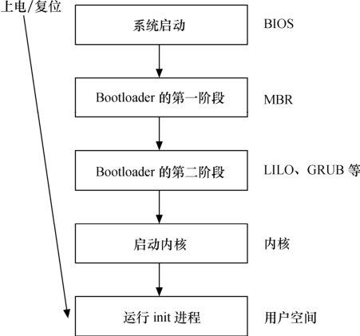

### 3.4.3 Linux内核的引导

引导Linux系统的过程包括很多阶段，这里将以引导X86 PC为例来进行讲解。引导X86 PC上的Linux的过程和引导嵌入式系统上的Linux的过程基本类似。不过在X86 PC上有一个从BIOS（基本输入/输出系统）转移到Bootloader的过程，而嵌入式系统往往复位后就直接运行Bootloader。

图3.8所示为X86 PC上从上电/复位到运行Linux用户空间初始进程的流程。在进入与Linux相关代码之间，会经历如下阶段。

（1）当系统上电或复位时，CPU会将PC指针赋值为一个特定的地址0xFFFF0并执行该地址处的指令。在PC机中，该地址位于BIOS中，它保存在主板上的ROM或Flash中。

（2）BIOS运行时按照CMOS的设置定义的启动设备顺序来搜索处于活动状态并且可以引导的设备。若从硬盘启动，BIOS会将硬盘MBR（主引导记录）中的内容加载到RAM。MBR是一个512字节大小的扇区，位于磁盘上的第一个扇区中（0道0柱面1扇区）。当MBR被加载到RAM中之后，BIOS就会将控制权交给 MBR。

（3）主引导加载程序查找并加载次引导加载程序。它在分区表中查找活动分区，当找到一个活动分区时，扫描分区表中的其他分区，以确保它们都不是活动的。当这个过程验证完成之后，就将活动分区的引导记录从这个设备中读入RAM中并执行它。

（4）次引导加载程序加载Linux内核和可选的初始RAM磁盘，将控制权交给Linux内核源代码。

（5）运行被加载的内核，并启动用户空间应用程序。

嵌入式系统中Linux的引导过程与之类似，但一般更加简洁。不论具体以怎样的方式实现，只要具备如下特征就可以称其为Bootloader。

● 可以在系统上电或复位的时候以某种方式执行，这些方式包括被BIOS引导执行、直接在NOR Flash中执行、NAND Flash中的代码被MCU自动拷入内部或外部RAM执行等。

● 能将U盘、磁盘、光盘、NOR/NAND Flash、ROM、SD卡等存储介质，甚或网口、串口中的操作系统加载到RAM并把控制权交给操作系统源代码执行。

完成上述功能的Bootloader的实现方式非常多样化，甚至本身也可以是一个简化版的操作系统。著名的Linux Bootloader包括应用于PC的LILO和GRUB，应用于嵌入式系统的U-Boot、RedBoot等。

相比较于LILO，GRUB本身能理解EXT2、EXT3文件系统，因此可在文件系统中加载Linux，而LILO只能识别“裸扇区”。

U-Boot的定位为“Universal Bootloader”，其功能比较强大，涵盖了包括PowerPC、ARM、MIPS和X86在内的绝大部分处理器构架，提供网卡、串口、Flash等外设驱动，提供必要的网络协议（BOOTP、DHCP、TFTP），能识别多种文件系统（cramfs、fat、jffs2和registerfs等），并附带了调试、脚本、引导等工具，应用十分广泛。

Redboot是Redhat公司随eCos发布的Bootloader开源项目，除了包含U-Boot类似的强大功能外，它还包含GDB stub（插桩），因此能通过串口或网口与GDB进行通信，调试GCC产生的任何程序（包括内核）。

我们有必要对上述流程的第5个阶段进行更详细的分析，它完成启动内核并运行用户空间的init进程。

当内核映像被加载到RAM之后，Bootloader的控制权被释放，内核阶段就开始了。内核映像并不是完全可直接执行的目标代码，而是一个压缩过的zImage（小内核）或bzImage（大内核，bzImage中的b是“big”的意思）。

但是，并非zImage和bzImage映像中的一切都被压缩了，否则Bootloader把控制权交给这个内核映像它就“傻”了。实际上，映像中包含未被压缩的部分，这部分中包含解压缩程序，解压缩程序会解压映像中被压缩的部分。zImage和bzImage都是用gzip压缩的，它们不仅是一个压缩文件，而且在这两个文件的开头部分内嵌有gzip解压缩代码。

如图3.9所示，当bzImage（用于i386映像）被调用时，它从/arch/i386/boot/head.S的start汇编例程开始执行。这个程序执行一些基本的硬件设置，并调用/arch/i386/boot/compressed/head.S中的startup_32例程。startup_32程序设置一些基本的运行环境（如堆栈）后，清除BSS段，调用/arch/ i386/boot/compressed/misc.c中的decompress_kernel() C函数解压内核。内核被解压到内存中之后，会再调用/arch/i386/kernel/head.S文件中的startup_32例程，这个新的startup_32例程（称为清除程序或进程0）会初始化页表，并启用内存分页机制，接着为任何可选的浮点单元（FPU）检测CPU的类型，并将其存储起来供以后使用。这些都做完之后，/init/main.c中的start_kernel()函数被调用，进入与体系结构无关的Linux内核部分。

start_kernel()会调用一系列初始化函数来设置中断，执行进一步的内存配置。之后，/arch/ i386/kernel/process.c中kernel_thread()被调用以启动第一个核心线程，该线程执行init()函数，而原执行序列会调用cpu_idle()等待调度。

作为核心线程的init()函数完成外设及其驱动程序的加载和初始化，挂接根文件系统。init()打开/dev/console设备，重定向stdin、stdout和stderr到控制台。之后，它搜索文件系统中的init程序（也可以由“init=”命令行参数指定init程序），并使用execve()系统调用执行init程序。搜索init程序的顺序为：/sbin/init、/etc/init、/bin/init和/bin/sh。在嵌入式系统中，多数情况下，可以给内核传入一个简单的 shell 脚本来启动必需的嵌入式应用程序。

至此，漫长的Linux内核引导和启动过程就此结束，而init()对应的这个由start_kernel()创建的第一个线程也进入用户模式。

