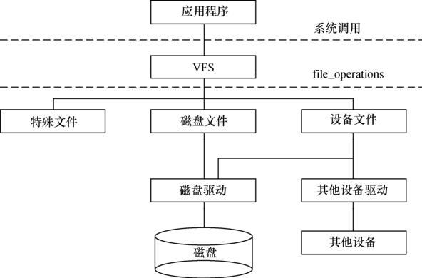

### 5.2.2 Linux文件系统与设备驱动

图5.1所示为Linux中虚拟文件系统、磁盘文件（存放于Ramdisk、Flash、ROM、SD卡、U盘等文件系统中的文件也属于此列）及一般的设备文件与设备驱动程序之间的关系。

应用程序和VFS之间的接口是系统调用，而VFS与磁盘文件系统以及普通设备之间的接口是file_operations结构体成员函数，这个结构体包含对文件进行打开、关闭、读写、控制的一系列成员函数。

由于字符设备的上层没有磁盘文件系统，所以字符设备的file_operations成员函数就直接由设备驱动提供了，在稍后的第6章，将会看到file_operations正是字符设备驱动的核心。

而对于块存储设备而言，ext2、fat、jffs2等文件系统中会实现针对VFS的file_operations成员函数，设备驱动层将看不到file_operations的存在。磁盘文件系统和设备驱动会将对磁盘上文件的访问最终转换成对磁盘上柱面和扇区的访问。

在设备驱动程序的设计中，一般而言，会关心file和inode这两个结构体。

#### 1．file结构体

file结构体代表一个打开的文件（设备对应于设备文件），系统中每个打开的文件在内核空间都有一个关联的struct file。它由内核在打开文件时创建，并传递给在文件上进行操作的任何函数。在文件的所有实例都关闭后，内核释放这个数据结构。在内核和驱动源代码中，struct file的指针通常被命名为file或filp（即file pointer）。代码清单5.3给出了文件结构体的定义。

代码清单5.3 文件结构体

1 struct file 
 
 2 { 
 
 3 union { 
 
 4 struct list_head fu_list; 
 
 5 struct rcu_head fu_rcuhead; 
 
 6 } f_u; 
 
 7 struct dentry *f_dentry; /*与文件关联的目录入口(dentry)结构*/ 
 
 8 struct vfsmount *f_vfsmnt; 
 
 9 struct file_operations *f_op; /* 和文件关联的操作*/ 
 
 10 atomic_t f_count; 
 
 11 unsigned int f_flags;/*文件标志，如O_RDONLY、O_NONBLOCK、O_SYNC*/ 
 
 12 mode_t f_mode; /*文件读/写模式，FMODE_READ和FMODE_WRITE*/ 
 
 13 loff_t f_pos; /* 当前读写位置*/ 
 
 14 struct fown_struct f_owner; 
 
 15 unsigned int f_uid, f_gid; 
 
 16 struct file_ra_state f_ra; 
 
 17 
 
 18 unsigned long f_version; 
 
 19 void *f_security; 
 
 20 
 
 21 /* tty驱动需要，其他的也许需要 */ 
 
 22 void *private_data; /*文件私有数据*/ 
 
 23 ... 
 
 24 struct address_space *f_mapping; 
 
 25 };

文件读/写模式mode、标志f_flags都是设备驱动关心的内容，而私有数据指针private_data在设备驱动中被广泛应用，大多被指向设备驱动自定义用于描述设备的结构体。

驱动程序中经常会使用如下类似的代码来检测用户打开文件的读写方式：

if (file->f_mode & FMODE_WRITE) {/* 用户要求可写 */

} 
 
 if (file->f_mode & FMODE_READ) {/* 用户要求可读 */

}

下面的代码可用于判断以阻塞还是非阻塞方式打开设备文件：

if (file->f_flags & O_NONBLOCK) /* 非阻塞 */ 
 
 pr_debug("open: non-blocking\n"); 
 
 else /* 阻塞 */ 
 
 pr_debug("open: blocking\n");

#### 2．inode结构体

VFS inode包含文件访问权限、属主、组、大小、生成时间、访问时间、最后修改时间等信息。它是Linux管理文件系统的最基本单位，也是文件系统连接任何子目录、文件的桥梁，inode结构体的定义如代码清单5.4所示。

代码清单5.4 inode结构体

1 struct inode { 
 
 2 ... 
 
 3 umode_t i_mode; /* inode的权限 */ 
 
 4 uid_t i_uid; /* inode拥有者的id */ 
 
 5 gid_t i_gid; /* inode所属的群组id */ 
 
 6 dev_t i_rdev; /* 若是设备文件，此字段将记录设备的设备号 */ 
 
 7 loff_t i_size; /* inode所代表的文件大小 */ 
 
 8 
 
 9 struct timespec i_atime; /* inode最近一次的存取时间 */ 
 
 10 struct timespec i_mtime; /* inode最近一次的修改时间 */ 
 
 11 struct timespec i_ctime; /* inode的产生时间 */ 
 
 12 
 
 13 unsigned long i_blksize; /* inode在做I/O时的区块大小 */ 
 
 14 unsigned long i_blocks; /* inode所使用的block数，一个block为512 byte*/ 
 
 15 
 
 16 struct block_device *i_bdev; 
 
 17 /*若是块设备，为其对应的block_device结构体指针*/ 
 
 18 struct cdev *i_cdev; /*若是字符设备，为其对应的cdev结构体指针*/ 
 
 19 ... 
 
 20 };

对于表示设备文件的inode结构，i_rdev字段包含设备编号。Linux 2.6设备编号分为主设备编号和次设备编号，前者为dev_t的高12位，后者为dev_t的低20位。下列操作用于从一个inode中获得主设备号和次设备号：

unsigned int iminor(struct inode *inode); 
 
 unsigned int imajor(struct inode *inode);

查看/proc/devices文件可以获知系统中注册的设备，第1列为主设备号，第2列为设备名，如：

Character devices: 
 
 1 mem 
 
 2 pty 
 
 3 ttyp 
 
 4 /dev/vc/0 
 
 4 tty 
 
 5 /dev/tty 
 
 5 /dev/console 
 
 5 /dev/ptmx 
 
 7 vcs 
 
 10 misc 
 
 13 input 
 
 21 sg 
 
 29 fb 
 
 128 ptm

136 pts 
 
 171 ieee1394 
 
 180 usb 
 
 189 usb_device

Block devices: 
 
 1 ramdisk 
 
 2 fd 
 
 8 sd 
 
 9 md 
 
 22 ide1 
 
 ...

查看/dev目录可以获知系统中包含的设备文件，日期的前两列给出了对应设备的主设备号和次设备号：

crw-rw---- 1 root uucp 4, 64 Jan 30 2003 /dev/ttyS0 
 
 brw-rw---- 1 root disk 8, 0 Jan 30 2003 /dev/sda

主设备号是与驱动对应的概念，同一类设备一般使用相同的主设备号，不同类的设备一般使用不同的主设备号（但是也不排除在同一主设备号下包含有一定差异的设备）。因为同一驱动可支持多个同类设备，因此用次设备号来描述使用该驱动的设备的序号，序号一般从0开始。

内核Documents目录下的devices.txt文件描述了Linux设备号的分配情况，它由LANANA（The Linux Assigned Names And Numbers Authority，网址：http://www.lanana.org/）组织维护，Torben Mathiasen（device@lanana.org）是其中的主要维护者。

