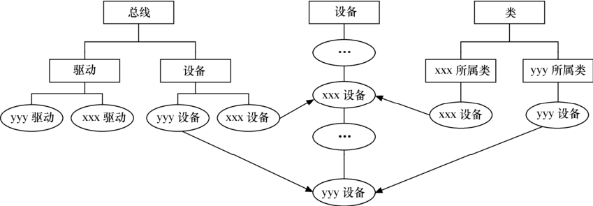

### 5.4.2 sysfs文件系统与Linux设备模型

Linux 2.6的内核引入了sysfs文件系统，sysfs被看成是与proc、devfs和devpty同类别的文件系统，该文件系统是一个虚拟的文件系统，它可以产生一个包括所有系统硬件的层级视图，与提供进程和状态信息的proc文件系统十分类似。

sysfs把连接在系统上的设备和总线组织成为一个分级的文件，它们可以由用户空间存取，向用户空间导出内核数据结构以及它们的属性。sysfs的一个目的就是展示设备驱动模型中各组件的层次关系，其顶级目录包括block、device、bus、drivers、class、power和firmware。

block目录包含所有的块设备；devices目录包含系统所有的设备，并根据设备挂接的总线类型组织成层次结构；bus目录包含系统中所有的总线类型；drivers目录包括内核中所有已注册的设备驱动程序；class目录包含系统中的设备类型（如网卡设备、声卡设备、输入设备等）。在/sys目录运行tree会得到一个相当长的树型目录，下面摘取一部分：

|-- block 
 
 | |-- fd0 
 
 | |-- md0 
 
 | |-- ram0 
 
 | |-- ram1 
 
 | |-- ... 
 
 |-- bus 
 
 | |-- eisa 
 
 | | |-- devices 
 
 | | '-- drivers 
 
 | |-- ide 
 
 | |-- ieee1394 
 
 | |-- pci 
 
 | | |-- devices 
 
 | | | |-- 0000:00:00.0 -> ../../../devices/pci0000:00/0000:00:00.0 
 
 | | | |-- 0000:00:01.0 -> ../../../devices/pci0000:00/0000:00:01.0 
 
 | | | |-- 0000:00:07.0 -> ../../../devices/pci0000:00/0000:00:07.0 
 
 | | '-- drivers 
 
 | | |-- PCI_IDE 
 
 | | | |-- bind 
 
 | | | |-- new_id 
 
 | | | '-- unbind 
 
 | | '-- pcnet32 
 
 | | |-- 0000:00:11.0 -> ../../../../devices/pci0000:00/0000:00:11.0 
 
 | | |-- bind 
 
 | | |-- new_id 
 
 | | '-- unbind 
 
 | |-- platform 
 
 | |-- pnp 
 
 | '-- usb 
 
 | |-- devices 
 
 | '-- drivers 
 
 | |-- hub

| |-- usb 
 
 | |-- usb-storage 
 
 | '-- usbfs 
 
 |-- class 
 
 | |-- graphics 
 
 | |-- hwmon 
 
 | |-- ieee1394 
 
 | |-- ieee1394_host 
 
 | |-- ieee1394_node 
 
 | |-- ieee1394_protocol 
 
 | |-- input 
 
 | |-- mem 
 
 | |-- misc 
 
 | |-- net 
 
 | |-- pci_bus 
 
 | | |-- 0000:00 
 
 | | | |-- bridge -> ../../../devices/pci0000:00 
 
 | | | |-- cpuaffinity 
 
 | | | '-- uevent 
 
 | | '-- 0000:01 
 
 | | |-- bridge -> ../../../devices/pci0000:00/0000:00:01.0 
 
 | | |-- cpuaffinity 
 
 | | '-- uevent 
 
 | |-- scsi_device 
 
 | |-- scsi_generic 
 
 | |-- scsi_host 
 
 | |-- tty 
 
 | |-- usb 
 
 | |-- usb_device 
 
 | |-- usb_host 
 
 | '-- vc 
 
 |-- devices 
 
 | |-- pci0000:00 
 
 | | |-- 0000:00:00.0 
 
 | | |-- 0000:00:07.0 
 
 | | |-- 0000:00:07.1 
 
 | | |-- 0000:00:07.2 
 
 | | |-- 0000:00:07.3 
 
 | |-- platform 
 
 | | |-- floppy.0 
 
 | | |-- host0 
 
 | | |-- i8042 
 
 | |-- pnp0 
 
 | '-- system 
 
 |-- firmware 
 
 |-- kernel 
 
 | '-- hotplug_seqnum 
 
 |-- module 
 
 | |-- apm 
 
 | |-- autofs 
 
 | |-- cdrom 
 
 | |-- eisa_bus 
 
 | |-- i8042 
 
 | |-- ide_cd

| |-- ide_scsi 
 
 | |-- ieee1394 
 
 | |-- md_mod 
 
 | |-- ohci1394 
 
 | |-- parport 
 
 | |-- parport_pc 
 
 | |-- usb_storage 
 
 | |-- usbcore 
 
 | | |-- parameters 
 
 | | |-- refcnt 
 
 | | '-- sections 
 
 | |-- virtual_root 
 
 | | '-- parameters 
 
 | | '-- force_probe 
 
 | '-- vmhgfs 
 
 | |-- refcnt 
 
 | '-- sections 
 
 | '-- _ _versions 
 
 '-- power 
 
 '-- state

在/sys/bus的pci等子目录下，又会再分出drivers和devices目录，而devices目录中的文件是对/sys/devices目录中文件的符号链接。同样地，/sys/class目录下也包含许多对/sys/devices下文件的链接。如图5.2所示，这与设备、驱动、总线和类的现实状况是直接对应的，也正符合Linux 2.6的设备模型。

随着技术的不断进步，系统的拓扑结构越来越复杂，对智能电源管理、热插拔以及即插即用的支持要求也越来越高，Linux 2.4内核已经难以满足这些需求。为适应这种形势的需要，Linux 2.6内核开发了上述全新的设备、总线、类和驱动环环相扣的设备模型。图5.3形象地表示了Linux驱动模型中设备、总线和类之间的关系。

大多数情况下，Linux 2.6内核中的设备模型代码会作为“幕后黑手”处理好这些关系，内核中的总线级和其他内核子系统会完成与设备模型的交互，这使得驱动工程师几乎不需要关心设备模型。

在Linux内核中，分别使用bus_type、device_driver和device来描述总线、驱动和设备，这3个结构体定义于include/linux/device.h头文件中，其定义如代码清单5.6所示。

代码清单5.6 bus_type、device_driver和device结构体

1 struct bus_type { 
 
 2 const char *name; 
 
 3 struct bus_attribute *bus_attrs; 
 
 4 struct device_attribute *dev_attrs; 
 
 5 struct driver_attribute *drv_attrs; 
 
 6 
 
 7 int (*match)(struct device *dev, struct device_driver *drv); 
 
 8 int (*uevent)(struct device *dev, struct kobj_uevent_env *env); 
 
 9 int (*probe)(struct device *dev); 
 
 10 int (*remove)(struct device *dev); 
 
 11 void (*shutdown)(struct device *dev); 
 
 12 
 
 13 int (*suspend)(struct device *dev, pm_message_t state); 
 
 14 int (*suspend_late)(struct device *dev, pm_message_t state); 
 
 15 int (*resume_early)(struct device *dev); 
 
 16 int (*resume)(struct device *dev); 
 
 17 
 
 18 struct pm_ext_ops *pm; 
 
 19

20 struct bus_type_private *p; 
 
 21 }; 
 
 22 
 
 23 struct device_driver { 
 
 24 const char *name; 
 
 
 25 struct bus_type 
 *bus; 
 
 26 
 
 27 struct module *owner; 
 
 28 const char *mod_name; 
 
 29 
 
 30 int (*probe) (struct device *dev); 
 
 31 int (*remove) (struct device *dev); 
 
 32 void (*shutdown) (struct device *dev); 
 
 33 int (*suspend) (struct device *dev, pm_message_t state); 
 
 34 int (*resume) (struct device *dev); 
 
 35 struct attribute_group **groups; 
 
 36 
 
 37 struct pm_ops *pm; 
 
 38 
 
 39 struct driver_private *p; 
 
 40 }; 
 
 41 
 
 42 struct device { 
 
 43 struct klist klist_children; 
 
 44 struct klist_node knode_parent; 
 
 45 struct klist_node knode_driver; 
 
 46 struct klist_node knode_bus; 
 
 47 struct device *parent; 
 
 48 
 
 49 struct kobject kobj; 
 
 50 char bus_id[BUS_ID_SIZE]; /* 在父总线中的位置 */ 
 
 51 const char *init_name; /* 设备的初始名 */ 
 
 52 struct device_type *type; 
 
 53 unsigned uevent_suppress:1; 
 
 54 
 
 55 struct semaphore sem; 
 
 56 
 
 
 57 struct bus_type *bus; 
 /* 
 设备所在的总线类型 
 */ 
 
 
 58 struct device_driver *driver; /* 
 设备用到的驱动 
 */ 
 
 59 void *driver_data; 
 
 60 void *platform_data; 
 
 61 struct dev_pm_info power; 
 
 62 
 
 63 #ifdef CONFIG_NUMA 
 
 64 int numa_node; 
 
 65 #endif 
 
 66 u64 *dma_mask; 
 
 67 u64 coherent_dma_mask; 
 
 68 
 
 69 struct device_dma_parameters *dma_parms; 
 
 70 
 
 71 struct list_head dma_pools; 
 
 72 
 
 73 struct dma_coherent_mem *dma_mem; 
 
 74

75 struct dev_archdata archdata; 
 
 76 
 
 77 spinlock_t devres_lock; 
 
 78 struct list_head devres_head; 
 
 79 
 
 80 struct klist_node knode_class; 
 
 81 struct class *class; 
 
 82 dev_t devt; /* dev_t, 创建sysfs "dev" */ 
 
 83 struct attribute_group**groups; 
 
 84 
 
 85 void (*release)(struct device *dev); 
 
 86 };

device_driver和device分别表示驱动和设备，而这两者都必须依附于一种总线，因此都包含struct bus_type指针。在Linux内核中，设备和驱动是分开注册的，注册1个设备的时候，并不需要驱动已经存在，而1个驱动被注册的时候，也不需要对应的设备已经被注册。设备和驱动各自涌向内核，而每个设备和驱动涌入的时候，都会去寻找自己的另一半。茫茫人海，何处觅踪？正是bus_type的match()成员函数将两者捆绑在一起。简单地说，设备和驱动就是红尘中漂浮的男女，而bus_type的match()则是牵引红线的月老，它可以识别什么设备与什么驱动可以配对。

注意，总线、驱动和设备都最终会落实为sysfs中的1个目录，因为进一步追踪代码会发现，它们实际上都可以认为是kobject的派生类（device结构体直接包含了kobject kobj成员，而bus_type 和device_driver则透过bus_type_private、driver_private间接包含kobject），kobject可看作所有总线、设备和驱动的抽象基类，1个kobject对应sysfs中的1个目录。

总线、设备和驱动中的各个attribute则直接落实为sysfs中的1个文件，attribute会伴随着show() 和store()这两个函数，分别用于读和写该attribute对应的sysfs文件结点，代码清单5.7给出了attribute、bus_attribute、driver_attribute和device_attribute这几个结构体的定义。

代码清单5.7 attribute、bus_attribute、driver_attribute和device_attribute结构体

1 struct attribute { 
 
 2 const char *name; 
 
 3 struct module *owner; 
 
 4 mode_t mode; 
 
 5 }; 
 
 6 
 
 7 struct bus_attribute { 
 
 8 struct attribute attr; 
 
 9 ssize_t (*show)(struct bus_type *bus, char *buf); 
 
 10 ssize_t (*store)(struct bus_type *bus, const char *buf, size_t count); 
 
 11 }; 
 
 12 
 
 13 struct driver_attribute { 
 
 14 struct attribute attr; 
 
 15 ssize_t (*show)(struct device_driver *driver, char *buf); 
 
 16 ssize_t (*store)(struct device_driver *driver, const char *buf, 
 
 17 size_t count); 
 
 18 }; 
 
 19 
 
 20 struct device_attribute { 
 
 21 struct attribute attr; 
 
 22 ssize_t (*show)(struct device *dev, struct device_attribute *attr,

23 char *buf); 
 
 24 ssize_t (*store)(struct device *dev, struct device_attribute *attr, 
 
 25 const char *buf, size_t count); 
 
 26 };

事实上，udev规则中各信息的来源实际上就是bus_type、device_driver、device以及attribute等所对应sysfs节点。

