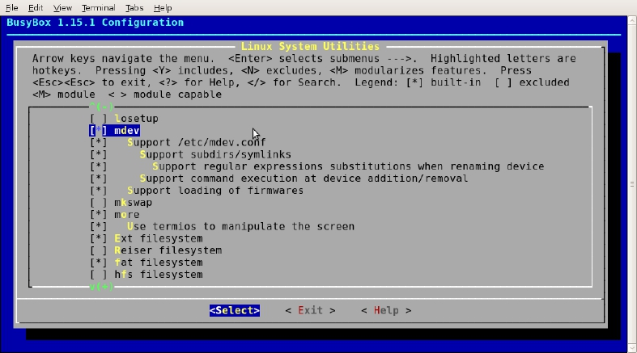

### 5.4.5 创建和配置mdev

在嵌入式系统中，通常可以用udev的轻量级版本mdev，mdev集成于busybox（本书配套VirtualBox虚拟机/home/lihacker/develop/svn/ldd6410-read-only/utils/busybox-1.15.1目录）中。在busybox的源代码目录运行make menuconfig，进入“Linux System Utilities”子选项，选中mdev相关项目，如图5-4所示。

LDD6410根文件系统中/etc/init.d/rcS包含的如下内容即是为了使用mdev的功能：

/bin/mount -t sysfs sysfs /sys 
 
 /bin/mount -t tmpfs mdev /dev 
 
 echo /bin/mdev > /proc/sys/kernel/hotplug 
 
 mdev -s

其中“mdev -s”的含义是扫描/sys中所有的类设备目录，如果在目录中含有名为“dev”的文件，且文件中包含的是设备号，则mdev就利用这些信息为该设备在/dev下创建设备节点文件。

“echo /sbin/mdev > /proc/sys/kernel/hotplug”的含义是当有热插拔事件产生时，内核就会调用位于 /sbin目录的mdev。这时mdev通过环境变量中的ACTION和DEVPATH，来确定此次热插拔事件的动作以及影响了/sys中的那个目录。接着会看看这个目录中是否有“dev”的属性文件，如果有就利用这些信息为这个设备在/dev下创建设备节点文件。

若要修改mdev的规则，可通过修改/etc/mdev.conf文件实现。

