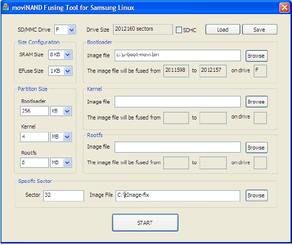

### 5.5 LDD6410的SD和NAND文件系统

LDD6410的SD卡分为两个区，其中的第2个分区为ext3文件系统，存放LDD6410的文件数据（5.2.1节给出的各个目录），其制作方法如下。

（1）在安装了Linux的PC机上通过fdisk给一张空的SD卡分为2个区（如果SD卡中本身已经包含，请通过fdisk的“d”命令全部删除），得到如下的分区表：

Command (m for help): p

Disk /dev/sdb: 1 030 MB, 1 030 225 920 bytes 
 
 32 heads, 62 sectors/track, 1 014 cylinders 
 
 Units = cylinders of 1984 * 512 = 1 015 808 bytes 
 
 Disk identifier: 0x6f20736b

Device Boot Start End Blocks Id System 
 
 /dev/sdb1 * 1 20 19 809 83 Linux 
 
 /dev/sdb2 21 1014 98 6048 83 Linux

注意第1个分区制作的命令为：

Command (m for help): n 
 
 Command action 
 
 e extended 
 
 p primary partition (1-4) 
 
 p 
 
 Partition number (1-4): 1 
 
 First cylinder (1-1 014, default 1): 
 
 Using default value 1 
 
 Last cylinder, +cylinders or +size{K,M,G} (1-1 014, default 1 014): 20M

第2个分区制作的命令是：

Command (m for help): n 
 
 Command action 
 
 e extended 
 
 p primary partition (1-4) 
 
 p 
 
 Partition number (1-4): 2 
 
 First cylinder (21-1 014, default 21): 
 
 Using default value 21 
 
 Last cylinder, +cylinders or +size{K,M,G} (21-1 014, default 1 014): 
 
 Using default value 1 014

Command (m for help):

我们还要通过“a”命令标记第1个分区：

Command (m for help): a 
 
 Partition number (1-4): 1

最后要通过“w”命令把建好的分区表写入SD卡。

（2）格式化SD卡的分区1和分区2：

mkfs.vfat /dev/sdb1 
 
 mkfs.ext3 /dev/sdb2 
 
 fsck.ext3 /dev/sdb2

（3）如图5-5所示，通过moviNAND_Fusing_Tool.exe烧写SD卡U­BOOT和zImage。

更新SD卡根文件系统的方法很简单，在PC机上mount /dev/sdb2后，直接通过

cp ­fa <your­rootfs> <sdb2­mount­point>

即可替换根文件系统了。<your­rootfs>是根文件系统的目录，<sdb2­mount­point>是/dev/sdb2挂载的目录。

特别要注意的是，SD的设备节点不一定是/dev/sdb，应该视用户电脑的硬盘情况而言，可能是/dev/sdc、/dev/sdd 等。

LDD6410的NAND分为3个区，分别存放U-BOOT、zImage和文件系统。该分区表定义在LDD6410的BSP中：

struct mtd_partition s3c_partition_info[] = { 
 
 { 
 
 .name = "Bootloader", 
 
 .offset = 0, 
 
 .size = (512*SZ_1K), 
 
 }, 
 
 { 
 
 .name = "Kernel", 
 
 .offset = (512*SZ_1K), 
 
 .size = (4*SZ_1M) - (512*SZ_1K),

}, 
 
 { 
 
 .name = "File System",

.offset = MTDPART_OFS_APPEND, 
 
 .size = MTDPART_SIZ_FULL, 
 
 } 
 
 };

更新NAND中U-BOOT的方法如下：

（1）通过 tftp 或 nfs 等方式获取新的 U­BOOT，如：

# tftp ­r u­boot­movi.bin ­g 192.168.1.111

（2）运行：

# flashcp u­boot­movi.bin /dev/mtd0

更新NAND中zImage的方法如下：

（1）通过 tftp 或 nfs 等方式获取新的 zImage，如：

# tftp ­r zImage­fix ­g 192.168.1.111

（2）运行：

# flashcp zImage­fix /dev/mtd1

更新NAND中文件系统的方法如下：

在PC上将做好的新的根文件系统拷贝到SD卡或NFS的某目录，下面我们以<new_rootfs_dir>指代该目录。

以SD卡或NFS为根文件系统启动系统，运行如下命令擦除/dev/mtd2分区：

# flash_eraseall /dev/mtd2

然后将NAND的该分区mount到/mnt：

# mount /dev/mtdblock2 ­t yaffs2 /mnt/

将新的文件系统拷贝到/mnt：

# cp ­fa <new_rootfs_dir> /mnt

若上述命令运行过程中设备结点不存在，可先执行：

# mdev ­s

启动到LDD6410，在根目录下运行ls，会发现LDD6410根文件系统包含如下子目录：

#1s 
 
 android init.rc sbin 
 
 bin lib sqlite_stmt_journals 
 
 cache linuxrc sys 
 
 data lost+found system 
 
 demo mnt tmp 
 
 dev opt usr 
 
 etc proc var 
 
 init.goldfish.rc qtopia

其中的/data /cache /system /sqlite_stmt_journals为Android所需要的目录，/opt下存放Qt/Embedded的可执行文件。运行“/android&”可启动Android，运行“/qtopia &”可启动Qt/Embedded。

/demo目录下存放在一些用于demo的图片、MP3等，如运行如下命令可显示jpeg图片1.jpg、2.jpg、3.jpg和4.jpg。

# cd /demo/ 
 
 # jpegview 1.jpg 2.jpg 3.jpg 4.jpg 
 
 480 272 480 544 0 272 16 0 480 272 
 
 framebase = 0x4016c000 err=0 
 
 ImageWidth=362 ImageHeight=272 
 
 read 1.jpg OK 
 
 ImageWidth=362 ImageHeight=272

read 2.jpg OK 
 
 ImageWidth=362 ImageHeight=272 
 
 read 3.jpg OK 
 
 ImageWidth=362 ImageHeight=272 
 
 read 4.jpg OK

