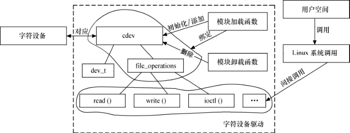

### 6.1.4 Linux字符设备驱动的组成

在Linux中，字符设备驱动由如下几个部分组成。

#### 1．字符设备驱动模块加载与卸载函数

在字符设备驱动模块加载函数中应该实现设备号的申请和cdev的注册，而在卸载函数中应实现设备号的释放和cdev的注销。

工程师通常习惯为设备定义一个设备相关的结构体，其包含该设备所涉及的cdev、私有数据及信号量等信息。常见的设备结构体、模块加载和卸载函数形式如代码清单6.5所示。

代码清单6.5 字符设备驱动模块加载与卸载函数模板

1 /* 设备结构体 
 
 2 struct xxx_dev_t { 
 
 3 struct cdev cdev; 
 
 4 ... 
 
 5 } xxx_dev; 
 
 6 /* 设备驱动模块加载函数 
 
 7 static int _ _init xxx_init(void) 
 
 8 { 
 
 9 ... 
 
 10 cdev_init(&xxx_dev.cdev, &xxx_fops); /* 初始化cdev */ 
 
 11 xxx_dev.cdev.owner = THIS_MODULE; 
 
 12 /* 获取字符设备号*/ 
 
 13 if (xxx_major) { 
 
 14 register_chrdev_region(xxx_dev_no, 1, DEV_NAME); 
 
 15 } else { 
 
 16 alloc_chrdev_region(&xxx_dev_no, 0, 1, DEV_NAME); 
 
 17 } 
 
 18 
 
 19 ret = cdev_add(&xxx_dev.cdev, xxx_dev_no, 1); /* 注册设备*/ 
 
 20 ... 
 
 21 } 
 
 22 /*设备驱动模块卸载函数*/ 
 
 23 static void _ _exit xxx_exit(void) 
 
 24 { 
 
 25 unregister_chrdev_region(xxx_dev_no, 1); /* 释放占用的设备号*/ 
 
 26 cdev_del(&xxx_dev.cdev); /* 注销设备*/ 
 
 27 ... 
 
 28 }

#### 2．字符设备驱动的file_operations结构体中成员函数

file_operations结构体中成员函数是字符设备驱动与内核的接口，是用户空间对Linux进行系统调用最终的落实者。大多数字符设备驱动会实现read()、write()和ioctl()函数，常见的字符设备驱动的这3个函数的形式如代码清单6.6所示。

代码清单6.6 字符设备驱动读、写、I/O控制函数模板

1 /* 读设备*/ 
 
 2 ssize_t xxx_read(struct file *filp, char __user *buf, size_t count, 
 
 3 loff_t*f_pos) 
 
 4 { 
 
 5 ... 
 
 6 copy_to_user(buf, ..., ...); 
 
 7 ... 
 
 8 } 
 
 9 /* 写设备*/ 
 
 10 ssize_t xxx_write(struct file *filp, const char __user *buf, size_t count, 
 
 11 loff_t *f_pos) 
 
 12 { 
 
 13 ... 
 
 14 copy_from_user(..., buf, ...); 
 
 15 ... 
 
 16 } 
 
 17 /* ioctl函数 */ 
 
 18 int xxx_ioctl(struct inode *inode, struct file *filp, unsigned int cmd, 
 
 19 unsigned long arg) 
 
 20 { 
 
 21 ... 
 
 22 switch (cmd) { 
 
 23 case XXX_CMD1: 
 
 24 ... 
 
 25 break; 
 
 26 case XXX_CMD2: 
 
 27 ... 
 
 28 break; 
 
 29 default: 
 
 30 /* 不能支持的命令 */ 
 
 31 return - ENOTTY; 
 
 32 } 
 
 33 return 0; 
 
 34 }

设备驱动的读函数中，filp是文件结构体指针，buf是用户空间内存的地址，该地址在内核空间不能直接读写，count 是要读的字节数，f_pos是读的位置相对于文件开头的偏移。

设备驱动的写函数中，filp是文件结构体指针，buf是用户空间内存的地址，该地址在内核空间不能直接读写，count 是要写的字节数，f_pos是写的位置相对于文件开头的偏移。

由于内核空间与用户空间的内存不能直接互访，因此借助了函数copy_from_user()完成用户空间到内核空间的拷贝，以及copy_to_user()完成内核空间到用户空间的拷贝，见代码第6行和第14行。

完成内核空间和用户空间内存拷贝的copy_from_user()和copy_to_user()的原型分别为：

unsigned long copy_from_user(void *to, const void _ _user *from, unsigned long count); 
 
 unsigned long copy_to_user(void _ _user *to, const void *from, unsigned long count);

上述函数均返回不能被复制的字节数，因此，如果完全复制成功，返回值为0。

如果要复制的内存是简单类型，如char、int、long等，则可以使用简单的put_user()和get_ user()，如：

int val; /* 内核空间整型变量

... 
 
 get_user(val, (int *) arg); /* 用户→内核，arg是用户空间的地址 
 
 ... 
 
 put_user(val, (int *) arg); /* 内核→用户，arg是用户空间的地址

读和写函数中的_ _user是一个宏，表明其后的指针指向用户空间，这个宏定义为：

#ifdef _ _CHECKER_ _ 
 
 # define _ _user _ _attribute_ _((noderef, address_space(1))) 
 
 #else 
 
 # define _ _user 
 
 #endif

I/O控制函数的cmd参数为事先定义的I/O控制命令，而arg为对应于该命令的参数。例如对于串行设备，如果SET_BAUDRATE是一道设置波特率的命令，那后面的arg就应该是波特率值。

在字符设备驱动中，需要定义一个file_operations的实例，并将具体设备驱动的函数赋值给file_operations的成员，如代码清单6.7所示。

代码清单6.7 字符设备驱动文件操作结构体模板

1 struct file_operations xxx_fops = { 
 
 2 .owner = THIS_MODULE, 
 
 3 .read = xxx_read, 
 
 4 .write = xxx_write, 
 
 5 .ioctl = xxx_ioctl, 
 
 6 ... 
 
 7 };

上述xxx_fops在代码清单6.5第10行的cdev_init(&xxx_dev.cdev, &xxx_fops)的语句中被建立与cdev的连接。

图6.1所示为字符设备驱动的结构、字符设备驱动与字符设备以及字符设备驱动与用户空间访问该设备的程序之间的关系。

