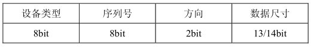

### 6.3.5 ioctl函数

#### 1．globalmem设备驱动的ioctl()函数

globalmem设备驱动的ioctl()函数接受MEM_CLEAR命令，这个命令会将全局内存的有效数据长度清0，对于设备不支持的命令，ioctl()函数应该返回- EINVAL，如代码清单6.15所示。

代码清单6.15 globalmem设备驱动的I/O控制函数

1 static int globalmem_ioctl(struct inode *inodep, struct file *filp, unsigned 
 
 2 int cmd, unsigned long arg) 
 
 3 { 
 
 4 switch (cmd) { 
 
 5 case MEM_CLEAR: 
 
 6 /* 清除全局内存 
 
 7 memset(dev->mem, 0, GLOBALMEM_SIZE); 
 
 8 printk(KERN_INFO "globalmem is set to zero\n"); 
 
 9 break; 
 
 10 
 
 11 default: 
 
 12 return - EINVAL; /* 其他不支持的命令 
 
 13 } 
 
 14 return 0; 
 
 15 }

在上述程序中，MEM_CLEAR被宏定义为0x01，实际上并不是一种值得推荐的方法，简单地对命令定义为0x0、0x1、0x2等类似值会导致不同的设备驱动拥有相同的命令号。如果设备A、B都支持0x0、0x1、0x2这样的命令，假设用户本身希望给A发0x1命令，可是不经意间发给了B，这个时候B因为支持该命令，它就会执行该命令。因此，Linux内核推荐采用一套统一的ioctl()命令生成方式。

#### 2．ioctl()命令

Linux建议以如图6.2所示的方式定义ioctl()的命令。

命令码的设备类型字段为一个“幻数”，可以是0～0xff之间的值，内核中的ioctl-number.txt给出了一些推荐的和已经被使用的“幻数”，新设备驱动定义“幻数”的时候要避免与其冲突。

命令码的序列号也是8位宽。

命令码的方向字段为2位，该字段表示数据传送的方向，可能的值是_IOC_NONE（无数据传输）、_IOC_READ（读）、_IOC_WRITE（写）和_IOC_READ|_IOC_WRITE（双向）。数据传送的方向是从应用程序的角度来看的。

命令码的数据长度字段表示涉及的用户数据的大小，这个成员的宽度依赖于体系结构，通常是13 或者14 位。

内核还定义了_IO()、_IOR()、_IOW()和_IOWR()这4个宏来辅助生成命令，这4个宏的通用定义如代码清单6.16所示。

代码清单6.16 _IO()、_IOR()、_IOW()和_IOWR()宏定义

1 #define _IO(type,nr) _IOC(_IOC_NONE,(type),(nr),0) 
 
 2 #define _IOR(type,nr,size) _IOC(_IOC_READ,(type),(nr),\ 
 
 3 (_IOC_TYPECHECK(size))) 
 
 4 #define _IOW(type,nr,size) _IOC(_IOC_WRITE,(type),(nr),\ 
 
 5 (_IOC_TYPECHECK(size))) 
 
 6 #define _IOWR(type,nr,size) _IOC(_IOC_READ|_IOC_WRITE,(type),(nr), \ 
 
 7 (_IOC_TYPECHECK(size))) 
 
 8 /*_IO、_IOR等使用的_IOC宏*/ 
 
 9 #define _IOC(dir,type,nr,size) \ 
 
 10 (((dir) << _IOC_DIRSHIFT) | \ 
 
 11 ((type) << _IOC_TYPESHIFT) | \ 
 
 12 ((nr) << _IOC_NRSHIFT) | \ 
 
 13 ((size) << _IOC_SIZESHIFT))

由此可见，这几个宏的作用是根据传入的type（设备类型字段）、nr（序列号字段）和size（数据长度字段）和宏名隐含的方向字段移位组合生成命令码。

由于globalmem的MEM_CLEAR命令不涉及数据传输，因此它可以定义为：

#define GLOBALMEM_MAGIC … 
 
 #define MEM_CLEAR _IO(GLOBALMEM_MAGIC,0)

#### 3．预定义命令

内核中预定义了一些I/O控制命令，如果某设备驱动中包含了与预定义命令一样的命令码，这些命令会被当作预定义命令被内核处理而不是被设备驱动处理，预定义命令有如下4种。

（1）FIOCLEX：即File IOctl Close on Exec，对文件设置专用标志，通知内核当exec()系统调用发生时自动关闭打开的文件。

（2）FIONCLEX：即File IOctl Not CLose on Exec，与FIOCLEX标志相反，清除由FIOCLEX命令设置的标志。

（3）FIOQSIZE：获得一个文件或者目录的大小，当用于设备文件时，返回一个ENOTTY错误。

（4）FIONBIO：即File IOctl Non-Blocking I/O，这个调用修改在 filp->f_flags中的O_NONBLOCK标志。

FIOCLEX、FIONCLEX、FIOQSIZE和FIONBIO这些宏的定义为：

#define FIONCLEX 0x5450 
 
 #define FIOCLEX 0x5451 
 
 #define FIOQSIZE 0x5460 
 
 #define FIONBIO 0x5421

