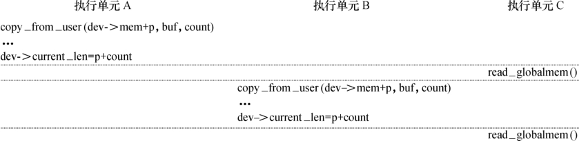
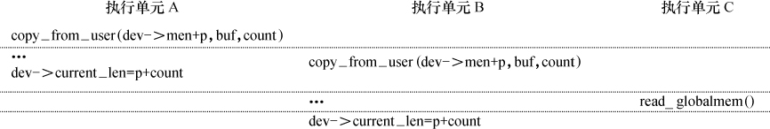
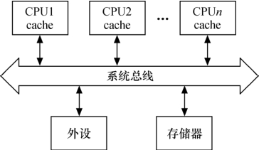

### 7.1 并发与竞态

并发（concurrency）指的是多个执行单元同时、并行被执行，而并发的执行单元对共享资源（硬件资源和软件上的全局变量、静态变量等）的访问则很容易导致竞态（race conditions）。例如，对于globalmem设备，假设一个执行单元A对其写入3 000个字符“a”，而另一个执行单元B对其写入4 000个“b”，第三个执行单元C读取globalmem的所有字符。如果执行单元A、B的写操作如图7.1那样顺序发生，执行单元C的读操作当然不会有什么问题。但是，如果执行单元A、B如图7.2那样被执行，而执行单元C又“不合时宜”地读，则会读出3 000个“b”。

比图7.2更复杂、更混乱的并发大量地存在于设备驱动中，只要并发的多个执行单元存在对共享资源的访问，竞态就可能发生。在Linux内核中，主要的竞态发生于如下几种情况。

#### 1．对称多处理器（SMP）的多个CPU

SMP是一种紧耦合、共享存储的系统模型，其体系结构如图7.3所示，它的特点是多个CPU使用共同的系统总线，因此可访问共同的外设和储存器。

#### 2．单CPU内进程与抢占它的进程

Linux 2.6内核支持抢占调度，一个进程在内核执行的时候可能被另一高优先级进程打断，进程与抢占它的进程访问共享资源的情况类似于SMP的多个CPU。

#### 3．中断（硬中断、软中断、Tasklet、底半部）与进程之间

中断可以打断正在执行的进程，如果中断处理程序访问进程正在访问的资源，则竞态也会发生。

此外，中断也有可能被新的更高优先级的中断打断，因此，多个中断之间本身也可能引起并发而导致竞态。

上述并发的发生情况除了SMP是真正的并行以外，其他的都是“宏观并行，微观串行”的，但其引发的实质问题和SMP相似。

解决竞态问题的途径是保证对共享资源的互斥访问，所谓互斥访问是指一个执行单元在访问共享资源的时候，其他的执行单元被禁止访问。

访问共享资源的代码区域称为临界区（critical sections），临界区需要被以某种互斥机制加以保护。中断屏蔽、原子操作、自旋锁和信号量等是Linux设备驱动中可采用的互斥途径，7.2～7.5节将一一讲解这些方法。

