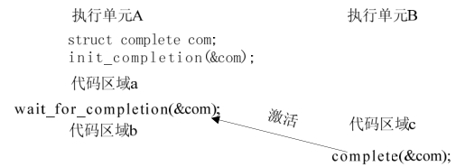

### 7.5.3 完成量用于同步

Linux提供了一种比7.5.2所述更好的同步机制，即完成量（completion，关于这个名词，至今没有好的翻译，笔者将其译为“完成量”），它用于一个执行单元等待另一个执行单元执行完某事。

Linux中与completion相关的操作主要有以下4种。

#### 1．定义完成量

下列代码定义名为my_completion的完成量：

struct completion my_completion;

#### 2．初始化completion

下列代码初始化my_completion这个完成量：

init_completion(&my_completion);

对my_completion的定义和初始化可以通过如下快捷方式实现：

DECLARE_COMPLETION(my_completion);

#### 3．等待完成量

下列函数用于等待一个completion被唤醒：

void wait_for_completion(struct completion *c);

#### 4．唤醒完成量

下面两个函数用于唤醒完成量：

void complete(struct completion *c); 
 
 void complete_all(struct completion *c);

前者只唤醒一个等待的执行单元，后者释放所有等待同一完成量的执行单元。图7.5描述了使用完成量实现的与图7.4对应的信号量实现的同步功能。

