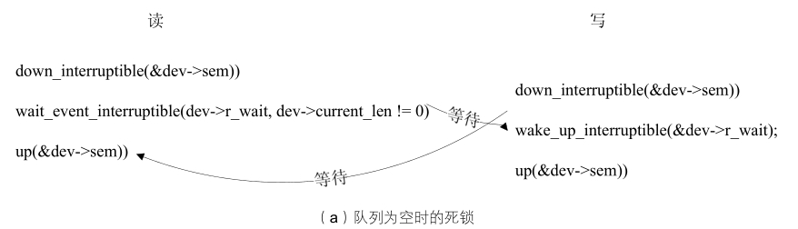
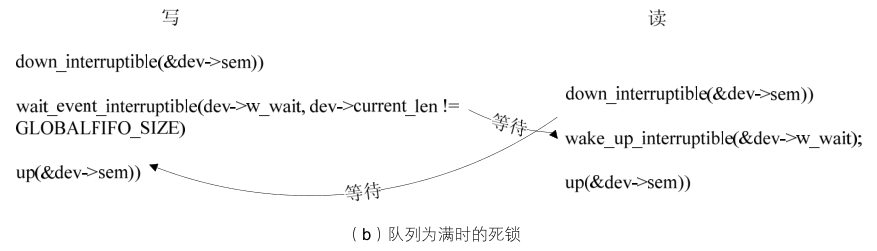

### 8.1.2 支持阻塞操作的globalfifo设备驱动

现在我们给globalmem增加这样的约束：把globalmem中的全局内存变成一个FIFO，只有当FIFO中有数据的时候（即有进程把数据写到这个FIFO而且没有被读进程读空），读进程才能把数据读出，而且读取后的数据会从globalmem的全局内存中被拿掉；只有当FIFO非满时（即还有一些空间未被写，或写满后被读进程从这个FIFO中读出了数据），写进程才能往这个FIFO中写入数据。

现在，将globalmem重命名为“globalfifo”，在globalfifo中，读FIFO将唤醒写FIFO，而写FIFO也将唤醒读FIFO。首先，需要修改设备结构体，在其中增加两个等待队列头，分别对应于读和写，如代码清单8.7所示。

代码清单8.7 globalfifo设备结构体

1 struct globalfifo_dev { 
 
 2 struct cdev cdev; /*cdev结构体*/ 
 
 3 unsigned int current_len; /*fifo有效数据长度*/ 
 
 4 unsigned char mem[GLOBALFIFO_SIZE]; /*全局内存*/ 
 
 5 struct semaphore sem; /*并发控制用的信号量*/ 
 
 6 wait_queue_head_t r_wait; /*阻塞读用的等待队列头*/ 
 
 7 wait_queue_head_t w_wait; /*阻塞写用的等待队列头*/ 
 
 8 };

与globalfifo设备结构体的另一个不同是增加了current_len成员用于表征目前FIFO中有效数据的长度。

这个等待队列需在设备驱动模块加载函数中调用init_waitqueue_head()被初始化，新的设备驱动模块加载函数如代码清单8.8所示。

代码清单8.8 globalfifo设备驱动模块加载函数

1 int globalfifo_init(void) 
 
 2 { 
 
 3 int ret; 
 
 4 dev_t devno = MKDEV(globalfifo_major, 0); 
 
 5 
 
 6 /* 申请设备号*/ 
 
 7 if (globalfifo_major) 
 
 8 ret = register_chrdev_region(devno, 1, "globalfifo"); 
 
 9 else { /* 动态申请设备号 */ 
 
 10 ret = alloc_chrdev_region(&devno, 0, 1, "globalfifo"); 
 
 11 globalfifo_major = MAJOR(devno); 
 
 12 } 
 
 13 if (ret < 0) 
 
 14 return ret; 
 
 15 /* 动态申请设备结构体的内存*/ 
 
 16 globalfifo_devp = kmalloc(sizeof(struct globalfifo_dev), GFP_KERNEL); 
 
 17 if (!globalfifo_devp) { /*申请失败*/ 
 
 18 ret = - ENOMEM; 
 
 19 goto fail_malloc; 
 
 20 } 
 
 21 
 
 22 memset(globalfifo_devp, 0, sizeof(struct globalfifo_dev)); 
 
 23 
 
 24 globalfifo_setup_cdev(globalfifo_devp, 0); 
 
 25

26 init_MUTEX(&globalfifo_devp->sem); /*初始化信号量*/ 
 
 
 27 init_waitqueue_head(&globalfifo_devp->r_wait); /* 
 初始化读等待队列头 
 */ 
 
 
 28 init_waitqueue_head(&globalfifo_devp->w_wait); /* 
 初始化写等待队列头 
 */ 
 
 29 
 
 30 return 0; 
 
 31 
 
 32 fail_malloc: unregister_chrdev_region(devno, 1); 
 
 33 return ret; 
 
 34 }

设备驱动读写操作需要被修改，在读函数中需增加等待globalfifo_devp->w_wait被唤醒的语句，而在写操作中唤醒globalfifo_devp->r_wait，如代码清单8.9所示。

代码清单8.9 增加等待队列后的globalfifo读写函数

1 /*globalfifo读函数*/ 
 
 2 static ssize_t globalfifo_read(struct file *filp, char __user *buf, size_t 
 
 3 count, loff_t *ppos) 
 
 4 { 
 
 5 int ret; 
 
 6 struct globalfifo_dev *dev = filp->private_data; /* 获得设备结构体指针 
 
 
 7 DECLARE_WAITQUEUE(wait, current); /* 
 定义等待队列 
 
 8 
 
 9 down(&dev->sem); /* 获得信号量 
 
 
 10 add_wait_queue(&dev->r_wait, &wait); /* 
 进入读等待队列头 
 
 11 
 
 12 /* 等待FIFO非空 */ 
 
 
 13 while (dev->current_len == 0) { 
 
 
 14 if (filp->f_flags &O_NONBLOCK) { 
 
 
 15 ret = - EAGAIN; 
 
 16 goto out; 
 
 17 } 
 
 
 18 _ _set_current_state(TASK_INTERRUPTIBLE); /* 
 改变进程状态为睡眠 
 
 19 up(&dev->sem); 
 
 20 
 
 
 21 schedule(); /* 
 调度其他进程执行 
 
 22 if (signal_pending(current)) {/* 如果是因为信号唤醒 */ 
 
 23 ret = - ERESTARTSYS; 
 
 24 goto out2; 
 
 25 } 
 
 26 
 
 27 down(&dev->sem); 
 
 28 } 
 
 29 
 
 30 /* 拷贝到用户空间 */ 
 
 31 if (count > dev->current_len) 
 
 32 count = dev->current_len; 
 
 33 
 
 34 if (copy_to_user(buf, dev->mem, count)) { 
 
 35 ret = - EFAULT; 
 
 36 goto out; 
 
 37 } else { 
 
 38 memcpy(dev->mem, dev->mem + count, dev->current_len - count); /* fifo数据前移*/ 
 
 39 dev->current_len -= count; /* 有效数据长度减少

40 printk(KERN_INFO "read %d bytes(s),current_len:%d\n", count, dev 
 
 41 ->current_len); 
 
 42 
 
 
 43 wake_up_interruptible(&dev->w_wait); /* 
 唤醒写等待队列 
 */ 
 
 44 
 
 45 ret = count; 
 
 46 } 
 
 47 out: up(&dev->sem); /* 释放信号量 
 
 
 48 out2: remove_wait_queue(&dev->w_wait, &wait); /* 
 移除等待队列 
 */ 
 
 
 49 set_current_state(TASK_RUNNING); 
 
 50 return ret; 
 
 51 } 
 
 52 
 
 53 
 
 54 /*globalfifo写操作*/ 
 
 55 static ssize_t globalfifo_write(struct file *filp, const char _ _user *buf, 
 
 56 size_t count, loff_t *ppos) 
 
 57 { 
 
 58 struct globalfifo_dev *dev = filp->private_data; /* 获得设备结构体指针*/ 
 
 59 int ret; 
 
 
 60 DECLARE_WAITQUEUE(wait, current); /* 
 定义等待队列 
 */ 
 
 61 
 
 62 down(&dev->sem); /* 获取信号量*/ 
 
 
 63 add_wait_queue(&dev->w_wait, &wait); /* 
 进入写等待队列头 
 */ 
 
 64 
 
 65 /* 等待FIFO非满 */ 
 
 
 66 while (dev->current_len == GLOBALFIFO_SIZE) { 
 
 67 if (filp->f_flags &O_NONBLOCK) { 
 
 68 /* 如果是非阻塞访问*/ 
 
 69 ret = - EAGAIN; 
 
 70 goto out; 
 
 71 } 
 
 
 72 _ _set_current_state(TASK_INTERRUPTIBLE); /* 
 改变进程状态为睡眠 
 */ 
 
 73 up(&dev->sem); 
 
 74 
 
 
 75 schedule(); /* 
 调度其他进程执行 
 */ 
 
 76 if (signal_pending(current)) { 
 
 77 /* 如果是因为信号唤醒*/ 
 
 78 ret = - ERESTARTSYS; 
 
 79 goto out2; 
 
 80 } 
 
 81 
 
 82 down(&dev->sem); /* 获得信号量 */ 
 
 83 } 
 
 84 
 
 85 /*从用户空间拷贝到内核空间*/ 
 
 86 if (count > GLOBALFIFO_SIZE - dev->current_len) 
 
 87 count = GLOBALFIFO_SIZE - dev->current_len; 
 
 88 
 
 89 if (copy_from_user(dev->mem + dev->current_len, buf, count)) { 
 
 90 ret = - EFAULT; 
 
 91 goto out; 
 
 92 } else {

93 dev->current_len += count; 
 
 94 printk(KERN_INFO "written %d bytes(s),current_len:%d\n", count, dev 
 
 95 ->current_len); 
 
 96 
 
 
 97 wake_up_interruptible(&dev->r_wait); /* 
 唤醒读等待队列 
 */ 
 
 98 
 
 99 ret = count; 
 
 100 } 
 
 101 
 
 102 out: up(&dev->sem); /* 释放信号量 */ 
 
 
 103 out2: remove_wait_queue(&dev->w_wait, &wait); 
 
 
 104 set_current_state(TASK_RUNNING); 
 
 105 return ret; 
 
 106 }

在代码清单8.9中，亲自掌管了等待队列进出和进程切换的过程，现在会有一个疑问，是否可以把读函数中一大段用于等待dev->current_len != 0的内容直接用wait_event_interruptible(dev-> r_wait, dev->current_len != 0)替换，把写函数中一大段用于等待dev->current_len != GLOBALFIFO_ SIZE的代码用wait_event_interruptible(dev->w_wait, dev->current_len != 0)替换呢？

实际上，就控制等待队列非空和非满的角度而言，wait_event_interruptible(dev->r_wait, dev-> current_len != 0)和第13～28行代码的功能完全一样，wait_event_interruptible(dev->w_wait, dev->current_len != 0)和第66～83行代码的功能完全一样。细微的区别体现在第13～28行代码和第66～83行代码在进行schedule()即切换进程前，通过up(&dev->sem)释放了信号量。这一细微的动作意义重大，非如此，则死锁将不可避免。

如图8.1（a）所示，假设目前的FIFO为空即dev->current_len为0，此时如果有一个读进程，它会先获得信号量，因为条件不满足，它将因为wait_event_interruptible(dev->r_wait, dev-> current_len != 0)而阻塞，而释放dev->r_wait等待队列及让dev->current_len != 0的操作又需要在写进程中进行，写进程在执行写操作前又必须等待读进程释放信号量，造成互相等待对方资源的矛盾局面，从而死锁。

如图8.1（b）所示，假设目前的FIFO为满即dev->current_len为GLOBALFIFO_SIZE，此时如果有一个写进程，它先获得了信号量，因为条件不满足，它将因为wait_event_interruptible(dev-> w_wait, dev->current_len != GLOBALFIFO_SIZE)而阻塞，而释放dev->w_wait等待队列及让dev->current_len != GLOBALFIFO_SIZE的操作又需要在读进程中进行，读进程在执行读操作前又必须等待写进程释放信号量，造成互相等待对方资源的矛盾局面，从而死锁。

所谓死锁，就是多个进程循环等待它方占有的资源而无限期地僵持下去的局面。如果没有外力的作用，那么死锁涉及的各个进程都将永远处于封锁状态。因此，驱动工程师一定要注意：当多个等待队列、信号量等机制同时出现时，谨防死锁！

现在回过来了看一下代码清单8.9的第15行和75行，发现在设备驱动的read()、write()等功能函数中，可以通过filp->f_flags标志获得用户空间是否要求非阻塞访问。驱动中可以依据此标志判断用户究竟要求阻塞还是非阻塞访问，从而进行不同的处理。

