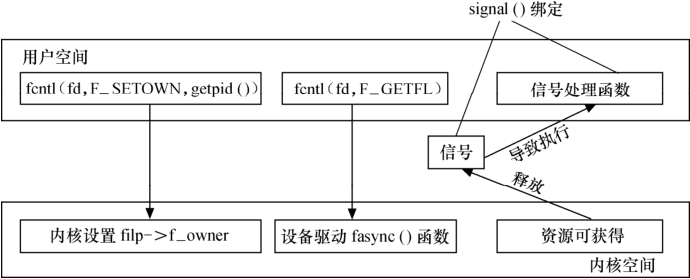

### 9.2.3 信号的释放

在设备驱动和应用程序的异步通知交互中，仅仅在应用程序端捕获信号是不够的，因为信号没有的源头在设备驱动端。因此，应该在合适的时机让设备驱动释放信号，在设备驱动程序中增加信号释放的相关代码。

为了使设备支持异步通知机制，驱动程序中涉及3项工作。

（1）支持F_SETOWN命令，能在这个控制命令处理中设置filp->f_owner为对应进程ID。不过此项工作已由内核完成，设备驱动无需处理。

（2）支持F_SETFL命令的处理，每当FASYNC标志改变时，驱动程序中的fasync()函数将得以执行。因此，驱动中应该实现fasync()函数。

（3）在设备资源可获得时，调用kill_fasync()函数激发相应的信号。

驱动中的上述3项工作和应用程序中的3项工作是一一对应的，图9.2所示为异步通知处理过程中用户空间和设备驱动的交互。

设备驱动中异步通知编程比较简单，主要用到一项数据结构和两个函数。数据结构是fasync_struct结构体，两个函数分别是：

处理FASYNC标志变更的。

int fasync_helper(int fd, struct file *filp, int mode, struct fasync_struct **fa);

释放信号用的函数。

void kill_fasync(struct fasync_struct **fa, int sig, int band);

和其他的设备驱动一样，将fasync_struct结构体指针放在设备结构体中仍然是最佳选择，代码清单9.3给出了支持异步通知的设备结构体模板。

代码清单9.3 支持异步通知的设备结构体模板

1 struct xxx_dev { 
 
 2 struct cdev cdev; /*cdev结构体*/ 
 
 3 ... 
 
 4 struct fasync_struct *async_queue; /* 异步结构体指针 */ 
 
 5 };

在设备驱动的fasync()函数中，只需要简单地将该函数的3个参数以及fasync_struct结构体指针的指针作为第4个参数传入fasync_helper()函数即可。代码清单9.4给出了支持异步通知的设备驱动程序fasync()函数的模板。

代码清单9.4 支持异步通知的设备驱动fasync()函数模板

1 static int xxx_fasync(int fd, struct file *filp, int mode) 
 
 2 {

3 struct xxx_dev *dev = filp->private_data; 
 
 
 4 return fasync_helper(fd, filp, mode, &dev->async_queue); 
 
 5 }

在设备资源可以获得时，应该调用kill_fasync()释放SIGIO信号，可读时第3个参数设置为POLL_IN，可写时第3个参数设置为POLL_OUT。代码清单9.5给出了释放信号的范例。

代码清单9.5 支持异步通知的设备驱动信号释放范例

1 static ssize_t xxx_write(struct file *filp, const char __user *buf, size_t count, 
 
 2 loff_t *f_pos) 
 
 3 { 
 
 4 struct xxx_dev *dev = filp->private_data; 
 
 5 ... 
 
 6 /* 产生异步读信号 */ 
 
 7 if (dev->async_queue) 
 
 8 kill_fasync(&dev->async_queue, SIGIO, POLL_IN); 
 
 9 ... 
 
 10 }

最后，在文件关闭时，即在设备驱动的release()函数中，应调用设备驱动的fasync()函数将文件从异步通知的列表中删除。代码清单9.5给出了支持异步通知的设备驱动release()函数的模板。

代码清单9.6 支持异步通知的设备驱动release()函数模板

1 static int xxx_release(struct inode *inode, struct file *filp) 
 
 2 { 
 
 3 /* 将文件从异步通知列表中删除 */ 
 
 4 xxx_fasync(-1, filp, 0); 
 
 5 ... 
 
 6 return 0; 
 
 7 }

