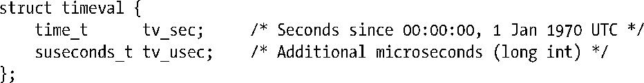
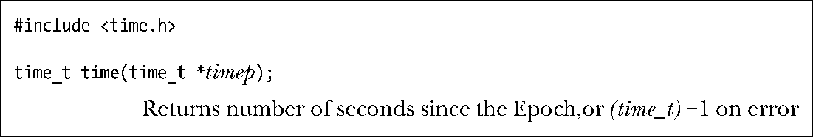

### 10.1　日历时间（Calendar Time）

无论地理位置如何，UNIX系统内部对时间的表示方式均是以自Epoch以来的秒数来度量的，Epoch亦即通用协调时间（UTC，以前也称为格林威治标准时间，或GMT）的1970年1月1日早晨零点。这也是UNIX系统问世的大致日期。日历时间存储于类型为time_t的变量中，此类型是由SUSv3定义的整数类型。

> 在32位Linux系统，time_t是一个有符号整数，可以表示的日期范围从1901年12月13日20时45分52秒至2038年1月19号03:14:07。（SUSv3未定义time_t值为负数时的含义。）因此，当前许多32位UNIX系统都面临一个2038年的理论问题，如果执行的计算工作涉及未来日期，那么在2038年之前就会与之遭遇。事实上，到了 2038年，可能所有的UNIX系统都早已升级为64位或更多位数的系统，这一问题也许会随之而大为缓解。然而，32位嵌入式系统，由于其寿命较之台式机硬件更长，故而仍然会受此问题的困扰。此外，对于依然以32位time_t格式保存时间的历史数据和应用程序，这个问题将依然存在。

系统调用gettimeofday()，可于tv指向的缓冲区中返回日历时间。

参数tv是指向如下数据结构的一个指针：

虽然tv_usec字段能提供微秒级精度，但其返回值的准确性则由依赖于构架的具体实现来决定。tv_usec中的u源于与之形似的希腊字母μ（读音“mu”），在公制系统中表示百万分之一。在现代X86-32系统上，gettimeofday()的确可以提供微秒级的准确度（例如， Pentium系统内置有时间戳计数寄存器，随每个CPU时钟周期而加一）。

gettimeofday()的参数tz是个历史产物。早期的UNIX实现用其来获取系统的时区信息，目前已遭废弃，应始终将其置为NULL。

> 如果提供了tz参数，那么将返回一个timezone的结构体，其内容为上次调用settimeofday()时传入的 tz 参数（已废弃）值。该结构包含两个字段tz_minuteswest和tz_dsttime。tz_minuteswest字段表示欲将本时区时间转换为UTC时间所必须增加的分钟数，如为负值，则表示此时区位于UTC以东（例如，如为欧洲中部时间，会提前UTC一小时，则将此字段设置为−60）。tz_dsttime字段内为一个常量，意在表示这个时区是否强制施行夏令时（DST）制。正由于夏令时制度无法用一个简单算法加以表达，故而tz参数已遭废弃。（Linux从未支持过此参数。）详情请参考gettimeofday(2)手册页。

time()系统调用返回自 Epoch 以来的秒数（和函数 gettimeofday()所返回的 tv 参数中tv_sec字段的数值相同）。

如果timep参数不为NULL，那么还会将自Epoch以来的秒数置于timep所指向的位置。

由于time()会以两种方式返回相同的值，而使用时唯一可能出错的地方是赋予timep参数一个无效地址（EFAULT），因此往往会简单地采用如下调用（不做错误检查）：

> 之所以存在两个本质上目的相同的系统调用（time()和gettimeofday()），自有其历史原因。早期的UNIX实现提供了time()。而4.3BSD又补充了更为精确的gettimeofday()系统调用。这时，再将 time()作为系统调用就显得多余，可以将其实现为一个调用gettimeofday()的库函数。

