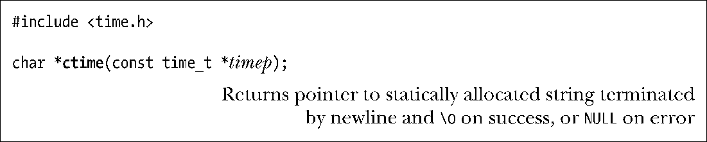

### 10.2.1　将time_t转换为可打印格式

为了将time_t转换为可打印格式，ctime()函数提供了一个简单方法。

把一个指向time_t的指针作为timep参数传入函数ctime()，将返回一个长达26字节的字符串，内含标准格式的日期和时间，如下例所示：

该字符串包含换行符和终止空字节各一。 ctime()函数在进行转换时，会自动对本地时区和DST设置加以考虑（10.3节将解释这些设置的确定过程）。返回的字符串经由静态分配，下一次对ctime()的调用会将其覆盖。

SUSv3规定，调用ctime()、gmtime()、localTime()或asctime()中的任一函数，都可能会覆盖由其他函数返回，且经静态分配的数据结构。换言之，这些函数可以共享返回的字符数组和tm结构体，某些版本的glibc也正是这样实现的。如果有意在对这些函数的多次调用间维护返回的信息，那么必须将其保存在本地副本中。

> ctime_r()是ctime()的可重入版本。（21.1.2节将解释重入。）该函数允许调用者额外指定一个指针参数，所指向的缓冲区（由调用者提供）用于返回时间字符串。本章所论及的其他函数的可重入版，其操作方式与之类似。

