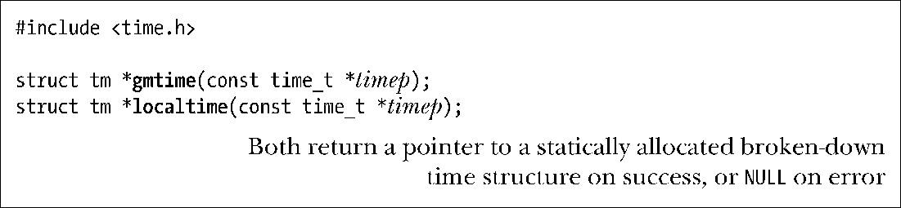
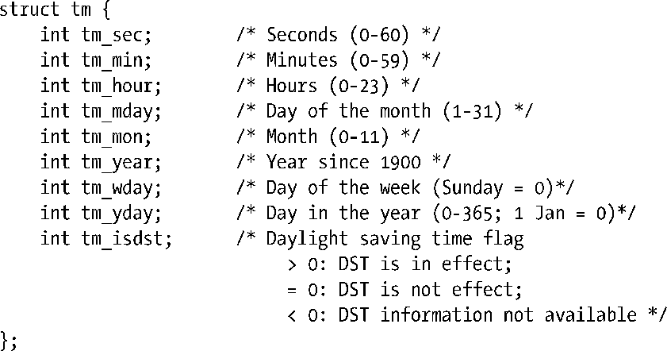
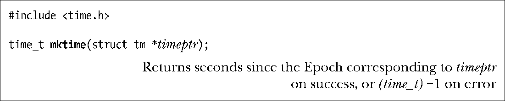

### 10.2.2　time_t和分解时间之间的转换

函数gmtime()和localtime()可将一time_t值转换为一个所谓的分解时间（broken-down time)。分解时间被置于一个经由静态分配的结构中，其地址则作为函数结果返回。

函数gmtime()能够把日历时间转换为一个对应于UTC的分解时间。（字母GM源于格林威治标准时间）。相形之下，函数localtime()需要考虑时区和夏令时设置，返回对应于系统本地时间的一个分解时间。

> gmtime_r()和localtime_r()分别是这些函数的可重入版。

在这些函数所返回的tm结构中，日期和时间被分解为多个独立字段，其形式如下：

将字段tm_sec的上限设为60（而非59）以考虑闰秒，偶尔会用其将人类日历调整至精确的天文年（所谓的回归年）。

如果定义了_BSD_SOURCE功能测试宏，那么由glibc定义的tm结构还会包含两个额外字段，以描述关于所示时间的深入信息。第一个字段long int tm_gmtoff，包含所示时间超出UTC以东的秒数。第二个字段const char* tm_zone，是时区名称的缩写（例如，CEST为欧洲中部夏令时间）。SUSv3并未定义这些字段，它们只见诸于少数其他UNIX实现（主要为BSD衍生版本）。

函数 mktime() 将一个本地时区的分解时间翻译为 time_t值，并将其作为函数结果返回。调用者将分解时间置于一个tm结构，再以timeptr指针指向该结构。这一转换会忽略输入tm结构中的tm_wday和tm_yday字段。

函数mktime()可能会修改timeptr所指向的结构体，至少会确保对tm_wday和tm_yday字段值的设置，会与其他输入字段的值能对应起来。

此外，mktime()不要求tm结构体的其他字段受到前述范围的限制。任何一个字段的值超出范围，mktime()都会将其调整回有效范围之内，并适当调整其他字段。所有这些调整，均发生于mktime()更新tm_wday和tm_yday字段并计算返回值time_t之前。

例如，如果输入字段tm_sec的值为123，那么在返回时此字段的值将为3，且tm_min字段值会在其之前值的基础上加2。（如果这一改动造成tm_min溢出，那么将调整tm_min的值，并且递增tm_hour字段，以此类推。）这些调整甚至适用于字段负值。例如，指定tm_sec 为−1即意味着前一分钟的第59秒。此功能允许以分解时间来计算日期和时间，故而非常有用。

mktime()在进行转换时会对时区进行设置。此外，DST设置的使用与否取决于输入字段tm_isdst的值。

+ 若tm_isdst为0，则将这一时间视为标准间（即，忽略夏令时，即使实际上每年的这一时刻处于夏令时阶段）。
+ 若tm_isdst大于0，则将这一时间视为夏令时（即，夏令时生效，即使每年的此时不处于夏令时阶段）。
+ 若tm_isdst小于0，则试图判定DTS在每年的这一时间是否生效。这往往是众望所归的设置。

（无论 tm_isdst 的初始设置如何）在转换完成时，如果针对给定的时间，DST生效，mktime()会将tm_isdst字段置为正值，若DST未生效，则将tm_isdst置为0。

