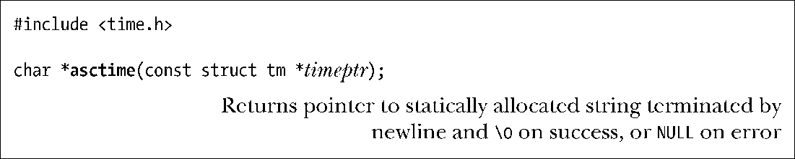
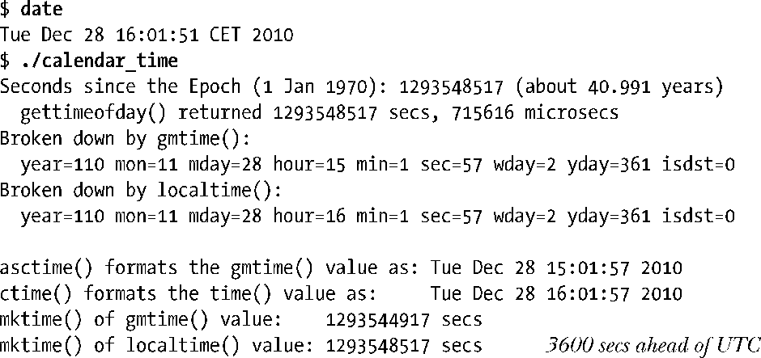
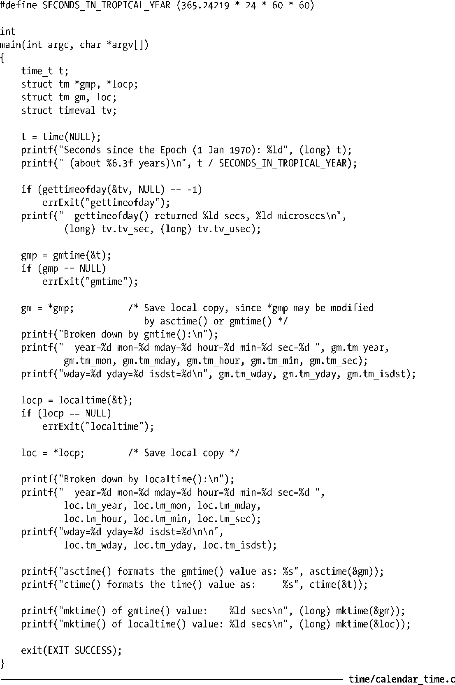
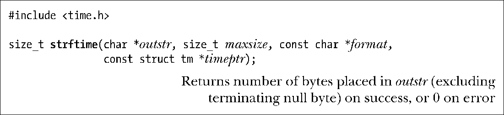
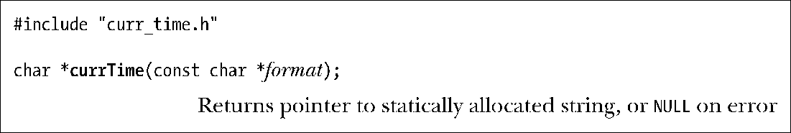
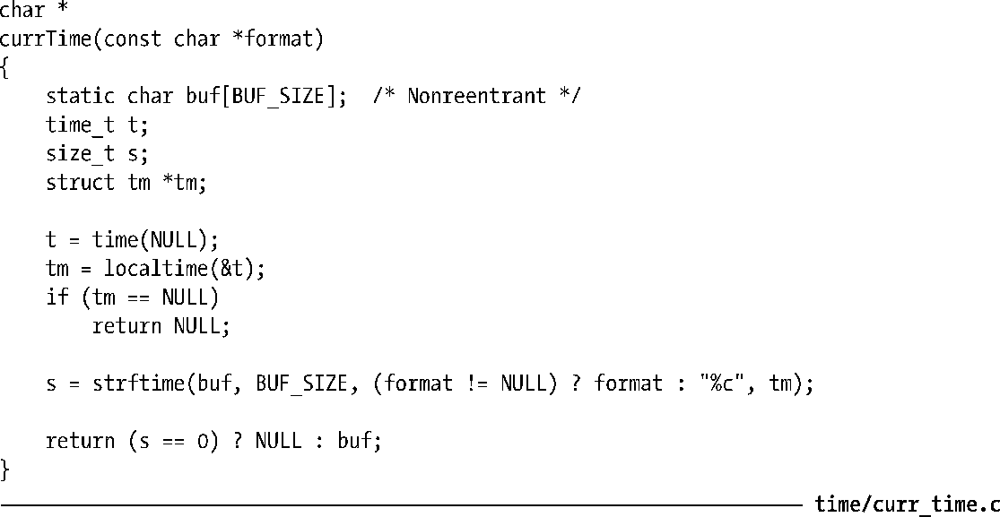
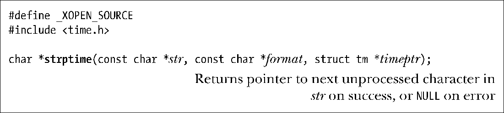
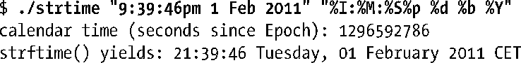
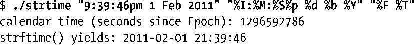

### 10.2.3　分解时间和打印格式之间的转换

本节会介绍将分解时间和打印格式相互进行转换的函数。

#### 从分解时间转换为打印格式

在参数tm中提供一个指向分解时间结构的指针，asctime()则会返回一指针，指向经由静态分配的字符串，内含时间，格式则与ctime ()相同。

相形于ctime()，本地时区设置对asctime()没有影响，因为其所转换的是一个分解时间，该时间通常要么已然通过 localtime()作了本地化处理，要么早已经由 gmtime()转换成了UTC。

如同ctime()一样，asctime()也无法控制其所生成字符串的格式。

> asctime()的可重入版为asctime_r()。

程序清单10-1演示asctime()以及直到本章结尾所述时间转换函数的用法。该程序获取当前的日历时间，随后使用各种时间转换函数并显示其结果。下例为冬季在德国慕尼黑运行此程序的结果，该地区处于欧洲中部时间这一时区，比UTC要早一小时。

程序清单10-1：获取和转换日历时间

当把一个分解时间转换成打印格式时，函数 strftime()可以提供更为精确的控制。令timeptr指向分解时间，strftime()会将以null结尾、由日期和时间组成的相应字符串置于outstr所指向的缓冲区中。

outstr中返回的字符串按照format参数定义的格式做了格式化。Maxsize参数指定 outstr的最大长度。不同于 ctime()和asctime()，strftime()不会在字符串的结尾包括换行符（除非format中定义有换行符）。

如果成功，strftime()返回 outstr 所指缓冲区的字节长度，且不包括终止空字节。如果结果字符串的总长度，含终止空字节，超过了maxsize参数，那么strftime()会返回0以示出错，且此时无法确定outstr的内容。

strftime()的format参数是一字符串，与赋予printf()的参数相类似。冠以百分号（%）的字符序列是对转换的定义，函数会将百分号后的说明符字符一一替换为日期和时间的组成部分。这是一套相当丰富的转换说明符，表 10-1 中所列的是其一个子集。（完整的列表可见诸于strftime(3)手册页。）除非特别注明，所有这些转换说明符都符合SUSv3标准。

%U和%W说明符都生成一年中的周数。%U的周数按以下方法计算。含有星期日的第一周编号为1，此周的前一周编号为0。如果星期天恰巧是当年的第一天，那么就没有第0周，当年的最后一天则属于第53周。%W的周数编号以同样的方式来计算，只不过计算对象是周一而非周日。

通常情况下，我们希望在本书的各种示范程序中显示当前时间。为此，本书提供了函数currTime()，其返回一字符串，内含strftime()按format参数格式化的当前时间。

程序清单10-2所示为currTime()函数的实现。

<b class="my_markdown">表10-1：strftime()的转换说明符选集</b>

| 说　明　符 | 描　　述 | 例　　子 |
| :-----  | :-----  | :-----  | :-----  | :-----  |
| %% | 百分号（%）字符 | % |
| %a | 星期几的缩写 | Tue |
| %A | 星期几的全称 | Tuesday |
| %b，%h | 月份名称的缩写 | Feb |
| %B | 月份全称 | February |
| %c | 日期和时间 | Tue Feb 1 21:39:46 2011 |
| %d | 一个月的一天（2位数字，01至31天） | 01 |
| %D | 美国日期格式（与%m%d%y相同） | 02/01/11 |
| %e | 一个月中的一天（2个字符） | 1 |
| %F | ISO日期格式（与%Y-%m-%d相同） | 2011-02-01 |
| %H | 小时（24小时制，2位数） | 21 |
| %I | 小时（12小时制，2位数） | 09 |
| %j | 一年中的一天（3位数字，从001到366） | 032 |
| %m | 十进制月（2位，01到12） | 02 |
| %M | 分（2位数） | 39 |
| %p | AM/PM | PM |
| %P | 上午/下午（GNU扩展） | pm |
| %R | 24小时制的时间（和%H:%M格式相同） | 21:39 |
| %S | 秒（00至60） | 46 |
| %T | 时间（和%H:%M:%S格式相同） | 21：39：46 |
| %u | 星期几编号（1至7，星期一= 1） | 2 |
| %U | 以周日计算、一年中的周数（00到53） | 05 |
| %w | 星期几编号（0至6，星期日= 0） | 2 |
| %W | 以周一计算、一年中的周数（00到53） | 05 |
| %x | 日期（本地化） | 02/01/11 |
| %X | 时间（本地化） | 21：39：46 |
| %y | 2位数字年份 | 11 |
| %Y | 4位数字年份 | 2011 |
| %Z | 时区名称 | CET |

程序清单10-2：返回当前时间的字符串的函数

#### 将打印格式时间转换为分解时间

函数strptime()是strftime()的逆向函数，将包含日期和时间的字符串转换成一分解时间。

函数strptime()按照参数format内的格式要求，对由日期和时间组成的字符串str加以解析，并将转换后的分解时间置于指针timeptr所指向的结构体中。

如果成功，strptime()返回一指针，指向str中下一个未经处理的字符。（如果字符串中还包含有需要应用程序处理的额外信息，这一特性就能派上用场。）如果无法匹配整个格式字符串，strptime()返回NULL，以示出现错误。

strptime()的格式规范类似于scanf(3)，包含以下类型的字符。

+ 转换字符串冠以一个百分号（%）字符。
+ 如包含空格字符，则意味着其可匹配零个或多个空格。
+ （%之外的）非空格字符必须和输入字符串中的相同字符严格匹配。

转换说明类似于之前为strftime()给出的内容（表10-1）。主要的区别在于，此处的说明符更为通用。例如，不拘于星期名称的全称或简称，%a和%A都可接受，而且%d和%e均可用于读取月中的个位天数，无论该数字前面是否有 0。此外，不区分大小写，例如，May 和 MAY是相同的月份名称。使用字符串%%来匹配输入字符串中的百分号字符。 strptime(3)手册页提供有更多的细节。

glibc在实现strptime()时，并不修改tm结构体中那些未获format说明符初始化的字段。这也意味着可以根据多个字符串，例如，一个日期字符串和一个时间字符串，发起多次strptime()调用，来创建一个tm结构体。SUSv3虽然允许这一行为，但并不强制要求实现，因此在其他UNIX实现上不能对其有所依赖。要保证应用的可移植性，就必须确保，要么str和format中所含输入信息足以设置最终tm结构的所有字段，要么在调用strptime()之前对tm结构体已经做了适当的初始化处理。在大多数情况下，用 memset()把整个结构体置为0也就足够了，但要留心，在glibc和许多其他时间转换函数的实现中，m_mday字段值为0，意为上月的最后一天。最后还要注意，strptime()从不设置tm结构体的tm_isdst字段。

> GNU　C库还提供有与strptime()功能类似的两个函数：getdate()（已由SUSv3规范，且应用广泛）及其可重入版getdate_r()（SUSv3中未定义，仅获少数UNIX实现支持）。此处将不会介绍这些函数，因为在指定用于扫描日期的格式时，它们所采用的是外部文件（由环境变量DATEMSK定义），这不但令其难以使用，而且会在set-user-ID程序中造成安全漏洞。

程序清单10-3演示了 strptime()和strftime()的用法。该程序从命令行参数中接受日期和时间，然后用strptime()将其转换为一分解时间，接着使用strftime()执行逆向转换并显示结果。该程序接收至多3个参数，其中前两个为必需提供。第一个参数是包含日期和时间的字符串。第二个参数指定了strptime()在解析第一个参数时所采用的格式。可选的第三个参数是格式字符串，用于strftime()的逆向转换。如果省略此参数，将使用一个默认的格式字符串。（本程序中使用的setLocale()函数将在10.4节中加以介绍。）以下shell会话日志显示了使用该程序的一些例子：

以下用法与之相似，只不过这次为strftime()明确指定了格式：

程序清单10-3：获取和转换日历时间

