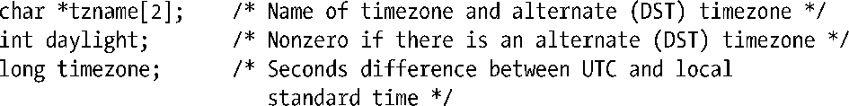
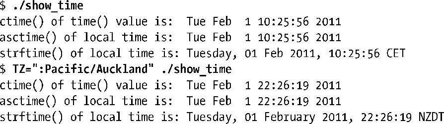
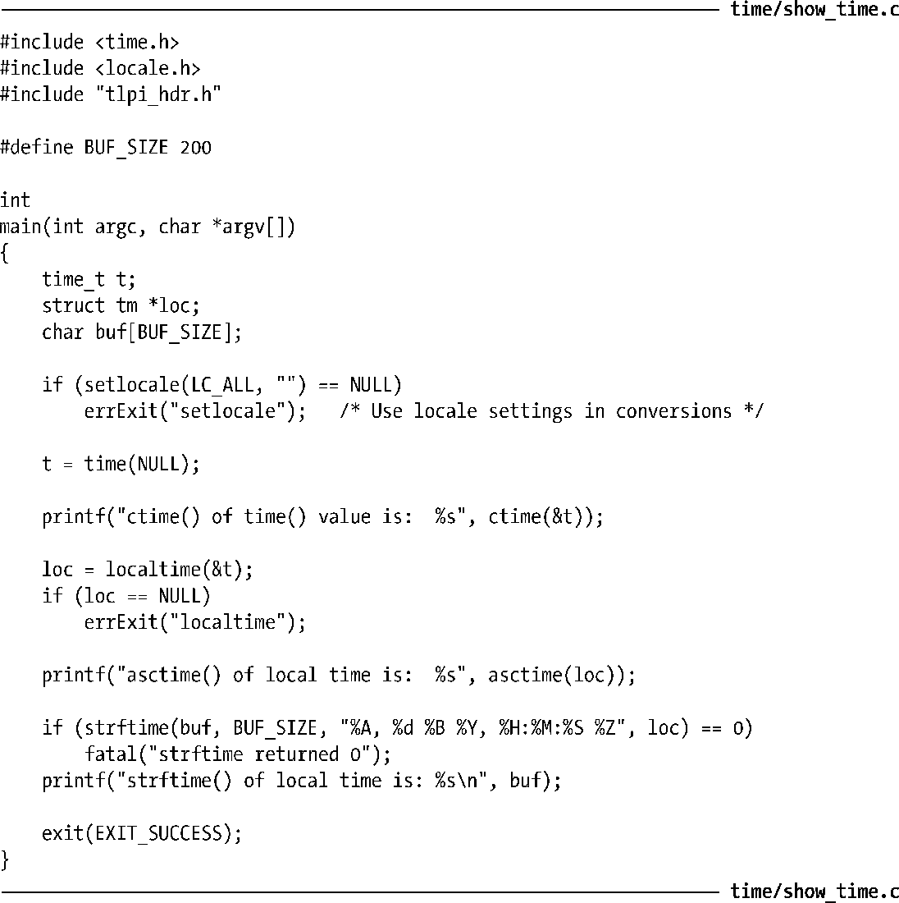
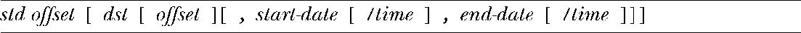

### 10.3　时区

不同的国家（有时甚至是同一国家内的不同地区）使用不同的时区和夏时制。对于要输入和输出时间的程序来说，必须对系统所处的时区和夏时制加以考虑。所幸的是，所有这些细节都已经由C语言函数库包办了。

#### 时区定义

时区信息往往是既浩繁又多变的。出于这一原因，系统没有将其直接编码于程序或函数库中，而是以标准格式保存于文件中，并加以维护。

这些文件位于目录/usr/share/zoneinfo中。该目录下的每个文件都包含了一个特定国家或地区内时区制度的相关信息，且往往根据其所描述的时区来加以命名，诸如EST（美国东部标准时间）、CET（欧洲中部时间）、UTC、Turkey和Iran。此外，可以利用子目录对相关时区进行有层次的分组。例如，Pacific 目录就可能包含文件 Auckland、Port_Moresby和Galapagos。在程序中指定使用的时区，实际上是指定该目录下某一时区文件的相对路径名。

系统的本地时间由时区文件/etc/localtime定义，通常链接到/usr/share/zoneinfo下的一个文件。

> 时区文件的格式记述于tzfile(5)手册页，其创建可通过zic(8)（时区信息编译器，zoone information compiler）工具来完成。zdump(8)命令可根据指定时区文件中的时区来显示当前时间。

#### 为程序指定时区

为运行中的程序指定一个时区，需要将TZ环境变量设置为由一冒号(:)和时区名称组成的字符串，其中时区名称定义于/usr/share/zoneinfo中。设置时区会自动影响到函数ctime()、localtime()、mktime()和strftime()。

为了获取当前的时区设置，上述函数都会调用tzset(3)，对如下3个全局变量进行了初始化：

函数tzset()会首先检查环境变量TZ。如果尚未设置该变量，那么就采用/etc/localtime中定义的默认时区来初始化时区。如果TZ环境变量的值为空，或无法与时区文件名相匹配，那么就使用UTC。还可将TZDIR环境变量（非标准的GNU扩展）设置为搜寻时区信息的目录名称，以替代默认的/usr/share/zoneinfo目录。

可以通过运行程序清单10-4中的程序来观察TZ变量的影响力。第一次运行输出的是相应系统的默认时区（欧洲中部时间，CET）。在第二次运行时，由于指定的时区为New Zealand，其在每年此时已进入夏令时，时区要比CET提前12个小时。

程序清单10-4：演示时区和地区的效果

SUSv3为设置TZ环境变量定义了两个通用方法。如前所述，可将TZ设置为由冒号外加字符串组成的字符序列，其中的字符串用以标识时区，并随系统实现的不同而不同，通常为时区描述文件的路径名。（在采用这种形式时，Linux和其他一些UNIX实现允许将冒号省略，但SUSv3并未规范这一行为。为了保证代码的可移植性，应当始终包含冒号。）

设置TZ的另一种方法在SUSv3中有完整的定义。使用此方法，可以将如下形式的字符串赋给TZ：

为了便于阅读，在上面这行字符串中加入了空格，但实际上任何空格都不应出现在TZ中。方括号（[]）用来表示可选项。

std和dst部分是用以标识标准和DST时区名称的字符串。例如，CET和CEST分别为欧洲中部时间和欧洲中部夏令时间。各种情况下的offset分别表示欲转换为UTC，需要叠加在本地时间上的正、负调整值。最后四部分则提供了一个规则，描述何时从标准时间变更为夏令时。

可以多种格式指定date，其中之一是Mm.n.d，意即：m(1～12)月中，第n（1～5，每月的最后d天总为第5周）周，星期d（0=星期一，6=星期天）。如果省略time，则无论何种情况下均默认为02:00:00（上午2点）。

以下将TZ定义为Central Europe ，该时区的标准时间比UTC提前1小时，且DST始于3月的最后一个星期日，直至10月的最后一个星期日结束，提前UTC 2小时。

此处省略了对DST转换时间的指定，因为默认其发生于02:00:00。显然，较之于如下的Linux专有格式，上述形式的确缺乏可读性：

