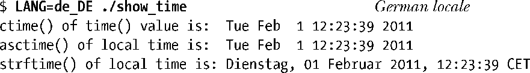
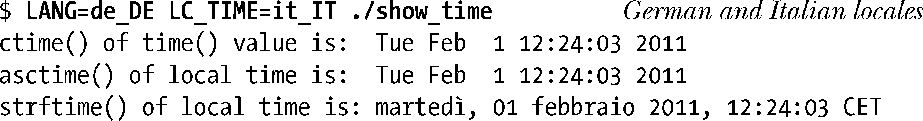
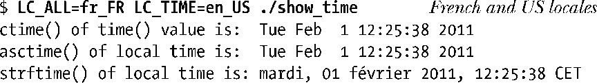

### 为程序设置地区

函数setlocale()既可设置也可查询程序的当前地区。

category参数选择设置或查询地区的哪一部分，它仅能使用表 10-2中列出的地区类别的常量名称。因此，它可以设置地区的时间显示格式是德国，而地区的货币符号是美元。或者，更常见的是，我们可以利用LC_ALL来指定我们要设置的地区的所有部分的值。

使用setLocale()设置地区有两种不同的方法。locale参数可能是一个字符串，指定系统上已定义的一个地区（例如，/usr /lib /locale中的子目录的名称），如de_DE或en_US。另外，地区可能被指定为空字符串，这意味着从环境变量取得地区的设置。

我们必须这样调用才能使程序使用环境变量中的地区。如果调用被省略，这些环境变量将不会对程序生效。

当运行程序调用了setLocale(LC_ALL，" ")，我们能够使用一系列环境变量来控制地区的各部分内容，环境变量的名称也是对应于表 10-2 中列出的类型：LC_CTYPE、LC_COLLATE、LC_MONETARY、LC_NUMERIC、LC_TIME、LC_MESSAGES。另外，我们可以使用LC_ALL或LANG环境变量指定整个地区的设置。如果设置了多个先前的环境变量，那么LC_ALL会覆盖所有其他的LC_*环境变量，同时LANG的优先级最低。因此，通常使用LANG为地区所有内容设置默认值，然后用单独的LC_*变量，设置地区的各个方面内容来覆盖默认值。

最后，setLocale()返回一个指针指向标识这一类地区设置的字符串（通常是静态分配的）。如果我们仅需要查看地区的设置而不需要改变它，那么我们可以指定 locale 参数为NULL。

地区设置影响众多GNU/ Linux实用程序，以及glibc的许多函数的功能。其中有函数strftime()和strptime()（10.2.3节），当我们在不同的地区运行程序清单10-4，strftime返回的结果如下：

下一个运行演示LC_TIME比LANG的优先级高：

而这个运行结果表明，LC_ALL超过LC_TIME的优先级：

