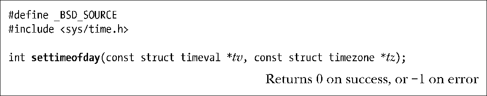
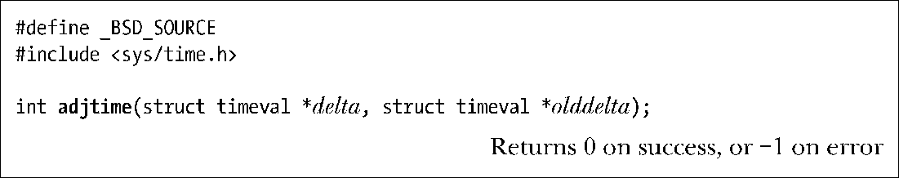

### 10.5　更新系统时钟

我们现在来看两个更新系统时钟的接口：settimeofday()和adjtime()。这些接口都很少被应用程序使用，因为系统时间通常是由工具软件维护，如网络时间协议（Network Time Protocol）守护进程，并且它们需要调用者已被授权（CAP_SYS_TIME）。

系统调用settimeofday()是gettimeofday()的逆向操作（这是我们在10.1节中描述的）。它将tv指向timeval结构体里的秒数和微秒数，设置到系统的日历时间。

和函数gettimeofday()一样，tz参数已被废弃，这个参数应该始终指定为NULL。

tv.tv_usec字段的微秒精度并不意味着我们以微秒精度来设置系统时钟，因为时钟的精度可能会低于微秒。

虽然SUSv3没有定义settimeofday()，但它在其他UNIX实现中被广泛使用。

> Linux还提供了 stime()系统调用来设置系统时钟。settimeofday()和stime()之间的区别是，后者调用允许使用秒的精度来表示新的日历时间。和函数time()与gettimeofday()相同，stime()和 settimeofday()的并存是由历史原因造成的：拥有更高精确度的后一个函数，是由4.3BSD添加的。

settimeofday()调用所造成的那种系统时间的突然变化，可能会对依赖于系统时钟单调递增的应用造成有害的影响（例如，make(1)，数据库系统使用的时间戳或包含时间戳记的日志文件）。出于这个原因，当对时间做微小调整时（几秒钟误差），通常是推荐使用库函数adjtime()，它将系统时钟逐步调整到正确的时间。

delta参数指向一个timeval结构体，指定需要改变时间的秒和微秒数。如果这个值是正数，那么每秒系统时间都会额外拨快一点点，直到增加完所需的时间。如果delta值为负时，时钟以类似的方式减慢。

> Linux/x86-32以每2000秒变化1秒（或每天43.2秒）的频率调整时钟。

在adjtime()函数执行的时间里，它可能无法完成时钟调整。在这种情况下，剩余未经调整的时间存放在olddelta指向的timeval结构体内。如果我们不关心这个值，我们可以指定olddelta为NULL。相反，如果我们只关心当前未完成时间校正的信息，而并不想改变它，我们可以指定delta参数为NULL。

虽然SUSv3未定义adjtime()，可大多数UNIX实现提供了这个函数。

> adjtime()在Linux上，基于更通用和复杂的特定于Linux的系统调用adjtimex()来完成功能。这个系统调用也同时被网络时间协议（NTP）守护进程调用。如需进一步信息，请参阅Linux的源代码，Linux adjtimex(2)帮助手册页和NTP规范（[Mills，1992]）。

