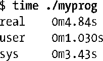
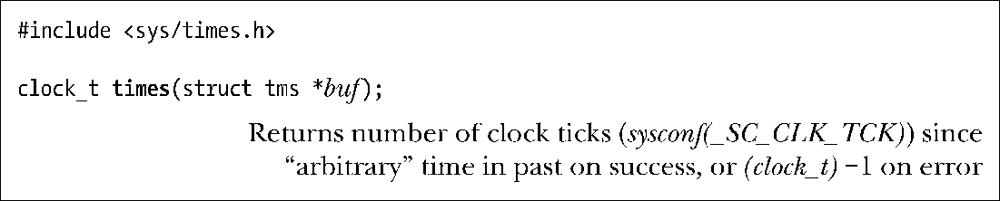
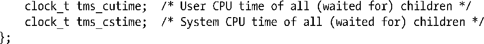

### 10.7　进程时间

进程时间是进程创建后使用的CPU时间数量。出于记录的目的，内核把CPU时间分成以下两部分。

+ 用户 CPU 时间是在用户模式下执行所花费的时间数量。有时也称为虚拟时间（virtual time），这对于程序来说，是它已经得到CPU的时间。
+ 系统CPU时间是在内核模式中执行所花费的时间数量。这是内核用于执行系统调用或代表程序执行的其他任务（例如，服务页错误）的时间。

有时候，进程时间是指处理过程中所消耗的总CPU时间。

当我们运行一个shell程序，我们可以使用的time(1)命令，同时获得这两个部分的时间值，以及运行程序所需的实际时间。

系统调用times()，检索进程时间信息，并把结果通过buf指向的结构体返回。

buf指向的TMS结构体有下列格式：

tms结构体的前两个字段返回调用进程到目前为止使用的用户和系统组件的 CPU 时间。最后两个字段返回的信息是：父进程（比如，times()的调用者）执行了系统调用wait()的所有已经终止的子进程使用的CPU时间。

数据类型clock_t是用时钟计时单元（clock tick）为单位度量时间的整型值，习惯用于计算tms结构体的4个字段。我们可以调用sysconf(_SC_CLK_TCK)来获得每秒包含的时钟计时单元数，然后用这个数字除以clock_t转换为秒。（我们在11.2节叙述sysconf()。）

> 在大多数Linux的硬件架构，sysconf(_SC_CLK_TCK)返回100。与此对应的内核常量是USER_HZ。然而USER_HZ在其他几个架构下可以被定义超过100，如Alpha和IA - 64。

如果成功，times()返回自过去的任意点流逝的以时钟计时单元为单位的（真实的）时间。SUSv3特别未定义这点是什么，只是说，这将是在调用进程的生命周期内的一个固定点。因此，这个返回值唯一的用法是通过计算一对times()调用返回的值的差，来计算进程执行消耗的时间。然而，即使是这种用法，times()的返回值仍然不可靠的，因为它可能会溢出clock_t的有效范围，这时times()的返回值将再次从0开始计算（也就是说，一个稍后的 times()的调用返回的数值可能会低于一个更早的times()调用）。可靠的测量经过时间的方法是使用函数gettimeofday()（10.1节所述）。

在Linux上，我们可以指定buf参数为NULL。在这种情况下，times()只是简单地返回一个函数结果。然而，这是没有意义的。 SUSv3并未定义buf可以使用NULL，因此许多其他UNIX实现需要这个参数必须为一个非NULL值。

函数clock()提供了一个简单的接口用于取得进程时间。它返回一个值描述了调用进程使用的总的CPU时间（包括用户和系统）。

time()的返回值的计量单位是CLOCKS_PER_SEC，所以我们必须除以这个值来获得进程所使用的CPU时间秒数。在POSIX.1，CLOCKS_PER_SEC是常量10000，无论底层软件时钟（10.6节）的分辨率是多少。clock()的精度最终仍然受限于软件时钟的分辨率。

> 虽然clock()和times()返回相同的数据类型clock_t，这两个接口使用的测量单位却并不相同。这是历史原因造成了clock_t定义的冲突，一个是POSIX.1标准，而另一个是C编程语言标准。

即使 CLOCKS_PER_SEC 是常量10000，SUSv3 注明，这个常量在不兼容XSI（non-XSI- conformant)的系统上可以为整型变量，所以，我们不能简单地把它作为一个编译时常量（即，我们不能够使用＃ifdef预处理表达式）。它可能会被定义为一个长整数（即1000000L），我们总是将这个常量转换为long，因此我们可以简单地用printf() 把它打印输出（见3.6.2节）。

SUSv3描述clock()应该返回“进程所使用的处理器时间”时有不同的解释。在一些UNIX的实现中，clock()返回的时间包含所有等待子进程使用的CPU时间。而在Linux上，它不包括。

