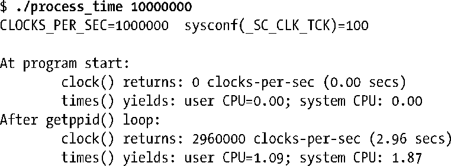
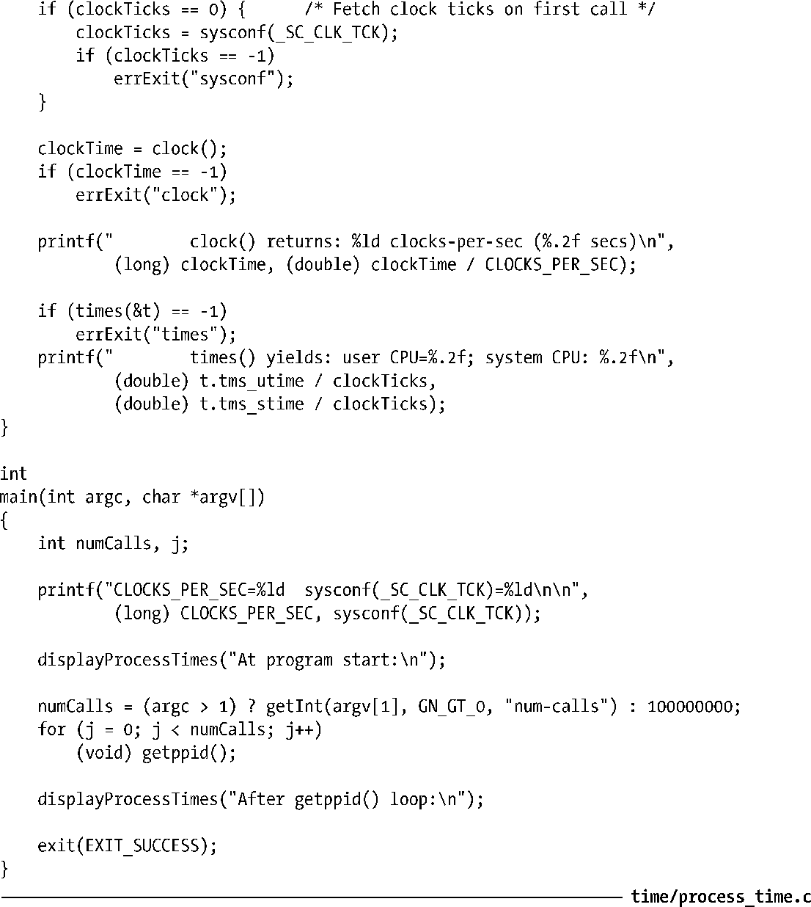

### 示例程序

在程序清单10-5中的程序演示了如何使用本节中描述的功能。函数displayProcessTimes()首先打印由调用者提供的信息，然后使用clock()和times()来获得和显示进程时间。主程序首先调用函数displayProcessTimes()，然后执行一个循环，通过重复调用getppid()消耗一些CPU时间，再次调用displayProcessTimes()来查看这个循环会消耗多少CPU时间。当我们使用这个程序调用getppid()十万次，这就是我们看到的：

程序清单10-5：获取进程CPU时间

