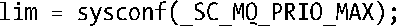

### 运行时恒定值（可能不确定）

所谓运行时恒定值是指某一限制，若已然在<limits.h>文件中定义，则对于实现而言固定不变。然而该值可能是不确定的（因为该值可能依赖于可用的内存空间），因而在<limits.h>文件中会忽略对其定义。在这种情况下（即使在<limits.h>文件中已然定义了该限制），应用程序可以使用sysconf()来获取运行时的值。

MQ_PRIO_MAX限制就是运行时恒定值的例子之一。正如52.5.1节所述，针对POSIX消息队列中的消息，存在着优先级方面的限制。SUSv3 定义了值为 32 的常量_POSIX_MQ_PRIO_MAX，将其作为符合规范的实现为该限制所必须提供的最小值。这意味着，所有符合规范的实现，其对消息优先级的支持至少应为从0～31。一个UNIX实现可以为此限制设定更高值，并将该值在<limits.h>文件中以常量MQ_PRIO_MAX加以定义。例如，Linux就将MQ_PRIO_MAX的值定义为32768。也可以通过下列调用在运行时获取该值：

