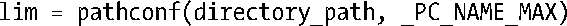

### 路径名变量值

所谓路径名变量值是指与路径名（文件、目录、终端等）相关的限制，每个限制可能是相对于某个系统实现的常量，也可能随文件系统的不同而不同。在限制可能因路径名而发生变化的情况下，应用程序可以使用pathconf()或fpathconf()来获取该值。

NAME_MAX限制是路径名变量值的例子之一。此限制定义了在一个特定文件系统中文件名的最大长度。SUSv3定义了值为 14 （老版本的 System V 文件系统限制）的常量_POSIX_NAME_MAX，作为系统实现必须支持的最小限制值。系统实现可以定义一个高于此值的NAME_MAX限制，并/或向应用开放如下形式的调用，以获取特定文件系统的相关信息：

参数directory_path是目标文件系统上的目录路径名。

