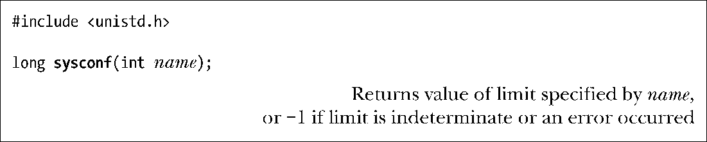
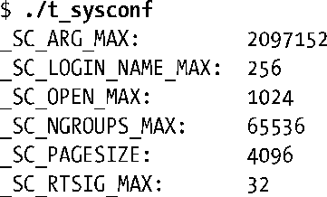
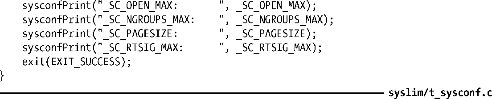

### 11.2　在运行时获取系统限制（和选项）

sysconf()函数允许应用程序在运行时获得系统限制值。

参数name应为定义于<unistd.h>文件中的_SC_系列常量之一，其中部分在表11-1中已有所罗列。限制值将作为函数结果返回。

若无法确定某一限制，则sysconf()返回−1。若调用sysconf()函数时发生错误，也会返回−1。（唯一指定的错误是EINVAL，表示name无效。）为区别上述两种情况，必须在调用函数前将errno设置为0，如果调用返回−1，且调用后errno值不为 0，那么调用sysconf()函数时发生了错误。

> 由sysconf()函数所返回的限制值类型总是（长）整型（pathconf()和fpathconf()也是如此）。在对 sysconf()函数的原理描述中，SUSv3特意指出，一度曾考虑将字符串作为可能的返回值，但由于实现和使用的复杂性而最终放弃了这一构想。

程序清单11-1所示为调用sysconf()来展示各种系统限制。在某一Linux 2.6.31/x86-32系统上运行该程序，将产生如下结果：

程序清单11-1：使用 sysconf()函数

SUSv3要求，针对特定限制，调用sysconf()所获取的值在调用进程的生命周期内应保持不变。例如，就可以这样认定：针对_SC_PAGESIZE限制的返回值在进程运行期间不会改变。

> 在Linux系统中，对于上述要求，有一些（合理的）例外。进程能够使用setrlimit()（见36.2节）修改进程的各种资源限制，这会波及由sysconf()所报告的限制值：RLIMIT_NOFILE，该限制确定进程能够打开的文件数量（_SC_OPEN_MAX）；RLIMIT_NPROC(实际并未纳入SUSv3 中)，即允许进程基于每用户所创建的子进程限额（_SC_CHILD_MAX）；RLIMIT_STACK，始于Linux 2.6.23版本，该限制确定了进程的命令行参数和环境变量所占存储空间的限额（_SC_ARG_MAX，具体参见execve(2)手册页）。

