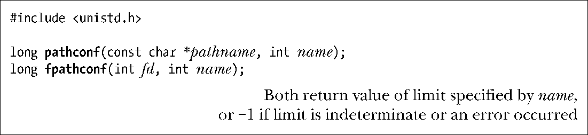
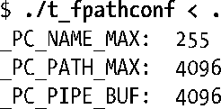
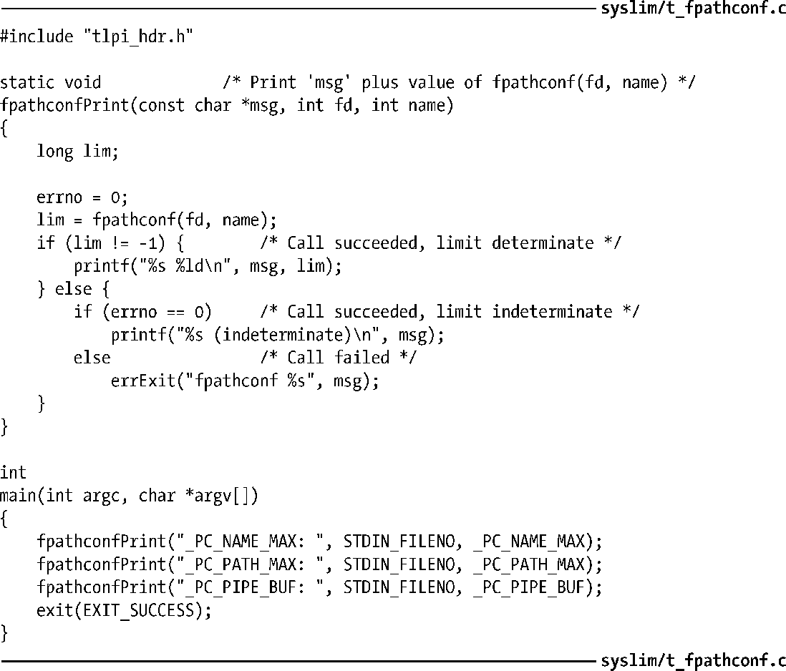

### 11.3　运行时获取与文件相关的限制（和选项）

pathconf()和fpathconf()函数允许应用程序在运行时获取文件相关的限制值。

pathconf()和fpathconf()之间唯一的区别在于对文件或目录的指定方式。pathconf()采用路径名方式来指定，而fpathconf()则使用（之前已经打开的）文件描述符。

参数name则是定义于<unistd.h>文件中的_PC_系列常量之一，在表11-1中已经列举了其中的一部分。表11-2又针对表11-1中展示的_PC_*常量，提供了更深入的细节。

限制的值将作为函数结果返回。如要区分限制值不确定与发生错误的情况，应对方式与sysconf()相同。

有别于sysconf()函数，SUSv3并不要求pathconf()和fpathconf()的返回值在进程的生命周期内保持恒定。这是因为，例如，在进程运行期间，可能会卸载一个文件系统，然后再以不同特性重新装载该文件系统。

<b class="my_markdown">表11-2：pathconf()函数中，选定_PC_系列命名的详细说明</b>

| 常　　量 | 说　　明 |
| :-----  | :-----  | :-----  | :-----  |
| _PC_NAME_MAX | 针对目录，返回该目录下文件命名的最大长度，对于其他文件类型，则未作规定 |
| _PC_PATH_MAX | 对于目录，返回该目录中相对路径名的最大长度，对于其他文件类型，则未作规定 |
| _PC_PIPE_BUF | 对于FIFO或者管道，返回一个应用于引用文件的值。对于目录，返回的值应用于在该目录下创建的一FIFO。对于其他文件类型，则未作规定 |

程序清单11-2所示为针对由标准输入所指向的文件，使用fpathconf()函数获取各种限制。运行该程序时，若将ext2文件系统上的某一目录指定为标准输入，可产生如下结果：

程序清单11-2：使用fpathconf()函数

