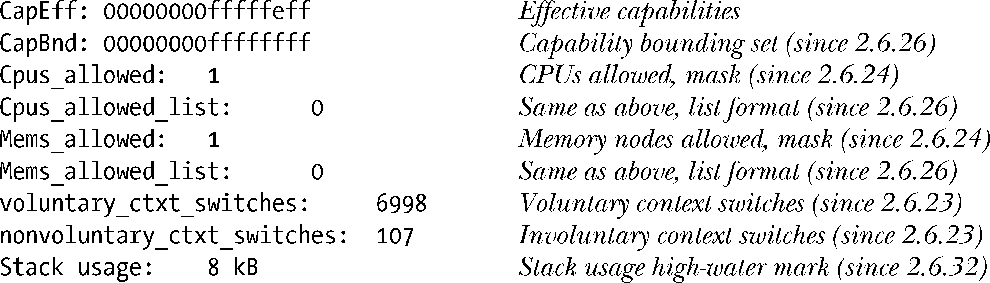

### 12.1.1　获取与进程有关的信息：/proc/PID

对于系统中每个进程，内核都提供了相应的目录，命名为/proc/PID，其中PID是进程的ID。在此目录中的各种文件和子目录包含了进程的相关信息。例如，通过查看/proc/1目录下的文件，可以获取init进程的信息，该进程的ID总是为1。

每个/proc/PID目录中都存在一个命名为status的文件，提供了有关该进程的一系列信息。

上面的输出来自于内核2.6.32。正如伴随文件输出的“始于”说明所示，该文件格式随着时间的推移而不断演进，在不同内核版本中增加了新字段（极少情况下，也会移除字段）。（除了注释中Linux 2.6所带来的改变之外，Linux 2.4增加了Tgid、TracerPid、FDSize和Threads字段。）

该文件内容随着时间而改变，这一事实揭示出关于/proc文件使用的要点所在。当这些文件由多个条目组成时，对其解析应当谨慎从事，在这种情况下，应查找包含特殊字符串（如，PPid）的匹配行记录，而非按照（逻辑）行号来处理文件。

表12-1列举了在每个/proc/PID目录中的部分其他文件。

<b class="my_markdown">表12-1：每个/proc/PID目录下的文件节选</b>

| 文　　件 | 描述（进程属性） |
| :-----  | :-----  | :-----  | :-----  |
| cmdline | 以\0分隔的命令行参数 |
| cwd | 指向当前工作目录的符号链接 |
| Environ | NAME=value 键值对环境列表，以\0分隔 |
| exe | 指向正在执行文件的符号链接 |
| fd | 文件目录，包含了指向由进程打开文件的符号链接 |
| maps | 内存映射 |
| mem | 进程虚拟内存（在I/O操作之前必须调用lseek()移至有效偏移量） |
| mounts | 进程的安装点 |
| root | 指向根目录的符号链接 |
| status | 各种信息（比如，进程ID、凭证、内存使用量、信号） |
| task | 为进程中的每个线程均包含一个子目录（始自Linux 2.6） |

#### /proc/PID/fd目录

/proc/PID/fd目录为进程打开的每个文件描述符都包含了一个符号链接，每个符号链接的名称都与描述符的数值相匹配。例如，/proc/1968/1是ID为1968的进程中指向标准输出的符号链接，更多信息参见5.11节。

为方便起见，任何进程都可使用符号链接/proc/self来访问其自己的/proc/PID目录。

#### 线程：/proc/PID/task目录

Linux 2.4增加了线程组概念，正式支持POSIX线程模型。因为线程组中的一些属性对于线程而言是唯一的，所以Linux 2.4在/proc/PID目录下增加了一个task子目录。针对进程中的每个线程，内核提供了以/proc/PID/task/TID命名的子目录，其中TID是该线程的线程ID。（此值等同于在线程中调用gettid()函数的返回值。）

每个/proc/PID/task/TID子目录中都有一套类似于/proc/PID目录内容的文件和目录。因为线程共享了多个属性，所以这些文件中的许多信息对进程中各个线程而言都是相同的。然而，这些文件也显示了每个线程的独特信息，故而是合理的。例如，在线程组的/proc/PID/task/TID/status文件中，存在那种对每个线程而言，内容都有可能不同的字段，State、Pid、SigPnd、SigBlk、CapInh、CapPrm、CapEff和CapBnd就在此列。

