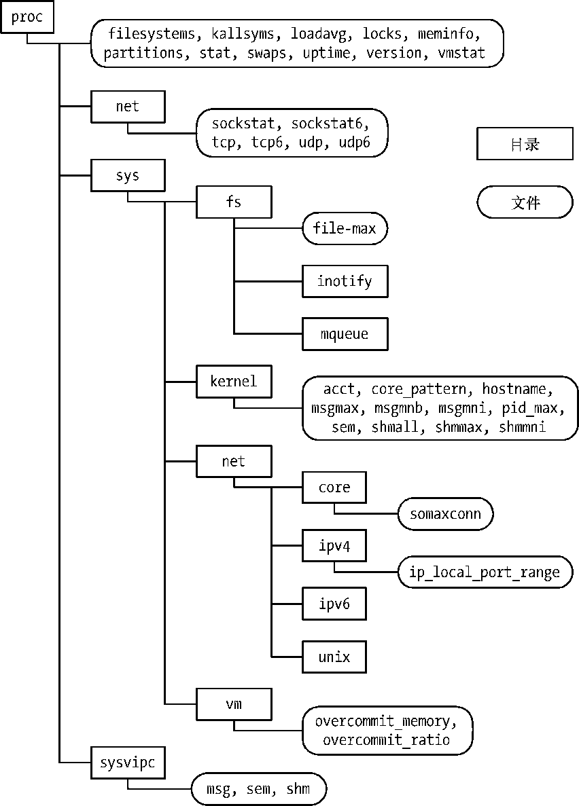

### 12.1.2　/proc 目录下的系统信息

/proc目录下的各种文件和子目录提供了对系统级信息的访问。图12-1展示了其中的部分。

<b class="my_markdown">图12-1：/proc目录下文件和子目录的节选</b>

图12-1中的许多文件在本书的其他章节进行描述。表12-2总结了图12-1所示/proc子目录的一般用途。

<b class="my_markdown">表12-2：节选/proc子目录的用途</b>

| 目　　录 | 目录中文件表达的信息 |
| :-----  | :-----  | :-----  | :-----  |
| /proc | 各种系统信息 |
| /proc/net | 有关网络和套接字的状态信息 |
| /proc/sys/fs | 文件系统相关设置 |
| /proc/sys/kernel | 各种常规的内核设置 |
| /proc/sys/net | 网络和套接字的设置 |
| /proc/sys/vm | 内存管理设置 |
| /proc/sysvipc | 有关System V IPC对象的信息 |

