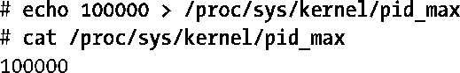
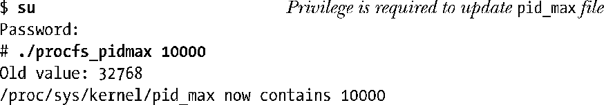
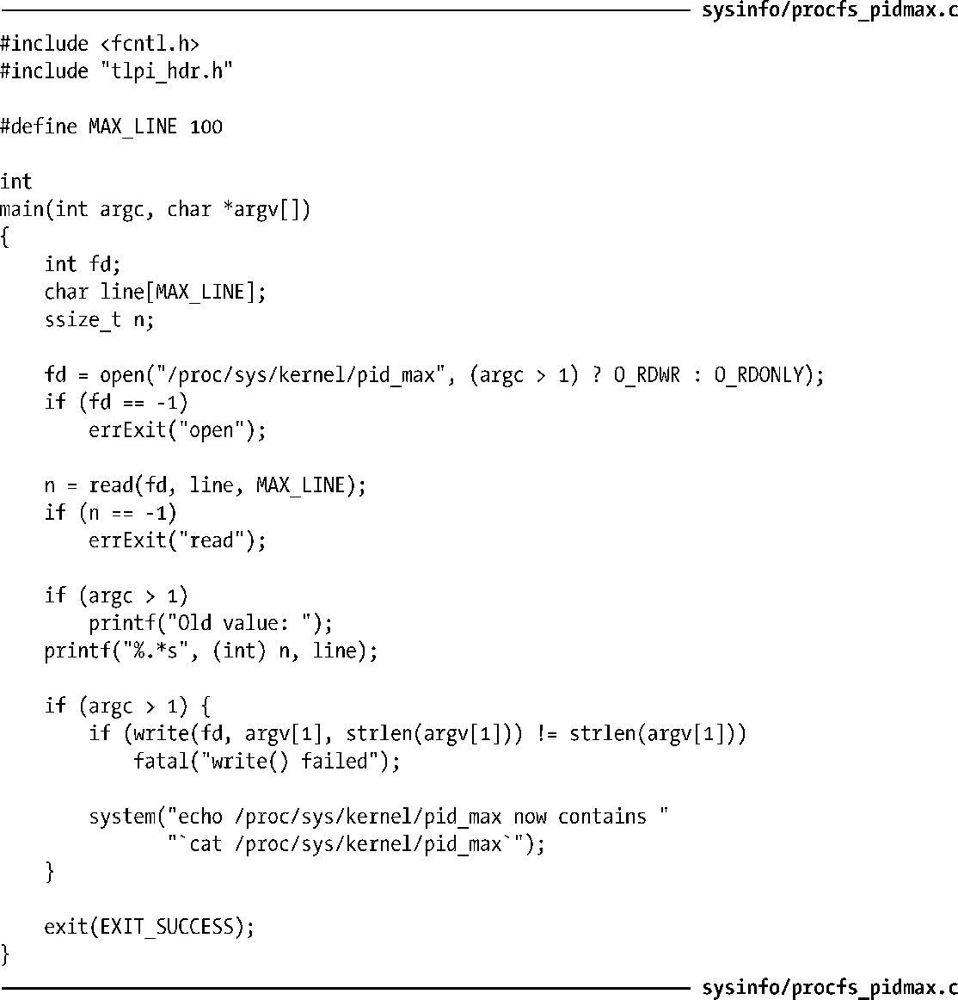

### 12.1.3　访问/proc文件

通常使用shell脚本来访问/proc目录下的文件（使用诸如Python或者Perl之类的脚本语言，很容易解析大多数/proc目录下包含有多个值的文件）。例如，使用如下shell命令，就可以修改和查看/proc目录下的文件内容：

也可以从程序中使用常规I/O系统调用来访问/proc目录下的文件。但在访问这些文件时，有如下一些限制。

+ /proc目录下的一些文件是只读的，即这些文件仅用于显示内核信息，但无法对其进行修改。/proc/PID目录下的大多数文件就属于此类型。
+ /proc目录下的一些文件仅能由文件拥有者（或特权级进程）读取。例如，/proc/PID目录下的所有文件都属于拥有相应进程的用户，而且即使是对文件的属主，其中的部分文件（如：proc/PID/environ文件）也仅仅授予了读权限。
+ 除了/proc/PID子目录中的文件，/proc目录的其他文件大多属于root用户，并且也仅有root用户能够修改那些可修改的文件。

#### 访问/proc/PID目录中的文件

/proc/PID目录内容变化不定。每个目录随着含有相应进程ID的进程创建而生，又随进程的终止而灭。这意味着要确定特定/proc/PID目录的存在，就需要干净利落地处理如下可能性：当打开此目录下的文件时，进程已经终止，并且也已经删除了相应的/proc/PID目录。

#### 示例程序

程序清单12-1展示了如何读取和修改一个/proc目录下的文件。该程序读取并显示了/proc/sys/kernel/pid_max文件的内容。若提供了命令行参数，则程序将使用此参数对文件进行更新。该文件（Linux 2.6的新增文件）规定了进程ID的上限（见6.2节）。此处是运用该程序的一个例子：

程序清单12-1：访问/proc/sys/kernel/pid_max文件

