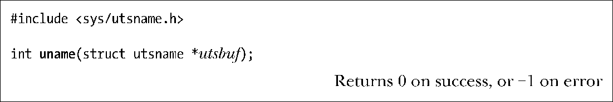
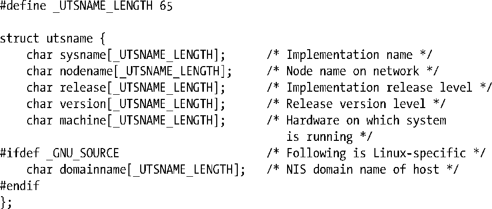
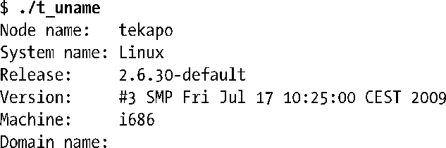
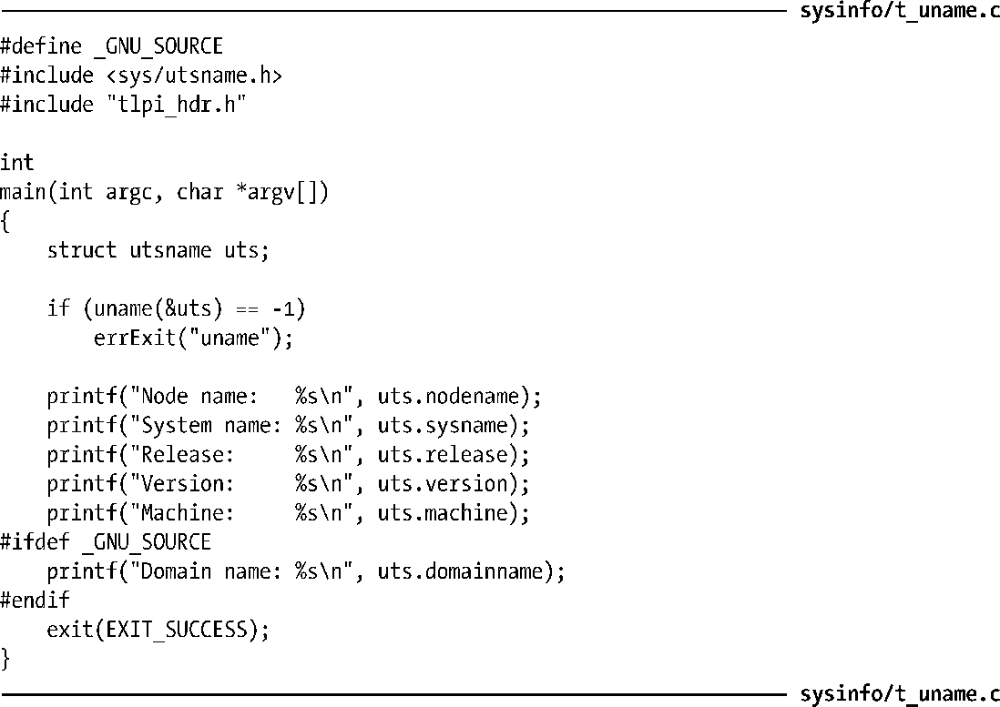

### 12.2　系统标识：uname()

uname()系统调用返回了一系列关于主机系统的标识信息，存储于utsbuf所指向的结构中。

utsbuf参数是一个指向utsname结构的指针，其定义如下：

SUSv3规范了uname()，但对utsname结构中各种字段的长度未加定义，仅要求字符串以空字节终止。在Linux中，这些字段长度均为65个字节，其中包括了空字节终止符所占用的空间。而在一些UNIX实现中，这些字段更短，但在其他操作系统（如Solaris）中，这些字段的长度长达257个字节。

utsname结构中的sysname、release、version和machine字段由内核自动设置。

> 在Linux中，/proc/sys/kernel目录下的3个文件提供了与utsname结构的sysname、release和 version 字段返回值相同的信息，这些只读文件分别为 ostype、osrelease和version。另外一个文件/proc/version，也包含了这些信息，并且还包含了有关内核编译的步骤信息（即执行编译的用户名、用于编译的主机名，以及使用的gcc版本）。

nodename字段的返回值由sethostname()系统调用设置（详情请参考此系统调用的手册页）。通常，该值类似于系统DNS域名中的前缀主机名。

domainname字段的返回值由setdomainname()系统调用设置（详情请参考此系统调用的手册页）。该值是主机的网络信息服务（NIS）域名（与主机域名不同）。

> gethostname()系统调用（是 sethostname()函数的反向操作）用于获取系统主机名，也可利用hostname(1)命令和Linux特有的/proc/hostname文件来查看和设置系统主机名。
> getdomainname()系统调用（setdomainname()函数的反向操作）用于获取NIS域名，也可利用domainname(1)命令和Linux特有的/proc/domainname文件来查看和设置NIS域名。
> sethostname()和setdomainname()系统调用在应用程序中鲜有使用。通常，会在系统启动时运行启动脚本来确立主机名和NIS域名。

程序清单12-2中程序展示了uname()的返回信息。下面是运行该程序可能看到的输出信息：

程序清单12-2：使用 uname()

