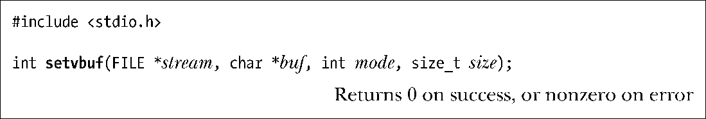
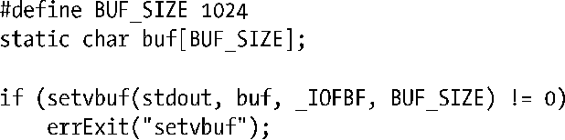
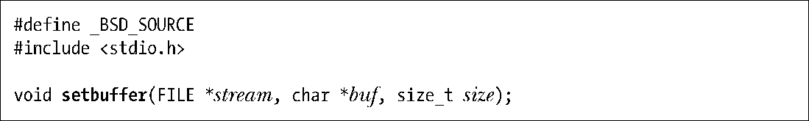
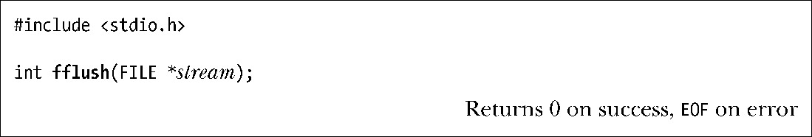

### 13.2　stdio库的缓冲

当操作磁盘文件时，缓冲大块数据以减少系统调用，C语言函数库的I/O函数（比如，fprintf()、fscanf()、fgets()、fputs()、fputc()、fgetc()）正是这么做的。因此，使用stdio库可以使编程者免于自行处理对数据的缓冲，无论是调用 write()来输出，还是调用 read()来输入。

#### 设置一个stdio流的缓冲模式

调用setvbuf()函数，可以控制stdio库使用缓冲的形式。

参数stream标识将要修改哪个文件流的缓冲。打开流后，必须在调用任何其他stdio函数之前先调用setvbuf()。setvbuf()调用将影响后续在指定流上进行的所有stdio操作。

> 不要将stdio库所使用的流与System V系统的STREAMS机制相混淆，Linux的主线内核中并未实现System V 系统的STREAMS。

参数buf和size则针对参数stream要使用的缓冲区，指定这些参数有如下两种方式。

+ 如果参数buf不为NULL，那么其指向size大小的内存块以作为stream的缓冲区。因为stdio库将要使用buf指向的缓冲区，所以应该以动态或静态在堆中为该缓冲区分配一块空间(使用malloc()或类似函数)，而不应是分配在栈上的函数本地变量。否则，函数返回时将销毁其栈帧，从而导致混乱。
+ 若buf为NULL，那么stdio库会为stream自动分配一个缓冲区（除非选择非缓冲的I/O，如下所述）。SUSv3允许，但不强制要求库实现使用size来确定其缓冲区的大小。glibc实现会在该场景下忽略size参数。

参数mode指定了缓冲类型，并具有下列值之一。

##### _IONBF

不对I/O进行缓冲。每个stdio库函数将立即调用write()或者read()，并且忽略buf和size参数，可以分别指定两个参数为NULL和0。stderr默认属于这一类型，从而保证错误能立即输出。

##### _IOLBF

采用行缓冲I/O。指代终端设备的流默认属于这一类型。对于输出流，在输出一个换行符（除非缓冲区已经填满）前将缓冲数据。对于输入流，每次读取一行数据。

##### _IOFBF

采用全缓冲I/O。单次读、写数据（通过read()或write()系统调用）的大小与缓冲区相同。指代磁盘的流默认采用此模式。

下面的代码演示了setvbuf()函数的用法：

注意：setvbuf()出错时返回非0值（而不一定是−1）。

setbuf()函数构建于setvbuf()之上，执行了类似任务。

setbuf(fp,buf)调用除了不返回函数结果外，就相当于：

要么将参数buf指定为NULL以表示无缓冲，要么指向由调用者分配的BUFSIZ个字节大小的缓冲区。（BUFSIZ定义于<stdio.h>头文件中。glibc库实现将此常量定义为一个典型值8192。）

setbuffer()函数类似于setbuf()函数，但允许调用者指定buf缓冲区大小。

对setbuffer(fp,buf,size)的调用相当于如下调用：

SUSv3并未对setbuffer()函数加以定义，但大多数UNIX实现均支持它。

#### 刷新stdio缓冲区

无论当前采用何种缓冲区模式，在任何时候，都可以使用 fflush()库函数强制将 stdio输出流中的数据（即通过write()）刷新到内核缓冲区中。此函数会刷新指定stream的输出缓冲区。

若参数stream为NULL，则fflush()将刷新所有的stdio缓冲区。

也能将 fflush()函数应用于输入流，这将丢弃业已缓冲的输入数据。（当程序下一次尝试从流中读取数据时，将重新装满缓冲区。）

当关闭相应流时，将自动刷新其stdio缓冲区。

在包括glibc库在内的许多C函数库实现中，若stdin和stdout指向一终端，那么无论何时从stdin中读取输入时，都将隐含调用一次fflush(stdout)函数。这将刷新写入stdout的任何提示，但不包括终止换行符（比如，printf("Date：")）。然而，SUSv3和C99并未规定这一行为，也并非所有的C语言函数库都实现了这一行为。要保证程序的可移植性，应用应使用显式的fflush(stdout)调用来确保显示这些提示。

> 若打开一个流同时用于输入和输出，则C99标准中提出了两项要求。首先，一个输出操作不能紧跟一个输入操作，必须在二者之间调用fflush()函数或是一个文件定位函数（fseek()、fsetpos()或者rewind()）。其次，一个输入操作不能紧跟一个输出操作，必须在二者之间调用一个文件定位函数，除非输入操作遭遇文件结尾。

