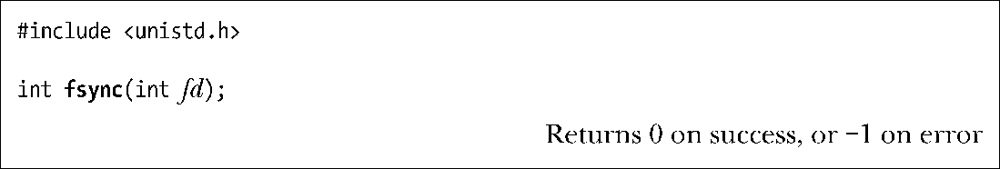

### 13.3　控制文件I/O的内核缓冲

强制刷新内核缓冲区到输出文件是可能的。这有时很有必要，例如，当应用程序（诸如数据库的日志进程）要确保在继续操作前将输出真正写入磁盘（或者至少写入磁盘的硬件高速缓存中）。

在描述用于控制内核缓冲的系统调用之前，有必要先熟悉一下SUSv3中的相关定义。

#### 同步I/O数据完整性和同步I/O文件完整性

SUSv3将同步I/O完成①定义为：某一I/O操作，要么已成功完成到磁盘的数据传递，要么被诊断为不成功。

SUSv3定义了两种不同类型的同步I/O完成，二者之间的区别涉及用于描述文件的元数据（关于数据的数据），亦即内核针对文件而存储的数据。14.4节在描述文件i-node时将详细讨论文件的元数据，但就目前而言，了解文件元数据包含了些什么，诸如文件属主、属组、文件权限、文件大小、文件（硬）链接数量，表明文件最近访问、修改以及元数据发生变化的时间戳，指向文件数据块的指针，就足够了。

SUSv3定义的第一种同步I/O完成类型是synchronized I/O data integrity completion②，旨在确保针对文件的一次更新传递了足够的信息（到磁盘），以便于之后对数据的获取。

+ 就读操作而言，这意味着被请求的文件数据已经（从磁盘）传递给进程。若存在任何影响到所请求数据的挂起写操作，那么在执行读操作之前，会将这些数据传递到磁盘。
+ 就写操作而言，这意味着写请求所指定的数据已传递（至磁盘）完毕，且用于获取数据的所有文件元数据也已传递（至磁盘）完毕。此处的要点在于要获取文件数据，并非需要传递所有经过修改的文件元数据属性。发生修改的文件元数据中需要传递的属性之一是文件大小（如果写操作确实扩展了文件）。相形之下，如果是文件时间戳发生了变化，就无需在下次获取数据前将其传递到磁盘。

Synchronized I/O file integrity completion是SUSv3定义的另一种同步I/O完成，也是上述synchronized I/O data integrity completion的超集。该I/O完成模式的区别在于在对文件的一次更新过程中，要将所有发生更新的文件元数据都传递到磁盘上，即使有些在后续对文件数据的读操作中并不需要。

#### 用于控制文件I/O内核缓冲的系统调用

fsync()系统调用将使缓冲数据和与打开文件描述符fd相关的所有元数据都刷新到磁盘上。调用fsync()会强制使文件处于Synchronized I/O file integrity completion状态。

仅在对磁盘设备（或者至少是其高速缓存）的传递完成后，fsync()调用才会返回。

fdatasync()系统调用的运作类似于 fsync()，只是强制文件处于synchronized I/O data integrity completion的状态。

fdatasync()可能会减少对磁盘操作的次数，由fsync()调用请求的两次变为一次。例如，若修改了文件数据，而文件大小不变，那么调用fdatasync()只强制进行了数据更新。（前面已然述及，针对synchronized I/O data completion状态，如果是诸如最近修改时间戳之类的元数据属性发生了变化，那么是无需传递到磁盘的。）相比之下，fsync()调用会强制将元数据传递到磁盘上。

对某些应用而言，以这种方式来减少磁盘I/O操作的次数是很有用的，比如对性能要求极高，而对某些元数据（比如时间戳）的准确性要求不高的应用。当应用程序同时进行多处文件更新时，二者存在相当大的性能差异，因为文件数据和元数据通常驻留在磁盘的不同区域，更新这些数据需要反复在整个磁盘上执行寻道操作。

Linux 2.2以及更早版本的内核将fdatasync()实现为对fsync()的调用，因而性能也未获得提升。

> 始于内核2.6.17，Linux提供了非标准的系统调用sync_file_range()，当刷新文件数据时，该调用提供比 fdatasync()调用更为精准的控制。调用者能够指定待刷新的文件区域，并且还能指定标志，以控制该系统调用在遭遇写磁盘时是否阻塞。更详细的信息请参阅sync_file_range(2)手册页。

sync()系统调用会使包含更新文件信息的所有内核缓冲区（即数据块、指针块、元数据等）刷新到磁盘上。

在Linux实现中，sync()调用仅在所有数据已传递到磁盘上（或者至少高速缓存）时返回。然而，SUSv3却允许sync()实现只是简单调度一下I/O传递，在动作未完成之前即可返回。

> 若内容发生变化的内核缓冲区在30秒内未经显式方式同步到磁盘上，则一条长期运行的内核线程会确保将其刷新到磁盘上。这一做法是为了规避缓冲区与相关磁盘文件内容长期处于不一致状态（以至于在系统崩溃时发生数据丢失）的问题。在Linux 2.6版本中，该任务由pdflush内核线程执行。（在Linux 2.4版本中，则由kupdated内核线程执行。）
> 文件/proc/sys/vm/dirty_expire_centisecs规定了在pdflush刷新之前脏缓冲区必须达到的“年龄”（以1%秒为单位）。位于同一目录下的其他文件则控制了pdflush操作的其他方面。

#### 使所有写入同步：O_SYNC

调用open()函数时如指定O_SYNC标志，则会使所有后续输出同步（synchronous）。

调用 open()后，每个 write()调用会自动将文件数据和元数据刷新到磁盘上（即，按照Synchronized I/O file integrity completion的要求执行写操作）。

> 早期BSD系统曾使用O_FSYNC标志来提供O_SYNC标志的功能。在glibc库中，将O_FSYNC定义为与O_SYNC标志同义。

#### O_SYNC 对性能的影响

采用O_SYNC标志（或者频繁调用fsync()、fdatasync()或sync()）对性能的影响极大。表13-3所示为采用不同缓冲区大小，在有、无O_SYNC标识的情况下将一百万字节写入一个（位于ext2文件系统上的）新创建文件所需要的时间。运行（随本书一同发行源码中的filebuff/write_bytes.c程序）结果取自于vanilla 2.6.30内核以及块大小为4096字节的ext2文件系统。每行数据均为在给定缓冲区大小下运行20次的平均值。

从表中可以看出，O_SYNC标志使运行总用时大为增加——在缓冲区为1字节的情况下，运行时间相差1000多倍。还要注意，以O_SYNC标志执行写操作时运行总用时和CPU时间之间的巨大差异。这是因为系统在将每个缓冲区中数据向磁盘传递时会把程序阻塞起来。

表13-3所示的结果中还略去了使用O_SYNC时影响性能的一个深层次因素。现代磁盘驱动器均内置大型高速缓存，而默认情况下，使用O_SYNC只是将数据传递到该缓存中。如果禁用磁盘上的高速缓存（使用命令hdparm –W0），那么O_SYNC对性能的影响将变得更为极端。在缓冲区大小为1字节的情况下，运行总用时从1030秒攀升到16000秒左右。而当缓冲区大小为4096字节时，运行总用时也会从0.34秒上升到4秒。

<b class="my_markdown">表13-3：O_SYNC标志对写入1MB速度的影响</b>

| BUF_SIZE | 所需时间（秒） |
| :-----  | :-----  | :-----  | :-----  |
| 无O_SYNC | 有O_SYNC |
| 运行总用时 | 总CPU时间 | 运行总用时 | 总CPU时间 |
| 1 | 0.73 | 0.73 | 1030 | 98.8 |
| 16 | 0.05 | 0.05 | 65.0 | 0.40 |
| 256 | 0.02 | 0.02 | 4.07 | 0.03 |
| 4096 | 0.01 | 0.01 | 0.34 | 0.03 |

总之，如果需要强制刷新内核缓冲区，那么在设计应用程序时就应考虑是否可以使用大尺寸的write()缓冲区，或者在调用fsync()或fdatasync()时谨慎行事，而不是在打开文件时就使用O_SYNC标志。

#### O_DSYNC和O_RSYNC标志

SUSv3规定了两个与同步I/O有关的、更为细化的打开文件状态标志：O_DSYNC 和 O_RSYNC。

O_DSYNC标志要求写操作按照synchronized I/O data integrity completion来执行（类似于fdatasync()）。与之相映成趣的是O_SYNC标志，遵从synchronized I/O file integrity completion（类似于fsync()函数）。

O_RSYNC标志是与O_SYNC标志或O_DSYNC标志配合一起使用的，将这些标志对写操作的作用结合到读操作中。如果在打开文件时同时指定O_RSYNC 和O_DSYNC标志，那么就意味着会遵照synchronized I/O data integrity completion的要求来完成所有后续读操作（即，在执行读操作之前，像执行O_DSYNC标志一样完成所有待处理的写操作）。而在打开文件时指定O_RSYNC 和 O_SYNC标志，则意味着会遵照synchronized I/O file integrity completion的要求来完成所有后续读操作（即，在执行读操作之前，像执行O_SYNC标志一样完成所有待处理的写操作）。

2.6.33版本之前的Linux内核并未实现O_DSYNC 和 O_RSYNC标志。glibc头文件当时只是将这些常量定义为O_SYNC标志。（以上描述实际上不适用于O_RSYNC标志，因为O_SYNC与读操作无关。）

始于2.6.33版本，Linux内核实现了O_DSYNC标志的功能，而O_RSYNC标志的功能则可望在未来的版本中添加。

> 在2.6.33版本之前，Linux内核并未完全实现O_SYNC的语义，而是将其实现为O_DSYNC标志。针对基于较老内核而构建的应用程序，为保证其行为的一致性，与老版GNU C函数库链接的应用程序会继续为O_SYNC标志提供O_DSYNC标志的语义，即使在Linux 2.6.33及更高版本的运行环境下。

