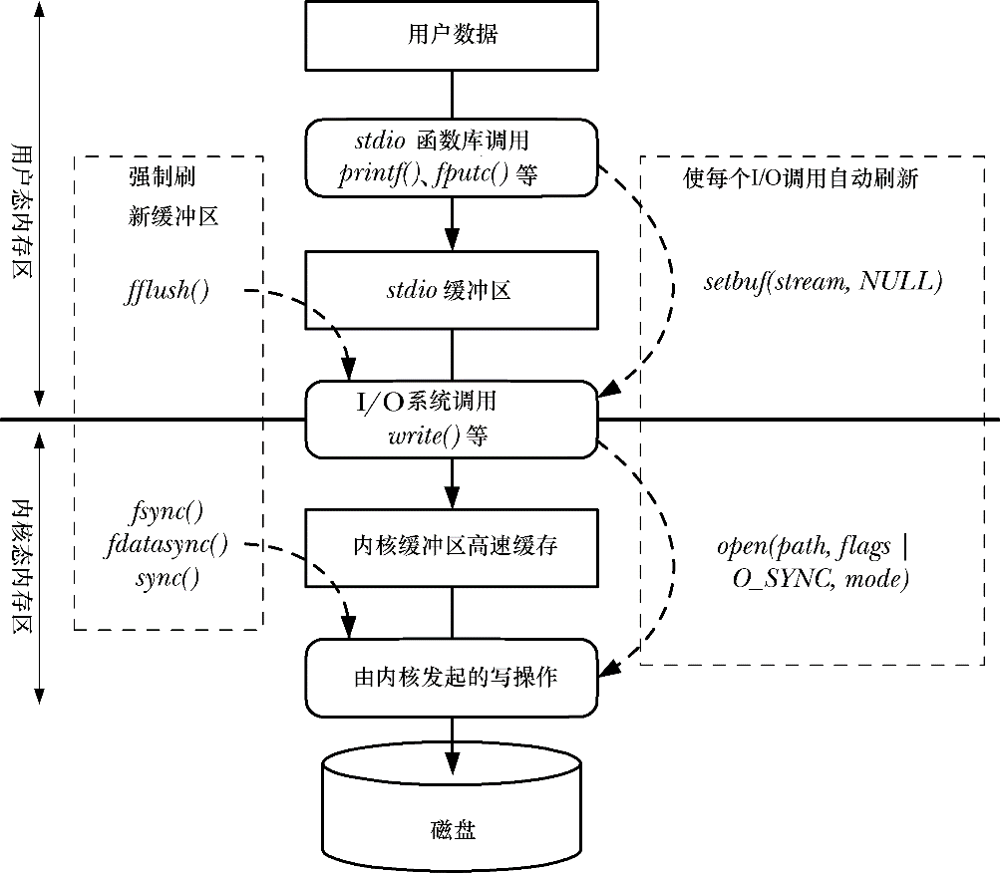

### 13.4　I/O缓冲小结

图13-1概括了stdio函数库和内核所采用的缓冲（针对输出文件），以及对各种缓冲类型的控制机制。从图中自上而下，首先是通过stdio库将用户数据传递到stdio缓冲区，该缓冲区位于用户态内存区。当缓冲区填满时，stdio库会调用write()系统调用，将数据传递到内核高速缓冲区（位于内核态内存区）。最终，内核发起磁盘操作，将数据传递到磁盘。

<b class="my_markdown">图13-1：I/O缓冲小结</b>

图13-1左侧所示为可于任何时刻显式强制刷新各类缓冲区的调用。图右侧所示为促使刷新自动化的调用：一是通过禁用stdio库的缓冲，二是在文件输出类的系统调用中启用同步，从而使每个write()调用立刻刷新到磁盘。

