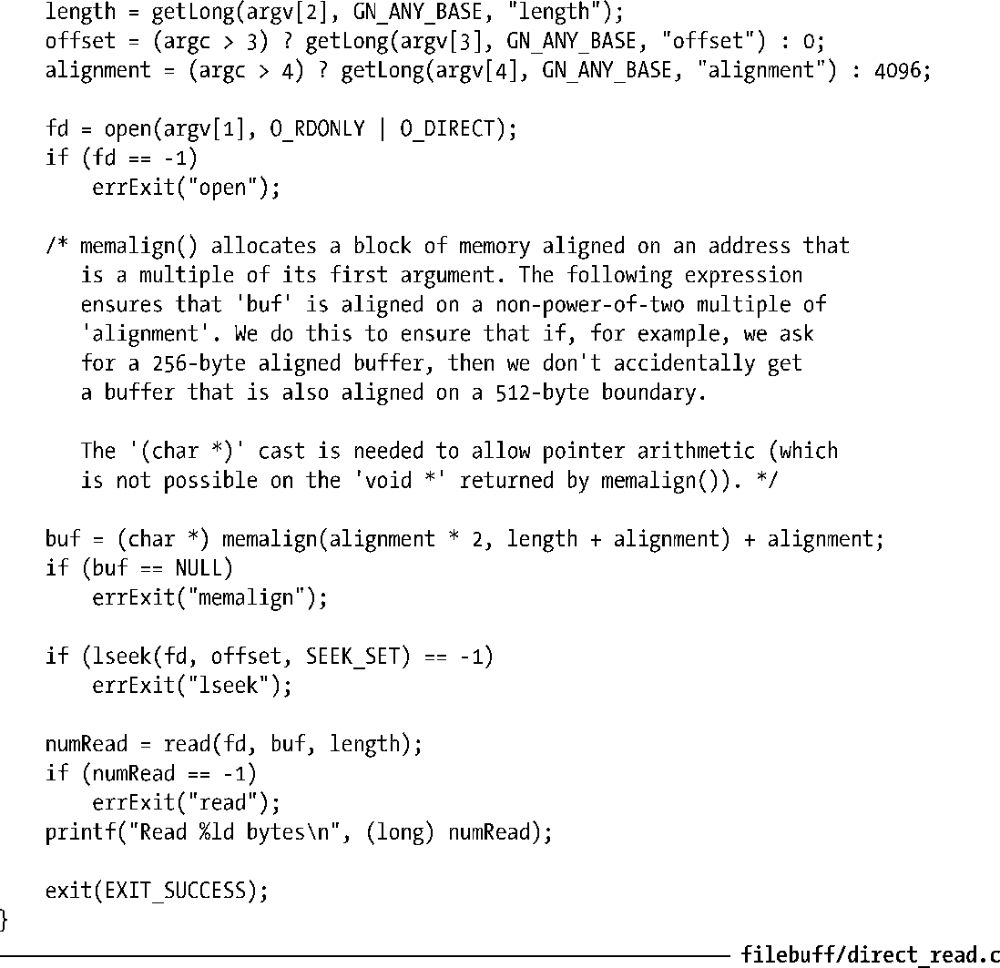

### 13.6　绕过缓冲区高速缓存：直接I/O

始于内核2.4，Linux允许应用程序在执行磁盘I/O时绕过缓冲区高速缓存，从用户空间直接将数据传递到文件或磁盘设备。有时也称此为直接I/O（direct I/O）或者裸I/O(raw I/O)。

> 此处的描述细节为Linux所特有，SUSv3并未对其进行规范。尽管如此，大多数UNIX实现均对设备和文件提供了某种形式的直接I/O访问。

有时会将直接I/O误认为获取快速I/O性能的一种手段。然而，对于大多数应用而言，使用直接I/O可能会大大降低性能。这是因为为了提高I/O性能，内核针对缓冲区高速缓存做了不少优化，其中包括：按顺序预读取，在成簇（clusters）磁盘块上执行I/O，允许访问同一文件的多个进程共享高速缓存的缓冲区。应用如使用了直接I/O将无法受益于这些优化举措。直接I/O只适用于有特定I/O需求的应用。例如数据库系统，其高速缓存和I/O优化机制均自成一体，无需内核消耗CPU时间和内存去完成相同任务。

可针对一个单独文件或块设备（比如，一块磁盘）执行直接I/O。要做到这点，需要在调用open()打开文件或设备时指定O_DIRECT标志。

O_DIRECT标志自内核2.4.10开始有效，并非所有Linux文件系统和内核版本都支持该标志。绝大多数原生（native）文件系统都支持O_DIRECT，但许多非UNIX文件系统（比如VFAT）则不支持。对于所关注的文件系统，有必要进行相关测试（若文件系统不支持O_DIRECT，则open()将失败并返回错误号EINVAL）或是阅读内核源码，以此来加以验证。

> 若一进程以O_DIRECT标志打开某文件，而另一进程以普通方式（即使用了高速缓存缓冲区）打开同一文件，则由直接I/O所读写的数据与缓冲区高速缓存中内容之间不存在一致性。应尽量避免这一场景。
> raw(8)手册页描述了一个获取对磁盘设备进行原始访问的老技术（现在已过时）。

##### 直接I/O的对齐限制

因为直接I/O（针对磁盘设备和文件）涉及对磁盘的直接访问，所以在执行I/O时，必须遵守一些限制。

+ 用于传递数据的缓冲区，其内存边界必须对齐为块大小的整数倍。
+ 数据传输的开始点，亦即文件和设备的偏移量，必须是块大小的整数倍。
+ 待传递数据的长度必须是块大小的整数倍。

不遵守上述任一限制均将导致EINVAL错误。在上述列表中，块大小（block size）指设备的物理块大小（通常为512字节）。

> 当执行直接I/O时，Linux 2.4比Linux 2.6限制更为严格：对齐、长度及偏移量必须是底层文件系统逻辑块大小的整数倍。（典型文件系统的逻辑块大小为1024、2048或4096字节。）

##### 示例程序

程序清单13-1提供了一个使用O_DIRECT标志打开一个文件读取数据的简单例子。该程序可指定多达4个命令行参数，依次为要读取的文件、要从文件中读取的字节数、读之前在文件中定位（seek）的偏移量和传递给read()的数据缓冲区对齐。最后两个为可选参数，默认值分别为0字节和4096字节。下面是运行该程序的一些示例：

> 程序清单13-1中程序使用memalign()函数来分配一块内存，其内存块与第一个参数的整数倍对齐。7.1.4节对memalign()函数有所描述。

程序清单13-1：使用O_DIRECT跳过缓冲区高速缓存

