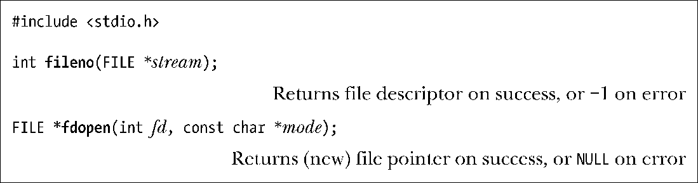
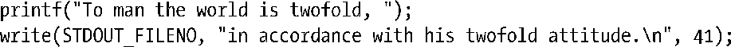

### 13.7　混合使用库函数和系统调用进行文件I/O

在同一文件上执行I/O操作时，还可以将系统调用和标准C语言库函数混合使用。fileno()和fdopen()函数有助于完成这一工作。

给定一个（文件）流，fileno()函数将返回相应的文件描述符（即stdio库在该流上已经打开的文件描述符）。随即可以在诸如read()、write()、dup()和fcntl()之类的I/O系统调用中正常使用该文件描述符。

fdopen()函数与 fileno()函数的功能相反。给定一个文件描述符，该函数将创建了一个使用该描述符进行文件I/O的相应流。mode参数与fopen()函数中mode参数含义相同。例如，r为读，w为写，a为追加。若该参数与文件描述符fd的访问模式不一致，则对fdopen()的调用将失败。

fdopen()函数对非常规文件描述符特别有用。正如后续章节将提及的，创建套接字和管道的系统调用总是返回文件描述符。为了在这些文件类型上使用stdio库函数，必须使用fdopen()函数来创建相应文件流。

当使用stdio库函数，并结合系统I/O调用来实现对磁盘文件的I/O操作时，必须将缓冲问题牢记于心。I/O系统调用会直接将数据传递到内核缓冲区高速缓存，而stdio库函数会等到用户空间的流缓冲区填满，再调用write()将其传递到内核缓冲区高速缓存。请考虑如下向标准输出写入的代码：

通常情况下，printf()函数的输出往往在 write()函数的输出之后出现。因此，代码产生如下输出：

将I/O系统调用和stdio函数混合使用时，使用fflush()来规避这一问题，是明智之举。也可以使用setvbuf()或setbuf()使缓冲区失效，但这样做可能会影响应用的I/O性能，因为每个输出操作将引起一次write()系统调用。

> 要将I/O系统调用和stdio函数混合使用，SUSv3针对此类应用的要求有所规范。详情参见系统接口卷（System Interfaces (XSH)）“通用信息”一章中“文件描述符和标准I/O流”一节。

