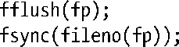

### 13.9　练习

**13-1.** 　使用shell内嵌的 time命令，测算程序清单4-1(copy.c)在当前环境下的用时。

a）使用不同的文件和缓冲区大小进行试验。编译应用程序时使用–DBUF_SIZE=nbytes选项可设置缓冲区大小。

b）对open()的系统调用加入O_SYNC 标识，针对不同大小的缓冲区，速度存在多大差异？

c）在一系列文件系统（比如，ext3、XFS、Btrfs和JFS）中执行这些计时测试。结果相似吗？当缓冲区大小从小变大时，用时趋势相同吗？

**13-2.** 　测定filebuff/write_bytes.c（随本书发行版提供源码）程序在不同的缓冲区大小以及文件系统下的用时。

**13-3.** 　如下语句的执行效果是什么？

**13-4.** 　试解释取决于将标准输出重定向到终端还是磁盘文件，为什么如下代码的输出结果不同。

**13-5.** 　tail [ –n num ] file命令打印名为file文件的最后num 行（默认为10行）。使用I/O系统调用（lseek()、read()、write()等）来实现该命令。牢记本章所描述的缓冲问题，力求实现的高效性。

①译者注：synchronized I/O completion。

②译者注：忍无可忍，保留原文。

