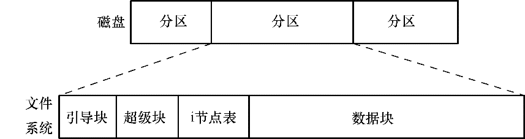

### 文件系统结构

在文件系统中，用来分配空间的基本单位是逻辑块，亦即文件系统所在磁盘设备上若干连续的物理块。例如，在ext2文件系统上，逻辑块的大小为1024、2048或4096字节。（使用mkfs(8)命令创建文件系统时，可指定逻辑块的大小作为命令行参数。）

> 特权级程序（CAP_SYS_RAWIO）可利用ioctl()的FIBMAP操作，来判定文件指定逻辑块的物理位置。该调用的第三个参数是整型值，同时用于返回结果。调用之前，应将该参数设置为逻辑块编号（第一个逻辑块编号为0）；调用之后，其中返回的为存储该逻辑块的起始物理块编号。

图14-1所示为磁盘分区和文件系统之间的关系，以及一般文件系统的组成。

<b class="my_markdown">图14-1：磁盘分区和文件系统布局</b>

文件系统由以下几部分组成。

+ 引导块：总是作为文件系统的首块。引导块不为文件系统所用，只是包含用来引导操作系统的信息。操作系统虽然只需一个引导块，但所有文件系统都设有引导块（其中的绝大多数都未使用）。
+ 超级块：紧随引导块之后的一个独立块，包含与文件系统有关的参数信息，其中包括：
      + i节点表容量；
    + 文件系统中逻辑块的大小；
    + 以逻辑块计，文件系统的大小；

驻留于同一物理设备上的不同文件系统，其类型、大小以及参数设置（比如，块大小）都可以有所不同。这也是将一块磁盘划分为多个分区的原因之一。

+ i节点表：文件系统中的每个文件或目录在i节点表中都对应着唯一一条记录。这条记录登记了关乎文件的各种信息。下一节会深入讨论i节点。有时也将i节点表称为i-list。
+ 数据块：文件系统的大部分空间都用于存放数据，以构成驻留于文件系统之上的文件和目录。

> 就ext2文件系统而言，情况要比正文中的描述稍微复杂一点。在起始的引导块之后，ext2文件系统被划分为一系列大小相等的块组（block group）。每个块组都包含了一份超级块的拷贝、与块组有关的参数信息，以及该块组的i节点表和数据块。ext2文件系统会尽量在同一块组内存储一个文件的所有块，以期在对文件线性访问时缩短寻道时间。更多详情，请参考Linux源码Documentation/filesystems/ext2.txt、dumpe2fs程序的源代码（作为e2fsprogs软件包的一部分发布），以及[Bovet & Cesati，2005]。

