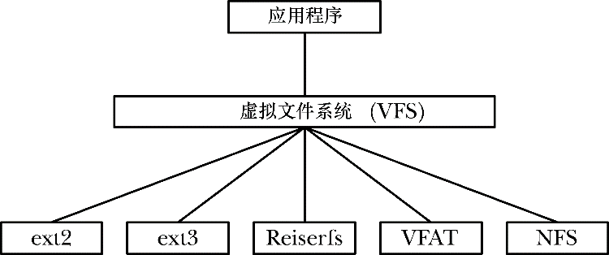

### 14.5　虚拟文件系统（VFS）

Linux所支持的各种文件系统，其实现细节均不相同。举例来说，这些差异包括文件块的分配方式，以及目录的组织方式。如果每个与文件打交道的程序都需要理解各种文件系统的具体细节，那么编写与各类文件系统交互的程序将近乎于不可能完成的任务。虚拟文件系统（VFS，有时也称为虚拟文件交换）是一种内核特性，通过为文件系统操作创建抽象层来解决上述问题（参见图14-3）。VFS背后的原理其实很直白。

<b class="my_markdown">图14-3：虚拟文件系统</b>

+ VFS针对文件系统定义了一套通用接口。所有与文件交互的程序都会按照这一接口来进行操作。
+ 每种文件系统都会提供VFS接口的实现。

这样一来，程序只需理解VFS接口，而无需过问具体文件系统的实现细节。

VFS接口的操作与涉及文件系统和目录的所有常规系统调用相对应，这些系统调用有open()、read()、write()、lseek()、close()、truncate()、stat()、mount()、umount()、mmap()、mkdir()、link()、unlink()、symlink()以及rename()。

VFS的抽象层建模精确仿照传统的UNIX文件系统模型。当然，还有一些文件系统，尤其是非UNIX文件系统，并不支持所有的VFS操作。（比如，微软的VFAT就不支持使用symlink()创建的符号链接概念。）对于这种情况，底层文件系统会将错误代码传回VFS层，表明不支持相应操作，而VFS随之会将错误代码传递给应用程序。

