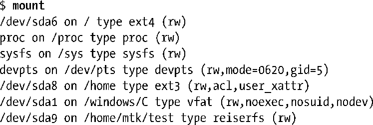
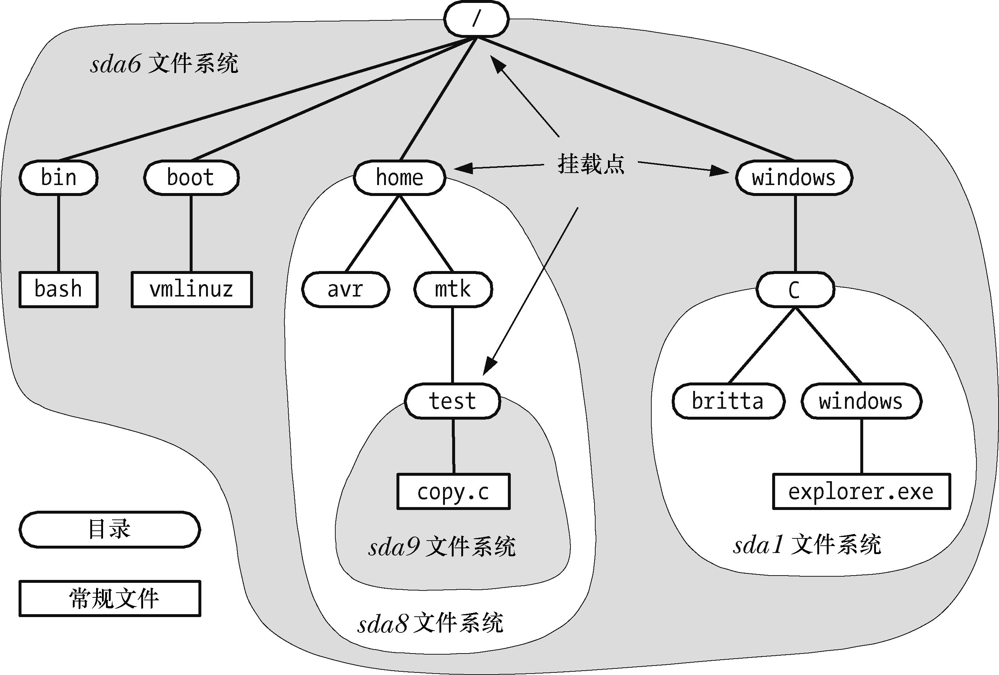

### 14.7　单根目录层级和挂载点

与其他UNIX系统一样，Linux上所有文件系统中的文件都位于单根目录树下，树根就是根目录“/”。其他的文件系统都挂载在根目录之下，被视为整个目录层级的子树（subtree）。超级用户可使用如下命令来挂载文件系统：

这条命令会将名为device的文件系统挂接到目录层级中由directory所指定的目录，即文件系统的挂载点。可使用unmount命令卸载文件系统，然后在另一个挂载点再次挂载文件系统，从而改变文件系统的挂载点。

> 自Linux 版本2.4.19以后，情况变得更为复杂。如今，内核支持针对每个进程的挂载命名空间（mount namespace）。这意味着每个进程都可能拥有属于自己的一组文件系统挂载点，因此进程视角下的单根目录层级彼此会有所不同。本书将在28.2.1节介绍CLONE_NEWNS标记时，对上述内容做深入讨论。

不带任何参数来执行mount命令，可以列出当前已挂载的文件系统，如下例所示（与实际输出相比，略有删减）：

图14-4所示的部分目录及文件结构就出自于执行上述mount命令的系统。该图演示了将安装点映射到目录层级的方法。

<b class="my_markdown">图14-4：演示文件系统挂载点的目录层级示例</b>

