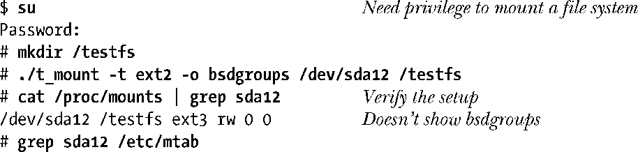
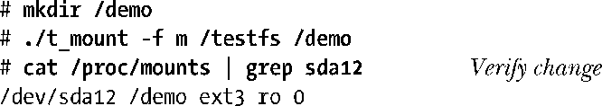
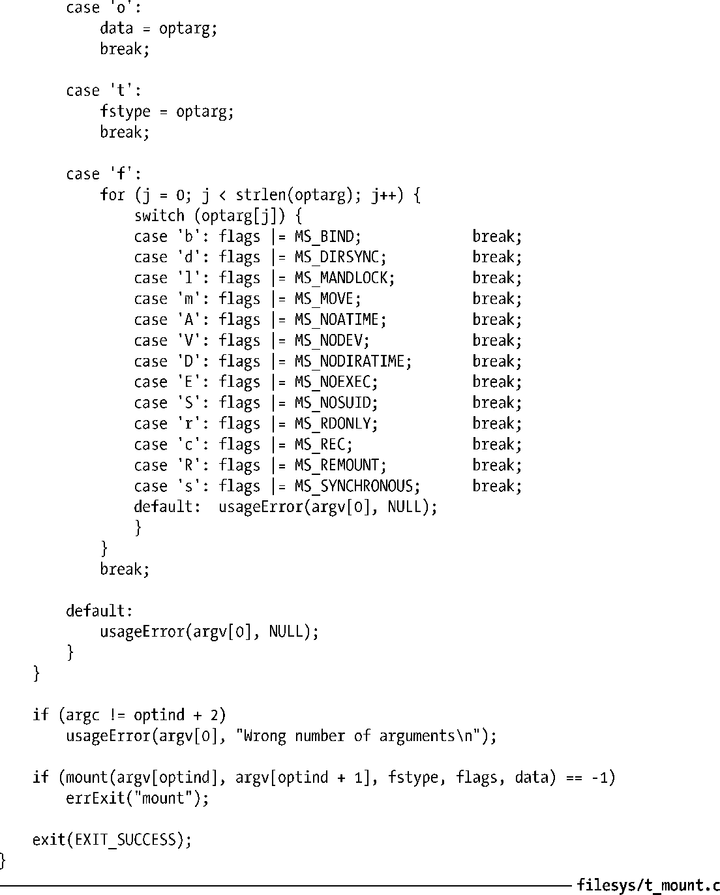

### 14.8.1　挂载文件系统：mount()

mount()系统调用将由source指定设备所包含的文件系统，挂载到由target指定的目录下。

头两个参数分别命名为source和target，其原因在于，除了将磁盘文件系统挂载到一目录下之外，mount()还可以执行其他任务。

参数fstype是一字符串，用来标识设备所含文件系统的类型，比如，ext4或btrfs。

参数mountflags为一位掩码，通过对表14-1中所示的0个或多个标志进行或（OR）操作而得出，稍后将做详细介绍。

<b class="my_markdown">表14-1：供mount()使用的mountflags值</b>

| 标　　记 | 用　　途 |
| :-----  | :-----  | :-----  | :-----  |
| MS_BIND | 建立绑定挂载（始于Linux 2.4） |
| MS_DIRSYNC | 同步更新路径（始于Linux 2.6） |
| MS_MANDLOCK | 允许强制锁定文件 |
| MS_MOVE | 以原子操作将挂载点移到新位置 |
| MS_NOATIME | 不更新文件的最后访问时间 |
| MS_NODEV | 不允许访问设备 |
| MS_NODIRATIME | 不更新目录的最后访问时间 |
| MS_NOEXEC | 不允许程序执行 |
| MS_NOSUID | 禁用set-user-ID和set-group-ID程序 |
| MS_RDONLY | 以只读方式挂载；不能修改或创建文件 |
| MS_REC | 递归挂载（始于 Linux 2.6.20） |
| MS_RELATIME | 只有当最后访问时间早于最后修改时间或最后状态变更时间时，才对前者进行更新（始于 Linux 2.4.11） |
| MS_REMOUNT | 使用新的mountflags和data重新挂载 |
| MS_STRICTATIME | 总是更新最后访问时间（始于 Linux 2.6.30） |
| MS_SYNCHRONOUS | 使得所有文件和目录同步更新 |

mount()的最后一个参数data是一个指向信息缓冲区的指针，对其信息的解释则取决于文件系统。就大多数文件系统而言，该参数是一字符串，包含了以逗号分隔的选项设置。在mount(8)手册页中，有这些选项的完整列表。若未见之于mount(8)手册页，请查找相关文件系统的文档。

mountflags参数是标志的位掩码，用来修改mount()操作。在mountflags中，可以指定0到多个如下标志：

##### MS_BIND（始于Linux 2.4）

用来建立绑定挂载。14.9.4节将描述这一特性。如果指定了该标志，那么mount()会忽略fstype、data参数，以及mountflags中除MS_REC之外的标志（见后续描述）。

##### MS_DIRSYNC（始于Linux 2.6）

用来同步更新路径。该标志的效果类似于open()的O_SYNC标志（参见13.3节），但只针对路径。后面介绍的MS_SYNCHRONOUS提供了MS_DIRSYNC功能的超集，可同时同步更新文件和目录。采用 MS_DIRSYNC 标志的应用程序在确保同步更新目录（比如，open(pathname，O_CREAT)、rename()、link()、unlink()、symlink()以及mkdir()）的同时，还无需消耗同步更新文件所带来的成本。FS_DIRSYNC_FL标志的用途与之相近，其区别在于可将MS_DIRSYNC应用于单个目录。此外，在Linux上，针对指代目录的文件描述符调用fsync()，可对目标目录进行更新。（SUSv3并未对fsync()的这一Linux专有行为加以规范。）

##### MS_MANDLOCK

允许对该文件系统中的文件强行锁定记录。第55章将描述记录锁定。

##### MS_MOVE

将由source指定的现有挂载点移到由target指定的新位置，整个动作为一原子操作，不可分割。这与mount(8)命令的--move选项相对应。实际上，这等同于卸载子树，并将其重新装载到另一位置，只是卸载子树的时点并无意义①。source参数为一字符串，其内容应与前一个mount()调用中的target相同。一旦使用了这一标志，那么mount()将忽略fstype、data参数，以及mountflags中的其他标志。

##### MS_NOATIME

针对该文件系统中的文件，不更新其最后访问时间。与下面将要介绍的MS_NODIRATIME标志一样，使用该标志意在消除额外的磁盘访问，避免在每次访问文件时都去更新文件i节点。对某些应用程序来说，维护这一时间戳意义不大，而放弃这一做法还能显著提升性能。MS_NOATIME标志与FS_NOATIME_FL标志（见15.5节）目的相似，区别在于可将FS_NOATIME_FL标志应用于单个文件。此外，Linux还可以运用open()的O_NOATIME标志，来提供类似功能，可以针对打开的单个文件来选择这一行为（参见4.3.1节）。

##### MS_NODEV

不允许访问此文件系统上的块设备和字符设备。设计这一特性的目的是为了保障系统安全，规避如下情况：假设用户插入了可移动磁盘，而磁盘中又包含了可随意访问系统的设备专有文件。

##### MS_NODIRATIME

不更新此文件系统中目录的最后访问时间（该标志提供了MS_NOATIME标志的部分功能，MS_NOATIME标志不会对所有文件类型的最后访问时间进行更新）。

##### MS_NOEXEC

不允许在此文件系统上执行程序（或脚本）。该标志用于文件系统包含非Linux可执行文件的场景。

##### MS_NOSUID

禁用此文件系统上的set-user-ID和set-group-ID程序。这属于安全特性，意在防止用户从可移动磁盘上运行set-user-ID和set-group-ID程序。

##### MS_RDONLY

以只读方式挂载文件系统，在此文件系统上既不能创建文件，也不能修改现有文件。

##### MS_REC（始于Linux 2.4.11）

该标志与其他标志（比如，MS_BIND）结合使用，以递归方式将挂载动作施之于子树下的所有挂载。

##### MS_RELATIME (始于Linux 2.6.20)

在此文件系统中，只有当文件最后访问时间戳的当前值②小于或等于最后一次修改或状态变更的时间戳时，才对其进行更新。这不但吸取了MS_NOATIME性能上的一些优点，而且还可应用于如下场景：程序能了解到，自上次更新以来，有无读取过文件。自Linux 2.6.30以来，系统会默认提供MS_RELATIME的行为（除非明确指定了MS_NOATIME标志），要获取传统行为，必须使用MS_STRICTATIME标志。此外，只要文件最后访问时间戳距今超过24小时，即便其大于最近修改和状态改变时间戳，系统仍会更新该文件的最后访问时间戳。（该标志对于监控目录的系统程序来说极为有用，可以了解最近有无对文件进行过访问。）

##### MS_REMOUNT

针对已挂载的文件系统，改变其mountflag（装备标记）和data（数据）。（例如，令只读文件系统可写。）使用该标志时，source和target参数应该与最初用于mount()系统调用的参数相同，而对fstype参数则予以忽略。使用该标志可以避免对磁盘进行卸载和重新挂载，在某些场合中，这是不可能做到的。比方说，如果有进程打开了文件系统上的文件，或进程的当前工作目录位于文件系统之内（对 root 文件系统来说，情况总是如此），就无法卸载相应的文件系统。使用MS_REMOUNT的另一场景是tmpfs（基于内存的）文件系统，一旦卸载了这一文件系统，其内容便会丢失。并非所有的mountflag都是可修改的，具体信息请参考mount(2)手册页。

##### MS_STRICTATIME（始于 Linux 2.6.30）

只要访问此文件系统上的文件，就总是更新文件的最后访问时间戳。Linux 2.6.30之前，这是系统的默认行为。只要定义了MS_STRICTATIME，即使在mountflag中定义了MS_NOATIME 和MS_RELATIME，也会将其忽略。

##### MS_SYNCHRONOUS

对文件系统上的所有文件和目录保持同步更新。（对文件来说，就如同总是以O_SYNC标志调用open()来打开文件一样。）

> 从内核2.6.15起，为支持共享子树（shared subtree）的概念，Linux提供了4个新的挂载标志，分别是MS_PRIVATE、MS_SHARED、MS_SLAVE、MS_UNBINDABLE。这些标志可与MS_REC结合使用，从而将其效果传播至一挂载子树（mount subtree）下的所有子挂载（submount）。设计共享子树的目的，是为了支持某些高级文件系统特性，比如，每进程挂载命名空间（请参见28.2.1一节对CLONE_NEWNS的描述），以及用户空间的文件系统（FUSE）工具。共享子树机制允许以一种受控方式在挂载命名空间之间传播文件系统的挂载。关于共享子树的详细信息，可查阅内核源码文件Documentation/filesystems/ sharedsubtree.txt和[Viro & Pai，2006]一书。

#### 程序示例

程序清单14-1提供了对mount(2)系统调用的命令行级接口。其实，也是mount(8)命令的简化版。以下shell会话日志演示了对该程序的运用。首先创建一个目录作为挂载点，并挂载文件系统。

这里可以发现，上面的grep命令并未产生任何输出，因为该程序并未更新/etc/mtab。现继续以只读方式重新挂载文件系统：

从/proc/mounts输出的字串“ro”表明这是一次只读方式的挂载。

最后，再将挂载点移动至目录层级内的新位置：

程序清单14-1：使用mount()

