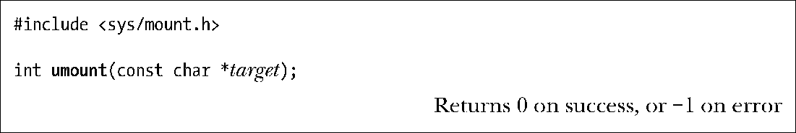
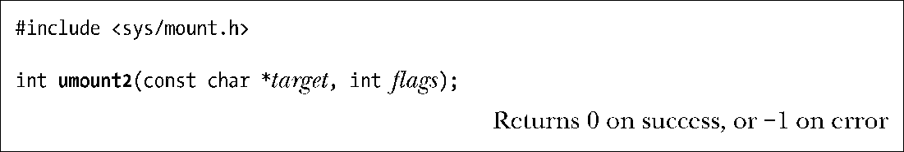

### 14.8.2　卸载文件系统：umount()和umount2()

umount()系统调用用于卸载已挂载的文件系统。

target参数指定待卸载文件系统的挂载点。

> 对于内核版本为2.2及更早的Linux系统来说，存在两种方法来标识文件系统：其一，通过挂载点；其二，通过包含文件系统的设备名。自内核版本2.4之后，Linux不再允许使用第二种方法，其原因是如今可以在多个位置挂载单个文件系统，以第二种方式为target指定文件系统就会混淆不清。本书的14.9.1节将详细介绍这一点。

无法卸载正在使用中的（busy）文件系统，意即这一文件系统上有文件被打开，或者进程的当前工作目录驻留在此文件系统下。针对使用中的文件系统调用umount()，系统会返回EBUSY错误。

系统调用umount2()是umount()的扩展版。通过flags参数，umount2()可对卸载操作施以更精密的控制。

这一标志位掩码参数由下列0个或多个值相或（OR）而成。

##### MNT_DETACH（始于Linux 2.4.11）

执行lazy卸载。对挂载点加以标记，一方面允许已使用了挂载点的进程得以继续使用，同时禁止任何其他进程对该挂载点发起新的访问。当所有进程不再使用访问点时，系统会卸载相应的文件系统。

##### MNT_EXPIRE (始于Linux 2.6.8)

将挂载点标记为到期（expired）。若首次调用umount2()时指定了该标志，且挂载点处于空闲状态，则该调用将以失败告终，并返回EAGAIN错误，同时将挂载点标记为到期。（如果挂载点处于在用状态，那么调用也将失败，并返回EBUSY错误，但不会将挂载点标记为到期。）只要无任何后续进程发起对挂载点的访问，该挂载点便会一直保持到期状态。再度调用umount2()时，如指定MNT_EXPIRE标志，将卸载到期的挂载点。这就提供了一种机制，以卸载在某段时间内未用的文件系统。该标志不能与 MNT_DETACH 或MNT_FORCE标志一并使用。

##### MNT_FORCE

即便文件系统（只对NFS挂载有效）处于在用状态，依然将其强行卸载。采用这一选项可能会造成数据丢失。

##### UMOUNT_NOFOLLOW(始于Linux 2.6.34)

若target为符号链接，则不对其进行解引用。该标志专为某些set-user-ID-root程序而设计——此类程序允许非特权级用户执行卸载操作，意在避免安全性问题的发生（例如，若target为符号链接，且被改变以指向另外的位置）。

