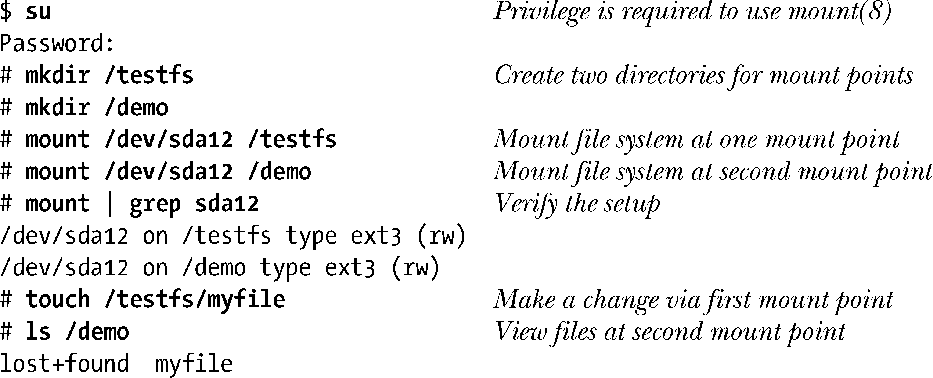

### 14.9.1　在多个挂载点挂载文件系统

内核版本2.4之前，一个文件系统只能挂载于单个挂载点。从内核版本2.4开始，可以将一个文件系统挂载于文件系统内的多个位置。由于每个挂载点下的目录子树内容都相同，在一个挂载点下对目录子树所做的改变，同样可见诸于其他挂载点，如下列shell会话所示：

如ls命令的输出所示，在挂载点一(/testfs)下对目录子树所做的改变，在挂载点二(/demo)下完全可见。

14.9.4节在介绍绑定挂载时，将举例说明多点挂载文件系统的用处所在。

> 正因为可在多点挂载一个设备，在Linux 2.4及其后续版本中，umount()系统调用不再将设备作为其入参。

